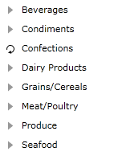

# Binding to ADO.NET Data Service

The purpose of this tutorial is to show you how to populate a __RadTreeView__ with data from an __ADO.NET Data Service__.  

>This tutorial will use the __Northwind__ database, which can be downloaded from [here](http://www.microsoft.com/downloads/details.aspx?FamilyID=06616212-0356-46A0-8DA2-EEBC53A68034&displaylang=en).

Here will be also examined "best practice" for using __RadTreeView__ with load on demand and ADO.NET Data Service. You can read more information about the load on demand behavior [here](). 

* Add a new __RadTreeView__ declaration in your XAML and add an event handler for __LoadOnDemand__ event. Also set the following properties to __True__:
	* __IsLoadOnDemandEnabled__
	* __IsExpandOnSingleClickEnabled__

	```XAML
		<telerik:RadTreeView x:Name="radTreeView" Margin="8"
			IsLoadOnDemandEnabled="True" IsExpandOnSingleClickEnabled="True"
			LoadOnDemand="radTreeView_LoadOnDemand"/>
	```

	The __RadTreeView__ will be bound to a data source object, that has a property __Categories__. When the __LoadOnDemand__ event of __RadTreeView__ is fired, the selected category asynchronously loads its related products. 

* Create a new class named __NorthwindDataSource__. 

	```C#
		public class NorthwindDataSource
		{
		}
	```
	```VB.NET
		Public Class NorthwindDataSource
		End Class
	```

* Add a reference to your ADO.NET Data Service.

* In the __NorthwindDataSource__ class add a reference to an __ObservableCollection__ of __Categories__.

* In the __NorthwindDataSource__ class add a reference to the __NorthwindEntities__ object: 

	```C#
		private NorthwindEntities northwindEntity;
		
		public NorthwindDataSource()
		{
			this.northwindEntity = new NorthwindEntities( new Uri( "Enter your service address here" ) );
			this.Categories = new ObservableCollection<Categories>();
		}
		
		public ObservableCollection<Categories> Categories
		{
			get;
			set;
		}
	```
	```VB.NET
		Private northwindEntity As NorthwindEntities
		
		Public Sub New()
			Me.northwindEntity = New NorthwindEntities(New Uri("Enter your service address here"))
			Me.Categories = New ObservableCollection(Of Categories)()
		End Sub
		
		Private _Categories As ObservableCollection(Of Categories)
		
		Public Property Categories() As ObservableCollection(Of Categories)
			Get
				Return _Categories
			End Get
			Set(ByVal value As ObservableCollection(Of Categories))
				_Categories = value
			End Set
		End Property
	```

* Add the following code in the constructor of the __NorthwindDataSource__. It will make the initial load of all __Categories__ from the database: 

	```C#
		northwindEntity.Categories.BeginExecute(
			( IAsyncResult result ) => EntitiesLoaded<Categories>( result, this.Categories ),
			northwindEntity.Categories );
	```
	```VB.NET
		northwindEntity.Categories.BeginExecute(Function(ByVal result As IAsyncResult) EntitiesLoaded(Of Categories)(result, Me.Categories), northwindEntity.Categories)
	```
		
	```C#
		foreach ( Categories c in northwindEntity.Categories.Execute() )
		{
			this.Categories.Add( c );
		}
	```
	```VB.NET
		For Each c As Categories In northwindEntity.Categories.Execute()
			Me.Categories.Add(c)
		Next
	```
	
	```C#
		private static void EntitiesLoaded<T>( IAsyncResult result, Collection<T> entities )
		{
			DataServiceQuery<T> query = result.AsyncState as DataServiceQuery<T>;
			foreach ( T entity in query.EndExecute( result ) )
			{
				entities.Add( entity );
			}
		}
	```
	```VB.NET
		Private Shared Sub EntitiesLoaded(Of T)(ByVal result As IAsyncResult, ByVal entities As Collection(Of T))
			Dim query As DataServiceQuery(Of T) = TryCast(result.AsyncState, DataServiceQuery(Of T))
			For Each entity As T In query.EndExecute(result)
				entities.Add(entity)
			Next
		End Sub
	```

	> Since the first load of the categories is also asynchronous, it takes some time to display the treeview for the first time. You may consider adding some loading animation in your application.

* Declare the __NorthwindDataSource__ object as a resource in your application. 

	```XAML
		<UserControl.Resources>
			<example:NorthwindDataSource x:Key="DataSource"/>
		</UserControl.Resources>
	```

* Declare [HierarchicalDataTemplates]() which will describe the __RadTreeView__ structure. 

	```XAML
		<DataTemplate x:Key="ProductTemplate">
			<TextBlock Text="{Binding ProductName}" />
		</DataTemplate>
		<HierarchicalDataTemplate x:Key="CategoryTemplate" ItemsSource="{Binding Products}"
			ItemTemplate="{StaticResource ProductTemplate}">
			<TextBlock Text="{Binding CategoryName}" />
		</HierarchicalDataTemplate>
	```

* Update your RadTreeView declaration - set the ItemsSource and __ItemTemplate__ properties. 

	```XAML
		<telerik:RadTreeView x:Name="radTreeView" Margin="8"
			IsLoadOnDemandEnabled="True" IsExpandOnSingleClickEnabled="True"
			LoadOnDemand="radTreeView_LoadOnDemand"
			ItemTemplate="{StaticResource CategoryTemplate}"
			ItemsSource="{Binding Source={StaticResource DataSource}, Path=Categories}"/>
	```
		
	Run your demo, the result can be seen on the next picture:
	

	If you try to expand any of the loaded categories, the default load on demand animation will be started: 
	

The next step is to handle the load on demand event. 

* Add the following method to the __NorthwindDataSource__ class, which aims to load the products for the expanded category: 

	```C#
		public static void BeginLoadingProducts( Categories category )
		{
			DataServiceQuery<Products> categoryProducts = northwindEntity
				.CreateQuery<Products>( string.Format( "Categories({0})/Products", category.CategoryID ) )
				.Expand( "Suppliers" )
				.Expand( "Categories" );
			categoryProducts.BeginExecute(
				( IAsyncResult result ) => EntitiesLoaded<Products>( result, category.Products ),
				categoryProducts );
		}
	```
	```VB.NET
		Public Shared Sub BeginLoadingProducts(ByVal category As Categories)
			Dim categoryProducts As DataServiceQuery(Of Products) = northwindEntity.CreateQuery(Of Products)(String.Format("Categories({0})/Products", category.CategoryID)).Expand("Suppliers").Expand("Categories")
		
			categoryProducts.BeginExecute(Function(ByVal result As IAsyncResult) EntitiesLoaded(Of Products)(result, category.Products), categoryProducts)
		End Sub
	```
	
	```C#
		public static void LoadProducts( Categories category )
		{
			DataServiceQuery<Products> categoryProducts = northwindEntity
				.CreateQuery<Products>( string.Format( "Categories({0})/Products", category.CategoryID ) )
				.Expand( "Suppliers" )
				.Expand( "Categories" );
			category.Products = new ObservableCollection<Products>();
			foreach ( Products p in categoryProducts.Execute() )
			{
				category.Products.Add( p );
			}
		}
	```
	```VB.NET
		Public Shared Sub LoadProducts(ByVal category As Categories)
			Dim categoryProducts As DataServiceQuery(Of Products) = northwindEntity.CreateQuery(Of Products)(String.Format("Categories({0})/Products", category.CategoryID)).Expand("Suppliers").Expand("Categories")
		
			category.Products = New ObservableCollection(Of Products)()
			For Each p As Products In categoryProducts.Execute()
				category.Products.Add(p)
			Next
		End Sub
	```

* Add the following code to the load on demand event handler, which you declared on step 1. 

	```C#
		private void radTreeView_LoadOnDemand( object sender, Telerik.Windows.RadRoutedEventArgs e )
		{
			RadTreeViewItem item = e.OriginalSource as RadTreeViewItem;
			Categories category = item.Item as Categories;
			if ( category != null )
			{
				NorthwindDataSource.BeginLoadingProducts( category );
			}
			else
			{
				item.IsLoadOnDemandEnabled = false;
			}
		}
	```
	```VB.NET
		Private Sub radTreeView_LoadOnDemand(ByVal sender As Object, ByVal e As Telerik.Windows.RadRoutedEventArgs)
			Dim item As RadTreeViewItem = TryCast(e.OriginalSource, RadTreeViewItem)
		
			Dim category As Categories = TryCast(item.Item, Categories)
			If category IsNot Nothing Then
				NorthwindDataSource.BeginLoadingProducts(category)
			Else
				item.IsLoadOnDemandEnabled = False
			End If
		End Sub
	```

	> When there are no items to add, and you want to prevent the __LoadOnDemand__ event to fire again, set the __IsLoadOnDemandEnabled__ property to __False__ to the __RadTreeViewItem__ that has fired the __LoadOnDemand__ event.

And here is the result:


## See Also
 * [DataBinding - Overview]()
 * [Populating with Data - Declaratively]()
 * [Populating with Data - In Code-Behind]()
 * [Binding to XML]()
 * [Binding to Object]()
 * [Binding to WCF Service]()