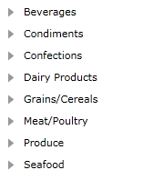
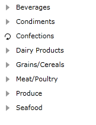
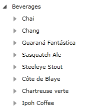

# Binding to ADO.NET Data Service

The purpose of this tutorial is to show you how to populate a __RadTreeView__ with data from an __ADO.NET Data Service__.  

>This tutorial will use the __Northwind__ database, which can be downloaded from [here](http://www.microsoft.com/downloads/details.aspx?FamilyID=06616212-0356-46A0-8DA2-EEBC53A68034&displaylang=en).

Here will be also examined "best practice" for using __RadTreeView__ with load on demand and ADO.NET Data Service. You can read more information about the load on demand behavior [here](). 

* Add a new __RadTreeView__ declaration in your XAML and add an event handler for __LoadOnDemand__ event. Also set the following properties to __True__:
	* __IsLoadOnDemandEnabled__
	* __IsExpandOnSingleClickEnabled__

	<snippet id='radtreeview-populating-with-data-databinding-to-adonet-service-block_1-xaml' />

	The __RadTreeView__ will be bound to a data source object, that has a property __Categories__. When the __LoadOnDemand__ event of __RadTreeView__ is fired, the selected category asynchronously loads its related products. 

* Create a new class named __NorthwindDataSource__. 

	<snippet id='radtreeview-populating-with-data-databinding-to-adonet-service-block_2-cs' />
	<snippet id='radtreeview-populating-with-data-databinding-to-adonet-service-block_3-vb' />

* Add a reference to your ADO.NET Data Service.

* In the __NorthwindDataSource__ class add a reference to an __ObservableCollection__ of __Categories__.

* In the __NorthwindDataSource__ class add a reference to the __NorthwindEntities__ object: 

	<snippet id='radtreeview-populating-with-data-databinding-to-adonet-service-block_4-cs' />
	<snippet id='radtreeview-populating-with-data-databinding-to-adonet-service-block_5-vb' />

* Add the following code in the constructor of the __NorthwindDataSource__. It will make the initial load of all __Categories__ from the database: 

	<snippet id='radtreeview-populating-with-data-databinding-to-adonet-service-block_6-cs' />
	<snippet id='radtreeview-populating-with-data-databinding-to-adonet-service-block_7-vb' />
		
	<snippet id='radtreeview-populating-with-data-databinding-to-adonet-service-block_8-cs' />
	<snippet id='radtreeview-populating-with-data-databinding-to-adonet-service-block_9-vb' />
	
	<snippet id='radtreeview-populating-with-data-databinding-to-adonet-service-block_10-cs' />
	<snippet id='radtreeview-populating-with-data-databinding-to-adonet-service-block_11-vb' />

	> Since the first load of the categories is also asynchronous, it takes some time to display the treeview for the first time. You may consider adding some loading animation in your application.

* Declare the __NorthwindDataSource__ object as a resource in your application. 

	<snippet id='radtreeview-populating-with-data-databinding-to-adonet-service-block_12-xaml' />

* Declare [HierarchicalDataTemplates]() which will describe the __RadTreeView__ structure. 

	<snippet id='radtreeview-populating-with-data-databinding-to-adonet-service-block_13-xaml' />

* Update your RadTreeView declaration - set the ItemsSource and __ItemTemplate__ properties. 

	<snippet id='radtreeview-populating-with-data-databinding-to-adonet-service-block_14-xaml' />
		
	Run your demo, the result can be seen on the next picture:
	

	If you try to expand any of the loaded categories, the default load on demand animation will be started: 
	

The next step is to handle the load on demand event. 

* Add the following method to the __NorthwindDataSource__ class, which aims to load the products for the expanded category: 

	<snippet id='radtreeview-populating-with-data-databinding-to-adonet-service-block_15-cs' />
	<snippet id='radtreeview-populating-with-data-databinding-to-adonet-service-block_16-vb' />
	
	<snippet id='radtreeview-populating-with-data-databinding-to-adonet-service-block_17-cs' />
	<snippet id='radtreeview-populating-with-data-databinding-to-adonet-service-block_18-vb' />

* Add the following code to the load on demand event handler, which you declared on step 1. 

	<snippet id='radtreeview-populating-with-data-databinding-to-adonet-service-block_19-cs' />
	<snippet id='radtreeview-populating-with-data-databinding-to-adonet-service-block_20-vb' />

	> When there are no items to add, and you want to prevent the __LoadOnDemand__ event to fire again, set the __IsLoadOnDemandEnabled__ property to __False__ to the __RadTreeViewItem__ that has fired the __LoadOnDemand__ event.

And here is the result:

## See Also
 * [DataBinding - Overview]()
 * [Populating with Data - Declaratively]()
 * [Populating with Data - In Code-Behind]()
 * [Binding to XML]()
 * [Binding to Object]()
 * [Binding to WCF Service]()