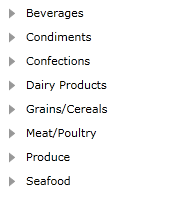
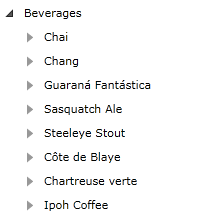

# Binding to WCF Service

The purpose of this tutorial is to show you how to populate a __RadTreeView__ with data from a __WCF Service__. 

>This tutorial will use the __Northwind__ database, which can be downloaded from [here](http://www.microsoft.com/downloads/details.aspx?FamilyID=06616212-0356-46A0-8DA2-EEBC53A68034&displaylang=en).

Here will be examined "best practice" for using __RadTreeView__ with load on demand and WCF Service.

* Add a new __RadTreeView__ declaration in your XAML and add an event handler for __LoadOnDemand__ event. Also set the following properties to __True__:
	* __IsLoadOnDemandEnabled__
	* __IsExpandOnSingleClickEnabled__

	```XAML
		<telerik:RadTreeView x:Name="radTreeView" Margin="8"
		   IsLoadOnDemandEnabled="True" IsExpandOnSingleClickEnabled="True"
		   LoadOnDemand="radTreeView_LoadOnDemand"/>
	```

	The treeview will be bound to a data source object, that has a property __Categories__. When the __LoadOnDemand__ event of __RadTreeView__ is fired, the selected category asynchronously loads its related products. 

* Create a new class named __NorthwindDataSource__. 

	```C#
		public class NorthwindDataSource
		{
		}
	```

* Add a reference to your WCF Service
* In the __NorthwindDataSource__ class add a reference to an __ObservableCollection__ of __Categories.__
* In the __NorthwindDataSource__ class add a reference to your WCF Service client: 

	```C#
		public class NorthwindDataSource
		{
			private SampleWcfServiceClient serviceClient;
			public NorthwindDataSource()
			{
				serviceClient = new SampleWcfServiceClient();
				this.Categories = new ObservableCollection<Categories>();
			}
			public ObservableCollection<Categories> Categories
			{
				get;
				set;
			}
		}
	```

* Add the following code in the constructor of the __NorthwindDataSource__. It will make the initial load of all __Categories__ from the database: 

	```C#
		this.serviceClient.LoadCategoriesCompleted += new EventHandler<LoadCategoriesCompletedEventArgs>( serviceClient_LoadCategoriesCompleted );
		this.serviceClient.LoadCategoriesAsync();
	```

	```C#
		foreach ( Categories c in serviceClient.LoadCategories() )
		{
			this.Categories.Add( c );
		}
	```		

* Update your treeview declaration - set the __ItemsSource__ and __ItemTemplate__ properties. 

	```XAML
		<telerik:RadTreeView x:Name="radTreeView" Margin="8"
			IsLoadOnDemandEnabled="True" IsExpandOnSingleClickEnabled="True"
			LoadOnDemand="radTreeView_LoadOnDemand"
			ItemTemplate="{StaticResource CategoryTemplate}"
			ItemsSource="{Binding Source={StaticResource DataSource}, Path=Categories}"/>
	```

	Run your demo, the result can be seen on the next picture:

	

	If you try to expand any of the loaded categories, the default load on demand animation will be started:

	

	The next step is to handle the load on demand event. 

* Add the following method to the __NorthwindDataSource__ class, which aims to load the products for the expanded category: 

	```C#
		public void BeginLoadingProducts( Categories category )
		{
			serviceClient.LoadProductsByCategoryIdCompleted += new EventHandler<LoadProductsByCategoryIdCompletedEventArgs>( serviceClient_LoadProductsByCategoryIdCompleted );
			serviceClient.LoadProductsByCategoryIdAsync( category.CategoryID, category );
		}
		private void serviceClient_LoadProductsByCategoryIdCompleted( object sender, LoadProductsByCategoryIdCompletedEventArgs e )
		{
			if ( e.Error == null && e.Result != null )
			{
				Categories currentCategory = e.UserState as Categories;
				foreach ( Products p in e.Result )
				{
					currentCategory.Products.Add( p );
				}
			}
		}
	```

	```C#
		public void LoadProducts( Categories category )
		{
			category.Products = new ObservableCollection<Products>();
			foreach ( Products p in serviceClient.LoadProductsByCategoryId( category.CategoryID ) )
			{
				category.Products.Add( p );
			}
		}
	```

	The body of the exposed __LoadProductsByCategoryId()__ method is shown on the code snippet below.
		
	```C#
		[OperationContract]
		public List<Products> LoadProductsByCategoryId( int categoryId )
		{
			NorthwindEntities ent = new NorthwindEntities();
			var q = from p in ent.Products
					where p.Categories.CategoryID == categoryId
					orderby p.ProductName
					select p;
			return q.ToList();
		}
	```

* Add the following code to the load on demand event handler, which you declared on step 1. 

	```C#
		private void radTreeView_LoadOnDemand( object sender, Telerik.Windows.RadRoutedEventArgs e )
		{
			RadTreeViewItem item = e.OriginalSource as RadTreeViewItem;
			Categories category = item.Item as Categories;
			if ( category != null )
			{
				( this.Resources[ "DataSource" ] as NorthwindDataSource ).BeginLoadingProducts( category );
			}
			else
			{
				item.IsLoadOnDemandEnabled = false;
			}
		}
	```

	>When there are no items to add, and you want to prevent the __LoadOnDemand__ event to fire again, set the __IsLoadOnDemandEnabled__ property to __False__ to the __RadTreeViewItem__ that has fired the __LoadOnDemand__ event.

And here is the result: 



## See Also
 * [DataBinding - Overview]()
 * [Populating with Data - Declaratively]()
 * [Populating with Data - In Code-Behind]()
 * [Binding to XML]()
 * [Binding to Object]()
 * [Binding to ADO.NET Data Service]()
