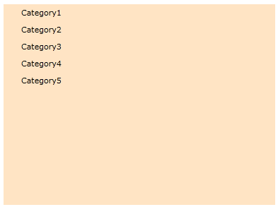
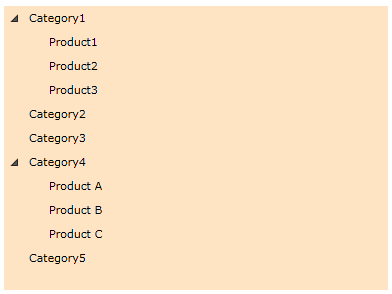

# Declaratively

This tutorial will walk you through the common task of populating __RadTreeView__ with __RadTreeViewItems__ declaratively.  

Here is a regular treeview declaration without items: 

#### __XAML__

```XAML
	<telerik:RadTreeView x:Name="radTreeView" Background="Bisque" Margin="8">
	</telerik:RadTreeView>
	```

In order to add treeview items you need to use the __Items__ property. The __Items__ property is an __ItemCollection__ which contains your treeview items. For example, insert the following lines to the declaration of your treeview and new items will be added to the treeview. 

#### __XAML__

```XAML
	<telerik:RadTreeView x:Name="radTreeView" Background="Bisque" Margin="8">
	    <telerik:RadTreeView.Items>
	        <telerik:RadTreeViewItem Header="Category1"/>
	        <telerik:RadTreeViewItem Header="Category2"/>
	        <telerik:RadTreeViewItem Header="Category3"/>
	        <telerik:RadTreeViewItem Header="Category4"/>
	        <telerik:RadTreeViewItem Header="Category5"/>
	    </telerik:RadTreeView.Items>
	</telerik:RadTreeView>
	```

Here is the result: 


>Consider adding __RadTreeViewItems__ directly, without specifying __<telerik:RadTreeView.Items>__
explicitly. The effect will be the same, but your XAML will be more readable:
`<telerik:RadTreeView x:Name="radTreeView" Background="Bisque" Margin="8">
    <telerik:RadTreeViewItem Header="Category1"/>
    <telerik:RadTreeViewItem Header="Category2"/>
    <telerik:RadTreeViewItem Header="Category3"/>
    <telerik:RadTreeViewItem Header="Category4"/>
    <telerik:RadTreeViewItem Header="Category5"/>
</telerik:RadTreeView>`

Each one of the __RadTreeViewItem__ nodes `<telerik:RadTreeViewItem Header="Category1"/>` in the example above represents declaration of a single treeview item that will be created and added to your treeview control at run-time. Just insert or delete __RadTreeViewItem__ child nodes to/from your treeview declaration and see how the treeview structure changes.

In order to create your hierarchical structure deeper, you just need to add __RadTreeViewItem__ child nodes to any of the previously declared items. For example: 

#### __XAML__

```XAML
	<telerik:RadTreeView x:Name="radTreeView" Background="Bisque" Margin="8">
	    <telerik:RadTreeViewItem Header="Category1">
	        <telerik:RadTreeViewItem Header="Product1"/>
	        <telerik:RadTreeViewItem Header="Product2"/>
	        <telerik:RadTreeViewItem Header="Product3"/>
	    </telerik:RadTreeViewItem>
	    <telerik:RadTreeViewItem Header="Category2"/>
	    <telerik:RadTreeViewItem Header="Category3"/>
	    <telerik:RadTreeViewItem Header="Category4">
	        <telerik:RadTreeViewItem Header="Product A"/>
	        <telerik:RadTreeViewItem Header="Product B"/>
	        <telerik:RadTreeViewItem Header="Product C"/>
	    </telerik:RadTreeViewItem>
	    <telerik:RadTreeViewItem Header="Category5"/>
	</telerik:RadTreeView>
	```



>tip Consider declaring treeview items in XAML instead of adding them by code whenever it's possible. This includes situations when you know what items you need at design time.

## See Also
 * [DataBinding - Overview]()
 * [Populating with Data - In Code-Behind]()
 * [Binding to XML]()
 * [Binding to Object]()
 * [Binding to WCF Service]()
 * [Binding to ADO.NET Data Service]()