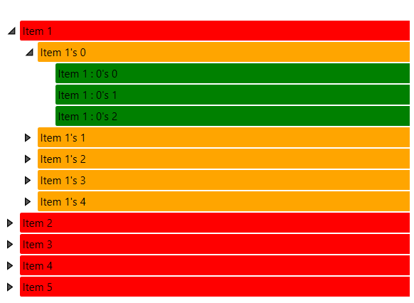

# Hierarchical Data Templates

__RadTreeViewItem__ inherits from __HeaderedItemsControl__ and they can display hierarchical data, e.g. collections that contain other collections.

The __HierarchicalDataTemplate__ class is designed to be used with __HeaderedItemsControl__ types to display such data. There should be virtually no differences between the usage of __HierarchicalDataTemplate__ in __RadTreeView__ and other controls.

The following example demonstrates how to create a hierarchical data source and bind a __RadTreeView__ to it, using a __HierarchicalDataTemplate__. The __ItemsSource__ property of the __HierarchicalDataTemplate__ specifies the __binding__ that has to be applied to the __ItemsSource__ property of each item. The __DataTemplate__ property specifies the template that has to be applied on each item, while the __ItemTemplate__ is the template applied on its child items. You can nest several __HierarchicalDataTemplate__ declarations if you need a deeper level of hierarchy. 

> If you have a __databound control__, then you must consider the following rules.The __ItemsControl__ prepares its children in a very different way, depending on the type of the __child__:

>	- If it is a __ContentControl__, the __ItemTemplate__ will be set as a __ContentTemplate__ and the non-visual element as content.
>	- If it is a __HeaderedControl__, the __ItemTemplate__ will be set as a __HeaderTemplate__ and the data item as a Header. 
>	- If it is a __HeaderedContentControl__ (i.e. the two above combined), the item will go as __Content__, but the __ContentTemplate__ won't be set. Instead, the item will be set as a __Header__ and the __ItemTemplate__ will be used as a __HeaderTemplate__.

>If the item is an __ItemsControl__, these properties are set to the child items as well, what is called "inherited": __ItemTemplate__, __ItemTemplateSelector__, __ItemContainerStyle__, __ItemContainerStyleSelector__, __DisplayMemberPath__, __ItemStringFormat__, __AnimationManager__.__IsAnimationEnabled__.In the case of the __RadTreeView__, the tree items are __HeaderedItemsControl__, which means that the above properties will be passed along to all the items, and there is no need to set the __ItemTemplate__ property of the __HierarchicalDataTemplate__, especially if there is a selector.The __ItemContainerStyle__ will be set as a style for the containers, if there is none and an __ItemContainerStyleSelector__ is present, a style will be selected. Then the __ItemContainerStyle__ (Selector) properties will be passed along ig the container is an __ItemsControl__.The above rules can "mix" with the properties set in the __HierarchicalDataTemplate__ to create even more combinations of ways to set the templates of items. The __HeaderTemplate__ displayed for an item can be a result of one of the following:

>	- Directly (locally) set __HeaderTemplate__.
>	- Directly (locally) set __HeaderTemplateSelector__. 
>	- __ItemTemplate__ of the parent __ItemsControl__. 
>	- __ItemTemplateSelector__ of the parent __ItemsControl__. 
>	- __ItemContainerStyle__ with a __HeaderTemplate__ of the parent __ItemsControl__. 
>	- __ItemContainerStyleSelector__ which selects a style with a __HeaderTemplate__. 
>	- __ItemContainerStyle__ with a __HeaderTemplateSelector__ of the parent __ItemsControl__.
>	- __ItemContainerStyleSelector__ which selects a style with a __HeaderTemplateSelector__. 
>	- An __ItemTemplate__ set in the __HierarchicalDataTemplate__ of the parent. 
>	- An __ItemTemplateSelector__ set in the __HierarchicalDataTemplate__ of the parent. 
>	- An __ItemContainerStyle__ set in the __HierarchicalDataTemplate__ of the parent, which sets a __HeaderTemplate__. 
>	- An __ItemContainerStyleSelector__ set in the __HierarchicalDataTemplate__ of the parent, which selects a style that sets a __HeaderTemplate__. 
>	- In WPF you have the DataType property of the __DataTemplate__ which will be a last fallback if a template is not set at all.

>tip The Telerik __HierarchicalDataTemplate__ offers two properties - __ItemContainerStyle__ and __ItemContainerStyleSelector__, which allows you to make your hierarchy quite flexible.An interesting point here is the precedence over what should be set. As always, local values are stronger than styles. But what happens when you have both an __ItemContainerStyle__ set in the __ItemsControl__ and the __HierarchicalDataTemplate__. Also what happens when you have an __ItemContainerStyle__ set in the two above __and__ in the __ItemContainerStyle__ as well. The rule is that the __ItemContainerStyle__ from the __HierarchicalDataTemplate__ is applied to the first level of containers that has a style which is the same as the parent's. The last __ItemContainerStyle__ to be actively set is inherited from them on. The same rule applies for selectors.For more information see the example below.

## Example

We will specify the following classes, which are going to be used to the RadTreeView control.

* __MyItem:__ A class that will be our business object. This class will have a collection of MyItems. It will be used to show hierarchy in the RadTreeView.
* __MyViewModel:__ The main ViewModel class of the application.

	__Example 1: Creating ViewModels__

	<snippet id='radtreeview-populating-with-data-hierarchical-data-templates-block_1-cs' />
	<snippet id='radtreeview-populating-with-data-hierarchical-data-templates-block_2-vb' />

	Now consider both of the background notes at the beginning of the topic and take a look at the following code snippet. It declares a __HierarchicalDataTemplate__ and uses the __ItemContainerStyle__ property of both the __RadTreeView__ and the __HierarchicalDataTemplate__.
	
	__Example 2: Defining RadTreeView in XAML__

	<snippet id='radtreeview-populating-with-data-hierarchical-data-templates-block_3-xaml' />

And finally, we need to set the DataContext of the MainWindow:

__Example 3: Setting DataContext__
<snippet id='radtreeview-populating-with-data-hierarchical-data-templates-block_4-cs' />
<snippet id='radtreeview-populating-with-data-hierarchical-data-templates-block_5-vb' />

Here is the final result: 

## See Also
 * [Styling and Appearance - Overview]()
 * [DataBinding - Overview]()