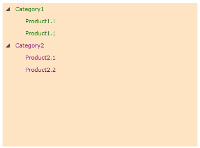

# In Code-Behind

This tutorial will walk you through the common tasks of __adding__ and __removing RadTreeViewItems__ programmatically.  

Here is a snapshot of a regular treeview without treeview items: 


#### __XAML__

```XAML
	<telerik:RadTreeView x:Name="radTreeView" Background="Bisque" Margin="8"/>
	```

## Adding TreeView Items 

In order to add new treeview items to a treeview control, first you have to create an instance of the __RadTreeViewItem__ class, set its properties like __Header__, __Foreground__, etc., and then add it to the treeview items collection. 

#### __C#__

```C#
	private void AddTreeViewItems()
	{
	    RadTreeViewItem category = new RadTreeViewItem();
	    category.Header = "Category1";
	    category.Foreground = new SolidColorBrush( Colors.Green );
	    radTreeView.Items.Add( category );
	    category = new RadTreeViewItem();
	    category.Header = "Category2";
	    category.Foreground = new SolidColorBrush( Colors.Purple );
	    radTreeView.Items.Add( category );
	}
	```

#### __VB.NET__

```VB.NET
	Private Sub AddTreeViewItems()
	    Dim category As New RadTreeViewItem()
	    category.Header = "Category1"
	    category.Foreground = New SolidColorBrush(Colors.Green)
	
	    radTreeView.Items.Add(category)
	
	    category = New RadTreeViewItem()
	    category.Header = "Category2"
	    category.Foreground = New SolidColorBrush(Colors.Purple)
	
	    radTreeView.Items.Add(category)
	End Sub
	```

In order to create your hierarchical structure deeper, you just need to add __RadTreeViewItem__ child nodes to any of the previously declared items. For example, here is the same __AddTreeViewItems()__ method, but this time a little more extended: 

#### __C#__

```C#
	private void AddTreeViewItems()
	{
	    RadTreeViewItem category = new RadTreeViewItem();
	    category.Header = "Category1";
	    category.Foreground = new SolidColorBrush( Colors.Green );
	    radTreeView.Items.Add( category );
	
	    // Adding child items
	    RadTreeViewItem product = new RadTreeViewItem();
	    product.Header = "Product1.1";
	    category.Items.Add( product );
	    product = new RadTreeViewItem();
	    product.Header = "Product1.1";
	    category.Items.Add( product );
	
	    category = new RadTreeViewItem();
	    category.Header = "Category2";
	    category.Foreground = new SolidColorBrush( Colors.Purple );
	    radTreeView.Items.Add( category );
	
	    // Adding child items
	    product = new RadTreeViewItem();
	    product.Header = "Product2.1";
	    category.Items.Add( product );
	    product = new RadTreeViewItem();
	    product.Header = "Product2.2";
	    category.Items.Add( product );
	}
	```

#### __VB.NET__

```VB.NET
	Private Sub AddTreeViewItems()
	    Dim category As New RadTreeViewItem()
	    category.Header = "Category1"
	    category.Foreground = New SolidColorBrush(Colors.Green)
	
	    radTreeView.Items.Add(category)
	
	    ' Adding child items '
	    Dim product As New RadTreeViewItem()
	    product.Header = "Product1.1"
	
	    category.Items.Add(product)
	
	    product = New RadTreeViewItem()
	    product.Header = "Product1.1"
	
	    category.Items.Add(product)
	
	    category = New RadTreeViewItem()
	    category.Header = "Category2"
	    category.Foreground = New SolidColorBrush(Colors.Purple)
	
	    radTreeView.Items.Add(category)
	
	    ' Adding child items '
	    product = New RadTreeViewItem()
	    product.Header = "Product2.1"
	
	    category.Items.Add(product)
	
	    product = New RadTreeViewItem()
	    product.Header = "Product2.2"
	
	    category.Items.Add(product)
	End Sub
	```

This will be the result if you execute the __AddTreeViewItems()__ method: 


>tip Consider declaring treeview items in XAML instead of adding them by code whenever it's possible. This includes situations when you know what items you need at design time.

## Removing TreeView Items 

In order to remove a treeview item you have to remove it from the treeview items collection.

#### __C#__

```C#
	private void RemoveTreeViewItem( RadTreeViewItem itemToRemove )
	{
	    radTreeView.Items.Remove( itemToRemove );
	}
	```

#### __VB.NET__

```VB.NET
	Private Sub RemoveTreeViewItem(ByVal itemToRemove As RadTreeViewItem)
	    radTreeView.Items.Remove(itemToRemove)
	End Sub
	```

## See Also
 * [DataBinding - Overview]()
 * [Populating with Data - Declaratively]()
 * [Binding to XML]()
 * [Binding to Object]()
 * [Binding to WCF Service]()
 * [Binding to ADO.NET Data Service]()