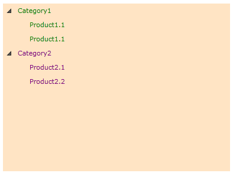

# In Code-Behind

This tutorial will walk you through the common tasks of __adding__ and __removing RadTreeViewItems__ programmatically.  

Here is a snapshot of a regular treeview without treeview items: 

<snippet id='radtreeview-populating-with-data-in-code-behind-block_1-xaml' />

## Adding TreeView Items 

In order to add new treeview items to a treeview control, first you have to create an instance of the __RadTreeViewItem__ class, set its properties like __Header__, __Foreground__, etc., and then add it to the treeview items collection. 

<snippet id='radtreeview-populating-with-data-in-code-behind-block_2-cs' />
<snippet id='radtreeview-populating-with-data-in-code-behind-block_3-vb' />

In order to create your hierarchical structure deeper, you just need to add __RadTreeViewItem__ child nodes to any of the previously declared items. For example, here is the same __AddTreeViewItems()__ method, but this time a little more extended: 

<snippet id='radtreeview-populating-with-data-in-code-behind-block_4-cs' />
<snippet id='radtreeview-populating-with-data-in-code-behind-block_5-vb' />

This will be the result if you execute the __AddTreeViewItems()__ method: 

>tip Consider declaring treeview items in XAML instead of adding them by code whenever it's possible. This includes situations when you know what items you need at design time.

## Removing TreeView Items 

In order to remove a treeview item you have to remove it from the treeview items collection.

<snippet id='radtreeview-populating-with-data-in-code-behind-block_6-cs' />
<snippet id='radtreeview-populating-with-data-in-code-behind-block_7-vb' />

## See Also
 * [DataBinding - Overview]()
 * [Populating with Data - Declaratively]()
 * [Binding to XML]()
 * [Binding to Object]()
 * [Binding to WCF Service]()
 * [Binding to ADO.NET Data Service]()