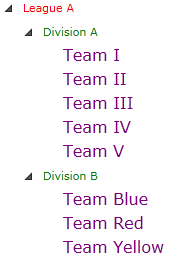

# ItemContainerStyleSelector

The Telerik __RadTreeView__ supports [ItemContainerStyle](). The __ItemContainerStyle__ property gives you the ability to change the treeview items' header. The container created by the __RadTreeView__ for each item in the collection is of type __RadTreeViewItem__.

If you have different items and/or you prefer to display items with different styles, then you should use the __ItemContainerStyleSelector__ property. This tutorial will walk you through the common task of creating and applying __ItemContainerStyleSelector__.

For the purpose of this tutorial will be used the following treeview declaration:



#### __XAML__

	```XAML
		<UserControl.Resources>
		
			<sampleData:RadTreeViewSampleData x:Key="DataSource"/>
		
			<DataTemplate x:Key="Team">
				<TextBlock Text="{Binding Name}" />
			</DataTemplate>
		
			<telerik:HierarchicalDataTemplate x:Key="Division" ItemTemplate="{StaticResource Team}"
				ItemsSource="{Binding Teams}">
				<TextBlock Text="{Binding Name}" />
			</telerik:HierarchicalDataTemplate>
		
			<telerik:HierarchicalDataTemplate x:Key="League" ItemTemplate="{StaticResource Division}"
				ItemsSource="{Binding Divisions}">
				<TextBlock Text="{Binding Name}" />
			</telerik:HierarchicalDataTemplate>
		
		</UserControl.Resources>
		
		<Grid x:Name="LayoutRoot" Background="White">
		
			<telerik:RadTreeView x:Name="radTreeView"
			   ItemsSource="{Binding Source={StaticResource DataSource}, Path=LeaguesDataSource}"
			   ItemTemplate="{StaticResource League}"/>
		
		</Grid>
		```


	


#### __XAML__

	```XAML
		<UserControl.Resources>
		
			<sampleData:RadTreeViewSampleData x:Key="DataSource"/>
		
			<DataTemplate x:Key="Team">
				<TextBlock Text="{Binding Name}" />
			</DataTemplate>
		
			<HierarchicalDataTemplate x:Key="Division" ItemTemplate="{StaticResource Team}"
				ItemsSource="{Binding Teams}">
				<TextBlock Text="{Binding Name}" />
			</HierarchicalDataTemplate>
		
			<HierarchicalDataTemplate x:Key="League" ItemTemplate="{StaticResource Division}"
				ItemsSource="{Binding Divisions}">
				<TextBlock Text="{Binding Name}" />
			</HierarchicalDataTemplate>
		
		</UserControl.Resources>
		
		<Grid x:Name="LayoutRoot" Background="White">
		
			<telerik:RadTreeView x:Name="radTreeView"
			   ItemsSource="{Binding Source={StaticResource DataSource}, Path=LeaguesDataSource}"
			   ItemTemplate="{StaticResource League}"/>
		
		</Grid>
		```

	

The data source class __RadTreeViewSampleData__ assigned to the __RadTreeView__ is covered in greater details in the chapter [Binding to Object]().


## ItemContainerStyleSelector 

The most common use of the "selectors" is to display different kind of data (different kind of items).

If you want to read more about __HierarchicalDataTemplate__ and __DataBinding__, see the main topics about [HierarchicalDataTemplate]() and [ Binding to Object]().

* Create three __styles__ in the resources of your application (user control).
	* __LeagueItemContainerStyle__

		#### __XAML__

		```XAML
			<Style x:Key="LeagueItemContainerStyle" TargetType="telerik:RadTreeViewItem{x:Type telerik:RadTreeViewItem}">
				<Setter Property="Foreground" Value="Red"/>
				<Setter Property="IsExpanded" Value="True"/>
			</Style>
			```

	* __DivisionItemContainerStyle__

		#### __XAML__

		```XAML
			<Style x:Key="DivisionItemContainerStyle" TargetType="telerik:RadTreeViewItem{x:Type telerik:RadTreeViewItem}">
				<Setter Property="Foreground" Value="Green"/>
				<Setter Property="IsExpanded" Value="True"/>
			</Style>
			```

	* __TeamItemContainerStyle__

		#### __XAML__

		```XAML
			<Style x:Key="TeamItemContainerStyle" TargetType="telerik:RadTreeViewItem{x:Type telerik:RadTreeViewItem}">
				<Setter Property="Foreground" Value="Purple"/>
				<Setter Property="FontSize" Value="16"/>
			</Style>
			```

	>The style defined for the __ItemContainerStyle__ property should have as __TargetType__  the __RadTreeViewItem__ class.

	These are the three __Styles__, which will be used as item container style. Accordingly, when the object type is League, then the __LeagueItemContainerStyle__ will be applied; when the object type is __Division__, then the __DivisionItemContainerStyle__ will be applied; when the object type is __Team__, then the __TeamItemContainerStyle__ will be applied.

The next step is to create a selector where the logic about selecting the right style will be.

* Create a new class, named __LeagueItemContainerStyleSelector__, which derives from __StyleSelector__.

	>If you create an __ItemTemplateSelector__ or __ItemEditTemplateSelector__, you must derive from the __DataTemplateSelector__ class. But if you want to create __ItemContainerStyleSelector__, you must derive from the __StyleSelector__ class.

	#### __C#__

	```C#
		public class LeagueItemContainerStyleSelector : StyleSelector
		{
		}
		```

	#### __VB.NET__

	```VB.NET
		Public Class LeagueItemContainerStyleSelector
			Inherits StyleSelector
		End Class
		```

* Override the __SelectStyle__ method and implement your custom logic in it. The method accepts as arguments an __object__ and a __DependencyObject__. The object argument is the actual object being bound and the __DependecyObject__ is the container for it. 

	#### __C#__

	```C#
		public class LeagueItemContainerStyleSelector : StyleSelector
		{
			private Style leagueStyle;
			private Style divisionStyle;
			private Style teamStyle;
			public override Style SelectStyle( object item, DependencyObject container )
			{
				if ( item is League )
					return this.leagueStyle;
				else if ( item is Division )
					return this.divisionStyle;
				else if ( item is Team )
					return this.teamStyle;
				return null;
			}
			public Style LeagueStyle
			{
				get
				{
					return this.leagueStyle;
				}
				set
				{
					this.leagueStyle = value;
				}
			}
			public Style DivisionStyle
			{
				get
				{
					return this.divisionStyle;
				}
				set
				{
					this.divisionStyle = value;
				}
			}
			public Style TeamStyle
			{
				get
				{
					return this.teamStyle;
				}
				set
				{
					this.teamStyle = value;
				}
			}
		}
		```
		
	#### __VB.NET__

	```VB.NET
		Public Class LeagueItemContainerStyleSelector
			Inherits StyleSelector
			Private m_leagueStyle As Style
			Private m_divisionStyle As Style
			Private m_teamStyle As Style
		
			Public Overloads Overrides Function SelectStyle(ByVal item As Object, ByVal container As DependencyObject) As Style
				If TypeOf item Is League Then
					Return Me.m_leagueStyle
				ElseIf TypeOf item Is Division Then
					Return Me.m_divisionStyle
				ElseIf TypeOf item Is Team Then
					Return Me.m_teamStyle
				End If
		
				Return Nothing
			End Function
		
			Public Property LeagueStyle() As Style
				Get
					Return Me.m_leagueStyle
				End Get
				Set(ByVal value As Style)
					Me.m_leagueStyle = value
				End Set
			End Property
		
			Public Property DivisionStyle() As Style
				Get
					Return Me.m_divisionStyle
				End Get
				Set(ByVal value As Style)
					Me.m_divisionStyle = value
				End Set
			End Property
		
			Public Property TeamStyle() As Style
				Get
					Return Me.m_teamStyle
				End Get
				Set(ByVal value As Style)
					Me.m_teamStyle = value
				End Set
			End Property
		End Class
		```

* Define the created selector as a resource in your XAML and set it to the __ItemContainerStyleSelector__ property. 

	#### __XAML__

	```XAML
		<example:LeagueItemContainerStyleSelector x:Key="myContainerStyleSelector"
			LeagueStyle="{StaticResource LeagueItemContainerStyle}"
			DivisionStyle="{StaticResource DivisionItemContainerStyle}"
			TeamStyle="{StaticResource TeamItemContainerStyle}"/>
		```

	#### __XAML__

	```XAML
		<telerik:RadTreeView x:Name="radTreeView"
			ItemsSource="{Binding Source={StaticResource DataSource}, Path=LeaguesDataSource}"
			ItemTemplate="{StaticResource League}"
			ItemContainerStyleSelector="{StaticResource myContainerStyleSelector}"/>
		```



## See Also
 * [ItemContainerStyle]()
 * [Styling and Appearance - Overview]()
 * [Styling the Expander]()