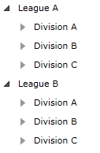
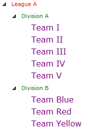

# ItemContainerStyleSelector

The Telerik __RadTreeView__ supports [ItemContainerStyle](). The __ItemContainerStyle__ property gives you the ability to change the treeview items' header. The container created by the __RadTreeView__ for each item in the collection is of type __RadTreeViewItem__.

If you have different items and/or you prefer to display items with different styles, then you should use the __ItemContainerStyleSelector__ property. This tutorial will walk you through the common task of creating and applying __ItemContainerStyleSelector__.

For the purpose of this tutorial will be used the following treeview declaration:

<snippet id='radtreeview-populating-with-data-item-container-style-selector-block_1-xaml' />

The data source class __RadTreeViewSampleData__ assigned to the __RadTreeView__ is covered in greater details in the chapter [Binding to Object]().

## ItemContainerStyleSelector 

The most common use of the "selectors" is to display different kind of data (different kind of items).

If you want to read more about __HierarchicalDataTemplate__ and __DataBinding__, see the main topics about [HierarchicalDataTemplate]() and [ Binding to Object]().

* Create three __styles__ in the resources of your application (user control).
	* __LeagueItemContainerStyle__

		<snippet id='radtreeview-populating-with-data-item-container-style-selector-block_2-xaml' />

	* __DivisionItemContainerStyle__

		<snippet id='radtreeview-populating-with-data-item-container-style-selector-block_3-xaml' />

	* __TeamItemContainerStyle__

		<snippet id='radtreeview-populating-with-data-item-container-style-selector-block_4-xaml' />

	>The style defined for the __ItemContainerStyle__ property should have as __TargetType__  the __RadTreeViewItem__ class.

	These are the three __Styles__, which will be used as item container style. Accordingly, when the object type is League, then the __LeagueItemContainerStyle__ will be applied; when the object type is __Division__, then the __DivisionItemContainerStyle__ will be applied; when the object type is __Team__, then the __TeamItemContainerStyle__ will be applied.

The next step is to create a selector where the logic about selecting the right style will be.

* Create a new class, named __LeagueItemContainerStyleSelector__, which derives from __StyleSelector__.

	>If you create an __ItemTemplateSelector__ or __ItemEditTemplateSelector__, you must derive from the __DataTemplateSelector__ class. But if you want to create __ItemContainerStyleSelector__, you must derive from the __StyleSelector__ class.

	<snippet id='radtreeview-populating-with-data-item-container-style-selector-block_5-cs' />
	<snippet id='radtreeview-populating-with-data-item-container-style-selector-block_6-vb' />

* Override the __SelectStyle__ method and implement your custom logic in it. The method accepts as arguments an __object__ and a __DependencyObject__. The object argument is the actual object being bound and the __DependecyObject__ is the container for it. 

	<snippet id='radtreeview-populating-with-data-item-container-style-selector-block_7-cs' />
	<snippet id='radtreeview-populating-with-data-item-container-style-selector-block_8-vb' />

* Define the created selector as a resource in your XAML and set it to the __ItemContainerStyleSelector__ property. 

	<snippet id='radtreeview-populating-with-data-item-container-style-selector-block_9-xaml' />

	<snippet id='radtreeview-populating-with-data-item-container-style-selector-block_10-xaml' />

## See Also
 * [ItemContainerStyle]()
 * [Styling and Appearance - Overview]()
 * [Styling the Expander]()