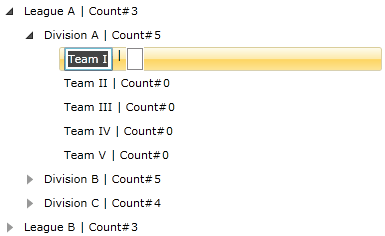

# ItemEditTemplateSelector

Telerik __RadTreeView__ also supports __ItemEditTemplateSelector__. This tutorial will walk you through the common task of creating and applying __ItemEditTemplateSelector__.

If you want to read about __ItemEditTemplate__, see the main topic [ItemEditTemplate]().

## ItemEditTemplateSelector 

The most common use of the "selectors" is to display different kind of data (different kind of items). 

For the purpose of this tutorial will be used the following treeview declaration: 

```XAML
	<UserControl.Resources>
	
	    <sampleData:RadTreeViewSampleData x:Key="DataSource"/>
	
	    <DataTemplate x:Key="Team">
	        <StackPanel Orientation="Horizontal">
	            <TextBlock Text="{Binding TeamName}" Foreground="{Binding TeamColor}"/>
	            <TextBlock Text=" | Count#"/>
	            <TextBlock Text="{Binding Count}"/>
	        </StackPanel>
	    </DataTemplate>
	
	    <HierarchicalDataTemplate x:Key="Division" ItemTemplate="{StaticResource Team}"
	        ItemsSource="{Binding Teams}">
	        <StackPanel Orientation="Horizontal">
	            <TextBlock Text="{Binding DivisionName}" Foreground="{Binding DivisionColor}"/>
	            <TextBlock Text=" | Count#"/>
	            <TextBlock Text="{Binding Count}"/>
	        </StackPanel>
	    </HierarchicalDataTemplate>
	
	    <HierarchicalDataTemplate x:Key="League" ItemTemplate="{StaticResource Division}"
	        ItemsSource="{Binding Divisions}">
	        <StackPanel Orientation="Horizontal">
	            <TextBlock Text="{Binding LeagueName}" Foreground="{Binding LeagueColor}"/>
	            <TextBlock Text=" | Count#"/>
	            <TextBlock Text="{Binding Count}"/>
	        </StackPanel>
	    </HierarchicalDataTemplate>
	
	</UserControl.Resources>
	
	<Grid x:Name="LayoutRoot" Background="White">
	
	    <telerik:RadTreeView x:Name="radTreeView"
	           IsEditable="True" Margin="8"
	           ItemsSource="{Binding Source={StaticResource DataSource}, Path=LeaguesDataSource}"
	           ItemTemplate="{StaticResource League}"/>
	
	</Grid>
```

If you want to read more about __HierarchicalDataTemplate__ and __DataBinding__, see the main topics about [HierarchicalDataTemplate]() and [Binding to Object]().		

* Create three __DataTemplates__ in the resources of your application (user control). These templates will be used by the selector as edit templates.		  

	* __LeagueItemEditTemplate__

		```XAML
			<DataTemplate x:Key="LeagueItemEditTemplate">
				<Grid>
					<StackPanel Orientation="Horizontal">
						<TextBox Text="{Binding LeagueName, Mode=TwoWay}"/>
						<telerik:RadMaskedNumericInput Mask="#" Value="{Binding Count, Mode=OneWay}"/>
					</StackPanel>
				</Grid>
			</DataTemplate>
		```

	* __DivisionItemEditTemplate__

		```XAML
			<DataTemplate x:Key="DivisionItemEditTemplate">
				<Grid>
					<StackPanel Orientation="Horizontal">
						<telerik:RadMaskedNumericInput Mask="#" Value="{Binding Count, Mode=OneWay}"/>
						<TextBox Text="{Binding DivisionName, Mode=TwoWay}"/>
					</StackPanel>
				</Grid>
			</DataTemplate>
		```

	* __TeamItemEditTemplate__

		```XAML
			<DataTemplate x:Key="TeamItemEditTemplate">
				<Grid>
					<StackPanel Orientation="Horizontal">
						<TextBox Text="{Binding TeamName, Mode=TwoWay}"/>
						<TextBlock Text=" | "/>						
						<telerik:RadMaskedNumericInput Mask="#" Value="{Binding Count, Mode=OneWay}"/>
					</StackPanel>
				</Grid>
			</DataTemplate>
		```

	>In order to use the Telerik __RadMaskedNumericInput__ you need to add a reference to the __Telerik.Windows.Controls.Input__ assembly in your user control.
		  

	These are the three __DataTemplates__, which will be used as edit templates. Accordingly, when the object type is League, then the __LeagueItemEditTemplate__ will be applied; when the object type is __Division__, then the __DivisionItemEditTemplate__ will be applied; when the object type is __Team__, then the __TeamItemEditTemplate__ will be applied.

The next step is to create a selector where the logic about selecting the right template will be.

* Create a new class, named __LeagueItemEditTemplateSelector__, which derives from __DataTemplateSelector__.		  

	```C#
		public class LeagueDataTemplateSelector : DataTemplateSelector
		{
		}
	```
	```VB.NET
		Public Class LeagueDataTemplateSelector
			Inherits DataTemplateSelector
		End Class
	```

* Override the __SelectTemplate__ method and implement your custom logic in it. The method accepts as arguments an __object__ and a __DependencyObject__. The object argument is the actual object being bound and the __DependecyObject__ is the container for it.
	
	```XAML
		<UserControl.Resources>
		
			<sampleData:RadTreeViewSampleData x:Key="DataSource"/>
		
			<DataTemplate x:Key="Team">
				<StackPanel Orientation="Horizontal">
					<TextBlock Text="{Binding TeamName}" Foreground="{Binding TeamColor}"/>
					<TextBlock Text=" | Count#"/>
					<TextBlock Text="{Binding Count}"/>
				</StackPanel>
			</DataTemplate>
		
			<HierarchicalDataTemplate x:Key="Division" ItemTemplate="{StaticResource Team}"
				ItemsSource="{Binding Teams}">
				<StackPanel Orientation="Horizontal">
					<TextBlock Text="{Binding DivisionName}" Foreground="{Binding DivisionColor}"/>
					<TextBlock Text=" | Count#"/>
					<TextBlock Text="{Binding Count}"/>
				</StackPanel>
			</HierarchicalDataTemplate>
		
			<HierarchicalDataTemplate x:Key="League" ItemTemplate="{StaticResource Division}"
				ItemsSource="{Binding Divisions}">
				<StackPanel Orientation="Horizontal">
					<TextBlock Text="{Binding LeagueName}" Foreground="{Binding LeagueColor}"/>
					<TextBlock Text=" | Count#"/>
					<TextBlock Text="{Binding Count}"/>
				</StackPanel>
			</HierarchicalDataTemplate>
		
		</UserControl.Resources>
		
		<Grid x:Name="LayoutRoot" Background="White">
		
			<telerik:RadTreeView x:Name="radTreeView"
				   IsEditable="True" Margin="8"
				   ItemsSource="{Binding Source={StaticResource DataSource}, Path=LeaguesDataSource}"
				   ItemTemplate="{StaticResource League}"/>
		
		</Grid>
	```
	
	```C#
		public class LeagueItemEditTemplateSelector : DataTemplateSelector
		{
			private DataTemplate leagueTemplate;
			private DataTemplate divisionTemplate;
			private DataTemplate teamTemplate;
			public override DataTemplate SelectTemplate( object item, DependencyObject container )
			{
				if ( item is League )
					return this.leagueTemplate;
				else if ( item is Division )
					return this.divisionTemplate;
				else if ( item is Team )
					return this.teamTemplate;
				return null;
			}
			public DataTemplate LeagueTemplate
			{
				get
				{
					return leagueTemplate;
				}
				set
				{
					leagueTemplate = value;
				}
			}
			public DataTemplate DivisionTemplate
			{
				get
				{
					return divisionTemplate;
				}
				set
				{
					divisionTemplate = value;
				}
			}
			public DataTemplate TeamTemplate
			{
				get
				{
					return teamTemplate;
				}
				set
				{
					teamTemplate = value;
				}
			}
		}
	```		
	```VB.NET
		Public Class LeagueItemEditTemplateSelector
			Inherits DataTemplateSelector
			Private m_leagueTemplate As DataTemplate
			Private m_divisionTemplate As DataTemplate
			Private m_teamTemplate As DataTemplate
		
			Public Overloads Overrides Function SelectTemplate(ByVal item As Object, ByVal container As DependencyObject) As DataTemplate
				If TypeOf item Is League Then
					Return Me.m_leagueTemplate
				ElseIf TypeOf item Is Division Then
					Return Me.m_divisionTemplate
				ElseIf TypeOf item Is Team Then
					Return Me.m_teamTemplate
				End If
		
				Return Nothing
			End Function
		
			Public Property LeagueTemplate() As DataTemplate
				Get
					Return m_leagueTemplate
				End Get
				Set(ByVal value As DataTemplate)
					m_leagueTemplate = value
				End Set
			End Property
		
			Public Property DivisionTemplate() As DataTemplate
				Get
					Return m_divisionTemplate
				End Get
				Set(ByVal value As DataTemplate)
					m_divisionTemplate = value
				End Set
			End Property
		
			Public Property TeamTemplate() As DataTemplate
				Get
					Return m_teamTemplate
				End Get
				Set(ByVal value As DataTemplate)
					m_teamTemplate = value
				End Set
			End Property
		End Class
	```

* Define the created selector as a resource in your XAML and set it to the __ItemEditTemplateSelector__ property.		  

	```XAML
		<UserControl.Resources>
		
		<sampleData:LeagueItemEditTemplateSelector x:Key="myEditDataTemplateSelector"
			LeagueTemplate="{StaticResource LeagueItemEditTemplate}"
			DivisionTemplate="{StaticResource DivisionItemEditTemplate}"
			TeamTemplate="{StaticResource TeamItemEditTemplate}"/>
		
		</UserControl.Resources>
	```

	```XAML
		<telerik:RadTreeView x:Name="radTreeView"
		   IsEditable="True" Margin="8"
		   ItemsSource="{Binding Source={StaticResource DataSource}, Path=LeaguesDataSource}"
		   ItemTemplate="{StaticResource League}"
		   ItemEditTemplate="{x:Null}"
		   ItemEditTemplateSelector="{StaticResource myEditDataTemplateSelector}"/>
	```

>caution The Telerik RadTreeView provides a default ItemEditTemplate which takes precedence. That's why in order to use ItemEditTemplateSelector, you need to null the ItemEditTemplate. In code this is trivial, in XAML can be done with the following: `ItemEditTemplate="{x:Null}"`

> Don't forget to null the ItemEditTemplate, because otherwise your template selector won't be applied.
		
Here are some snapshots when you edit an object of type League and when you edit an object of type __Team__:




## See Also
 * [ItemEditTemplate]()
 * [ItemTemplate]()
 * [DataBinding - Overview]()