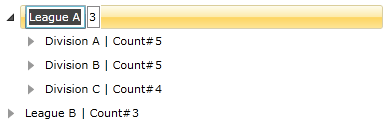
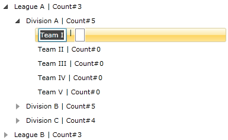

# ItemEditTemplateSelector

Telerik __RadTreeView__ also supports __ItemEditTemplateSelector__. This tutorial will walk you through the common task of creating and applying __ItemEditTemplateSelector__.

If you want to read about __ItemEditTemplate__, see the main topic [ItemEditTemplate]().

## ItemEditTemplateSelector 

The most common use of the "selectors" is to display different kind of data (different kind of items). 

For the purpose of this tutorial will be used the following treeview declaration: 

<snippet id='radtreeview-populating-with-data-item-edit-template-selector-block_1-xaml' />

If you want to read more about __HierarchicalDataTemplate__ and __DataBinding__, see the main topics about [HierarchicalDataTemplate]() and [Binding to Object]().		

* Create three __DataTemplates__ in the resources of your application (user control). These templates will be used by the selector as edit templates.		  

	* __LeagueItemEditTemplate__

		<snippet id='radtreeview-populating-with-data-item-edit-template-selector-block_2-xaml' />

	* __DivisionItemEditTemplate__

		<snippet id='radtreeview-populating-with-data-item-edit-template-selector-block_3-xaml' />

	* __TeamItemEditTemplate__

		<snippet id='radtreeview-populating-with-data-item-edit-template-selector-block_4-xaml' />

	>In order to use the Telerik __RadMaskedNumericInput__ you need to add a reference to the __Telerik.Windows.Controls.Input__ assembly in your user control.
		  

	These are the three __DataTemplates__, which will be used as edit templates. Accordingly, when the object type is League, then the __LeagueItemEditTemplate__ will be applied; when the object type is __Division__, then the __DivisionItemEditTemplate__ will be applied; when the object type is __Team__, then the __TeamItemEditTemplate__ will be applied.

The next step is to create a selector where the logic about selecting the right template will be.

* Create a new class, named __LeagueItemEditTemplateSelector__, which derives from __DataTemplateSelector__.		  

	<snippet id='radtreeview-populating-with-data-item-edit-template-selector-block_5-cs' />
	<snippet id='radtreeview-populating-with-data-item-edit-template-selector-block_6-vb' />

* Override the __SelectTemplate__ method and implement your custom logic in it. The method accepts as arguments an __object__ and a __DependencyObject__. The object argument is the actual object being bound and the __DependecyObject__ is the container for it.
	
	<snippet id='radtreeview-populating-with-data-item-edit-template-selector-block_7-xaml' />
	
	<snippet id='radtreeview-populating-with-data-item-edit-template-selector-block_8-cs' />
	<snippet id='radtreeview-populating-with-data-item-edit-template-selector-block_9-vb' />

* Define the created selector as a resource in your XAML and set it to the __ItemEditTemplateSelector__ property.		  

	<snippet id='radtreeview-populating-with-data-item-edit-template-selector-block_10-xaml' />

	<snippet id='radtreeview-populating-with-data-item-edit-template-selector-block_11-xaml' />

>caution The Telerik RadTreeView provides a default ItemEditTemplate which takes precedence. That's why in order to use ItemEditTemplateSelector, you need to null the ItemEditTemplate. In code this is trivial, in XAML can be done with the following: `ItemEditTemplate="{x:Null}"`

> Don't forget to null the ItemEditTemplate, because otherwise your template selector won't be applied.
		
Here are some snapshots when you edit an object of type League and when you edit an object of type __Team__:

## See Also
 * [ItemEditTemplate]()
 * [ItemTemplate]()
 * [DataBinding - Overview]()