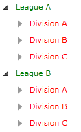

# ItemTemplateSelector

When binding your __RadTreeView__ to a collection, you are able to configure the visualization of the data and the appearance of the __RadTreeViewItems__ via the __ItemTemplate__ and the __ItemTemplateSelectior__ properties.	  

If you want to read about the __ItemTemplate__, see the main topic [ItemTemplate]().

The purpose of this tutorial is to show you how to create and apply an __ItemTemplateSelector__.

## ItemTemplateSelector Property 

The most common use of the "selectors" is to display different kind of data (different kind of items). 

To create your own selector you have to use Visual Studio.

* Create a class and name it __LeagueDataTemplateSelector__. The __LeagueDataTemplateSelector__ must inherit from the __DataTemplateSelector__ class, which is located into __Telerik.Windows.Controls__ assembly.
	
	```C#
		public class LeagueDataTemplateSelector : DataTemplateSelector
		{
		}
	```
	```VB.NET
		Public Class LeagueDataTemplateSelector
			Inherits DataTemplateSelector
		End Class
	```

* Override the __SelectTemplate__ method and implement your custom logic in it. The method accepts as arguments an __object__ and a __DependencyObject__. The object argument is the actual object being bound and the __DependecyObject__ is the container for it.			

	```C#
		private HierarchicalDataTemplate leagueTemplate;
		private HierarchicalDataTemplate divisionTemplate;
		private DataTemplate teamTemplate;
		public LeagueDataTemplateSelector()
		{
		}
		public override DataTemplate SelectTemplate( object item, DependencyObject container )
		{
			if ( item is League )
				return this.leagueTemplate;
			else if ( item is Division )
				return this.divisionTemplate;
			else if ( item is Team )
				return this.teamTemplate;
			return null;
		}
		public HierarchicalDataTemplate LeagueTemplate
		{
			get
			{
				return this.leagueTemplate;
			}
			set
			{
				this.leagueTemplate = value;
			}
		}
		public HierarchicalDataTemplate DivisionTemplate
		{
			get
			{
				return this.divisionTemplate;
			}
			set
			{
				this.divisionTemplate = value;
			}
		}
		public DataTemplate TeamTemplate
		{
			get
			{
				return teamTemplate;
			}
			set
			{
				this.teamTemplate = value;
			}
		}
	```
	```VB.NET
			Private leagueTemplate As HierarchicalDataTemplate
			Private divisionTemplate As HierarchicalDataTemplate
		Private teamTemplate As DataTemplate
		Public Sub New()
		End Sub
		Public Overloads Overrides Function SelectTemplate(ByVal item As Object, ByVal container As DependencyObject) As DataTemplate
			If TypeOf item Is League Then
				Return Me.leagueTemplate
			ElseIf TypeOf item Is Division Then
				Return Me.divisionTemplate
			ElseIf TypeOf item Is Team Then
				Return Me.teamTemplate
				End If
		
			Return Nothing
		End Function
			Public Property LeagueTemplate() As HierarchicalDataTemplate
				Get
					Return Me.leagueTemplate
				End Get
				Set(ByVal value As HierarchicalDataTemplate)
					Me.leagueTemplate = value
				End Set
			End Property
			Public Property DivisionTemplate() As HierarchicalDataTemplate
				Get
					Return Me.divisionTemplate
				End Get
				Set(ByVal value As HierarchicalDataTemplate)
					Me.divisionTemplate = value
				End Set
			End Property
		Public Property TeamTemplate() As DataTemplate
			Get
				Return teamTemplate
			End Get
			Set(ByVal value As DataTemplate)
				Me.teamTemplate = value
			End Set
		End Property
	```
	
	> Please note that in order to use the __HierarchicalDataTemplate__ class, you need to add a using for the __System.Windows__ namespace.	

* Define the created selector as a resource in your XAML and set it to the __ItemTemplateSelector__ property.

	```XAML
		<UserControl.Resources>
			<sampleData:RadTreeViewSampleData x:Key="DataSource"/>
		
			<DataTemplate x:Key="Team">
				<TextBlock Text="{Binding TeamName}" Foreground="{Binding TeamColor}"/>
			</DataTemplate>
		
			<HierarchicalDataTemplate x:Key="Division" ItemsSource="{Binding Teams}">
				<TextBlock Text="{Binding DivisionName}" Foreground="{Binding DivisionColor}"/>
			</HierarchicalDataTemplate>
		
			<HierarchicalDataTemplate x:Key="League" ItemsSource="{Binding Divisions}">
				<TextBlock Text="{Binding LeagueName}" Foreground="{Binding LeagueColor}" />
			</HierarchicalDataTemplate>
		
			<example:LeagueDataTemplateSelector x:Key="myDataTemplateSelector"
				LeagueTemplate="{StaticResource League}"
				DivisionTemplate="{StaticResource Division}"
				TeamTemplate="{StaticResource Team}"/>
		
		</UserControl.Resources>
		<Grid x:Name="LayoutRoot" Background="White">
		
			<telerik:RadTreeView x:Name="radTreeView"
			   ItemsSource="{Binding Source={StaticResource DataSource}, Path=LeaguesDataSource}"
			   ItemTemplateSelector="{StaticResource myDataTemplateSelector}"/>
		
		</Grid>
	```

	The data source class __RadTreeViewSampleData__ assigned to the __RadTreeView__ is covered in greater details in the chapter [Binding to Object]().

	```XAML
		<telerik:RadTreeView
		   ItemsSource="{Binding Source={StaticResource DataSource}, Path=LeaguesDataSource}"
		   ItemTemplateSelector="{StaticResource myDataTemplateSelector}" />
	```

And the result of the demo can be seen on the next figure: 


## See Also
 * [ItemTemplate]()
 * [ItemEditTemplate]()
 * [DataBinding - Overview]()