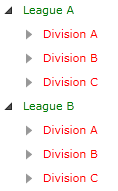

# ItemTemplateSelector

When binding your __RadTreeView__ to a collection, you are able to configure the visualization of the data and the appearance of the __RadTreeViewItems__ via the __ItemTemplate__ and the __ItemTemplateSelectior__ properties.	  

If you want to read about the __ItemTemplate__, see the main topic [ItemTemplate]().

The purpose of this tutorial is to show you how to create and apply an __ItemTemplateSelector__.

## ItemTemplateSelector Property 

The most common use of the "selectors" is to display different kind of data (different kind of items). 

To create your own selector you have to use Visual Studio.

* Create a class and name it __LeagueDataTemplateSelector__. The __LeagueDataTemplateSelector__ must inherit from the __DataTemplateSelector__ class, which is located into __Telerik.Windows.Controls__ assembly.
	
	<snippet id='radtreeview-populating-with-data-item-template-selector-block_1-cs' />
	<snippet id='radtreeview-populating-with-data-item-template-selector-block_2-vb' />

* Override the __SelectTemplate__ method and implement your custom logic in it. The method accepts as arguments an __object__ and a __DependencyObject__. The object argument is the actual object being bound and the __DependecyObject__ is the container for it.			

	<snippet id='radtreeview-populating-with-data-item-template-selector-block_3-cs' />
	<snippet id='radtreeview-populating-with-data-item-template-selector-block_4-vb' />
	
	> Please note that in order to use the __HierarchicalDataTemplate__ class, you need to add a using for the __System.Windows__ namespace.	

* Define the created selector as a resource in your XAML and set it to the __ItemTemplateSelector__ property.

	<snippet id='radtreeview-populating-with-data-item-template-selector-block_5-xaml' />

	The data source class __RadTreeViewSampleData__ assigned to the __RadTreeView__ is covered in greater details in the chapter [Binding to Object]().

	<snippet id='radtreeview-populating-with-data-item-template-selector-block_6-xaml' />

And the result of the demo can be seen on the next figure: 

## See Also
 * [ItemTemplate]()
 * [ItemEditTemplate]()
 * [DataBinding - Overview]()