# ItemTemplate

When binding your __RadTreeView__ to a collection, you are able to configure the visualization of the data and the appearance of the __RadTreeViewItems__ via the __ItemTemplate__ and the __ItemTemplateSelector__ properties. 

If you want to read about the __ItemTemplateSelector__, see the main topic [ItemTemplateSelector]().

Since the most common scenario is to display hierarchical data with the __RadTreeView__, this tutorial will show you how to create __HierarchicalDataTemplate__ and set it to the __ItemTemplate__ property of the treeview using the Expression Blend.

The final result should look like the snapshot below:
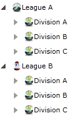

* Create a new Silverlight application and perform the following steps: 
	* Add a __RadTreeView__ in your XAML. 
	* Create two empty hierarchical data templates and one empty data template in your application resources as it is shown in the XAML below: 
	
		
		#### __XAML__

		```XAML
			<UserControl.Resources>
			
				<DataTemplate x:Key="Team">
					<Grid>
					</Grid>
				</DataTemplate>
			
				<telerik:HierarchicalDataTemplate x:Key="Division">
					<Grid>
					</Grid>
				</telerik:HierarchicalDataTemplate>
			
				<telerik:HierarchicalDataTemplate x:Key="League">
					<Grid>
					</Grid>
				</telerik:HierarchicalDataTemplate>
			
			</UserControl.Resources>
			
			<Grid x:Name="LayoutRoot" Background="White">
				<telerik:RadTreeView x:Name="radTreeView" Margin="8"/>
			</Grid>
			```

		
		

		#### __XAML__

		```XAML
			<UserControl.Resources>
			
				<DataTemplate x:Key="Team">
					<Grid>
					</Grid>
				</DataTemplate>
			
				<HierarchicalDataTemplate x:Key="Division">
					<Grid>
					</Grid>
				</HierarchicalDataTemplate>
			
				<HierarchicalDataTemplate x:Key="League">
					<Grid>
					</Grid>
				</HierarchicalDataTemplate>
			
			</UserControl.Resources>
			
			<Grid x:Name="LayoutRoot" Background="White">
				<telerik:RadTreeView x:Name="radTreeView" Margin="8"/>
			</Grid>
			```

		

* Open your page in Expression Blend.

	In the __Resources__ window (Window->Resources), in the context of your control you will see the three templates which were declared directly in the XAML on the previous step. 
	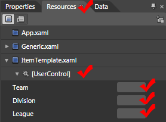

* Press the "__Edit resource__" button (located next to each template) for the __League__ template. This will open the current template for edit. Drag and drop the controls you need for the template and configure their properties. In the example are used an __Image__ and a __TextBlock__ controls: 
	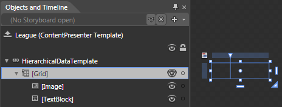

	#### __XAML__

	```XAML
		<telerik:HierarchicalDataTemplate x:Key="League">
			<Grid d:DesignWidth="93" d:DesignHeight="26">
			 <Grid.ColumnDefinitions>
			  <ColumnDefinition Width="0.323"/>
			  <ColumnDefinition Width="0.677"/>
			 </Grid.ColumnDefinitions>
			 <Image Stretch="None"/>
			 <TextBlock Margin="0" Grid.Column="1" TextWrapping="Wrap"/>
			</Grid>
		</telerik:HierarchicalDataTemplate>
		```

	

	#### __XAML__

	```XAML
		<HierarchicalDataTemplate x:Key="League" ItemsSource="{Binding Divisions, Mode=OneWay}"
				ItemTemplate="{StaticResource Division}">
			<Grid d:DesignWidth="93" d:DesignHeight="26">
			 <Grid.ColumnDefinitions>
			  <ColumnDefinition Width="0.323*"/>
			  <ColumnDefinition Width="0.677*"/>
			 </Grid.ColumnDefinitions>
			 <Image Source="{Binding ImageUrl, Mode=OneWay}"/>
			 <TextBlock Margin="0" Grid.Column="1" TextWrapping="Wrap" Text="{Binding Name, Mode=OneWay}"/>
			</Grid>
		</HierarchicalDataTemplate>
		```

	

	To configure the binding for the __Source__ property of the __Image control__, select it in the "__Object and Timeline__" pane. 

	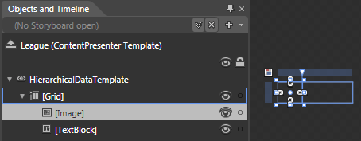

	Go to the "__Properties__" pane and find the __Source__ property in the __Common properties__ section. 
	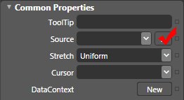

	Click the empty square that's on the right of it to open the context menu for the property and choose DataBinding to open the __"Create Data Binding"__ dialog
	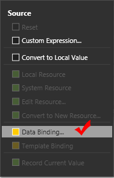

	In the  __"Create Data Binding"__ dialog choose the __Explicit DataContext__ tab and check the __"Use custom path expression"__ box. In the field write the name of the property you would like to bind to. Click __"Finish"__. 
	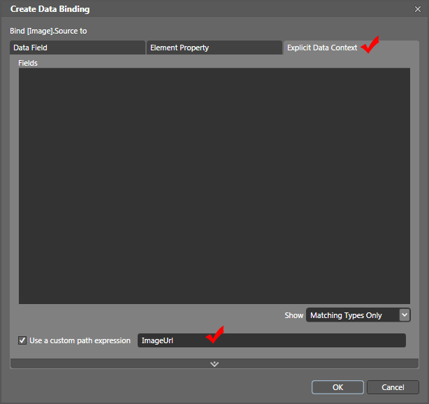

	Do the same for the __Text__ property of the __TextBlock__.

	Finally, in the "__Object and Timeline__" pane, select the __HierarchicalDataTemplate:__
	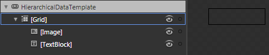

	Find and set the following properties in the "__Properties__" pane:
	
	* __ItemsSource__
	
		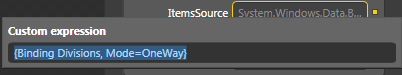
	* __ItemTemplate__
		
		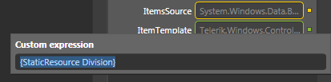

	Here is the result XAML for the __League__ data template:
	
	
	#### __XAML__

	```XAML
		<telerik:HierarchicalDataTemplate x:Key="League" ItemsSource="{Binding Divisions, Mode=OneWay}"
				ItemTemplate="{StaticResource Division}">
			<Grid d:DesignWidth="93" d:DesignHeight="26">
			 <Grid.ColumnDefinitions>
			  <ColumnDefinition Width="0.323"/>
			  <ColumnDefinition Width="0.677"/>
			 </Grid.ColumnDefinitions>
			 <Image Source="{Binding ImageUrl, Mode=OneWay}"/>
			 <TextBlock Margin="0" Grid.Column="1" TextWrapping="Wrap" Text="{Binding Name, Mode=OneWay}"/>
			</Grid>
		</telerik:HierarchicalDataTemplate>
		```

	
	

	#### __XAML__

	```XAML
		<HierarchicalDataTemplate x:Key="League" ItemsSource="{Binding Divisions, Mode=OneWay}"
				ItemTemplate="{StaticResource Division}">
			<Grid d:DesignWidth="93" d:DesignHeight="26">
			 <Grid.ColumnDefinitions>
			  <ColumnDefinition Width="0.323"/>
			  <ColumnDefinition Width="0.677"/>
			 </Grid.ColumnDefinitions>
			 <Image Source="{Binding ImageUrl, Mode=OneWay}"/>
			 <TextBlock Margin="0" Grid.Column="1" TextWrapping="Wrap" Text="{Binding Name, Mode=OneWay}"/>
			</Grid>
		</HierarchicalDataTemplate>
		```

	

* Perform the same steps for the other two templates - __Division__ and __Team__. 

* The final step is to select your treeview and to set the __ItemTemplate__ property:
	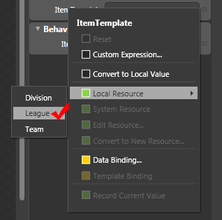

Here is the final XAML: 


#### __XAML__

```XAML
	<UserControl.Resources>
	    <sampleData:RadTreeViewSampleData x:Key="DataSource"/>
	
	    <DataTemplate x:Key="Team">
	       <Grid>
	            <Grid.ColumnDefinitions>
	                <ColumnDefinition Width="0.323"/>
	                <ColumnDefinition Width="0.677"/>
	            </Grid.ColumnDefinitions>
	            <Image Source="{Binding ImageUrl, Mode=OneWay}" Width="16" Height="16"/>
	            <TextBlock Margin="0" Grid.Column="1" TextWrapping="Wrap" Text="{Binding Name, Mode=OneWay}"/>
	        </Grid>
	    </DataTemplate>
	
	    <telerik:HierarchicalDataTemplate x:Key="Division"
	        ItemsSource="{Binding Teams, Mode=OneWay}"
	        ItemTemplate="{StaticResource Team}">
	        <Grid>
	            <Grid.ColumnDefinitions>
	                <ColumnDefinition Width="0.323"/>
	                <ColumnDefinition Width="0.677"/>
	            </Grid.ColumnDefinitions>
	            <Image Source="{Binding ImageUrl, Mode=OneWay}" Width="16" Height="16"/>
	            <TextBlock Margin="0" Grid.Column="1" TextWrapping="Wrap" Text="{Binding Name, Mode=OneWay}"/>
	        </Grid>
	    </telerik:HierarchicalDataTemplate>
	    <telerik:HierarchicalDataTemplate x:Key="League" 
	        ItemsSource="{Binding Divisions, Mode=OneWay}"
	        ItemTemplate="{StaticResource Division}">
	        <Grid>
	            <Grid.ColumnDefinitions>
	                <ColumnDefinition Width="0.323"/>
	                <ColumnDefinition Width="0.677"/>
	            </Grid.ColumnDefinitions>
	            <Image Source="{Binding ImageUrl, Mode=OneWay}" Width="16" Height="16"/>
	            <TextBlock Margin="0" Grid.Column="1" TextWrapping="Wrap" Text="{Binding Name, Mode=OneWay}"/>
	        </Grid>
	    </telerik:HierarchicalDataTemplate>
	</UserControl.Resources>
	<Grid x:Name="LayoutRoot" Background="White">
	    <telerik:RadTreeView x:Name="radTreeView" Margin="8"
	       ItemsSource="{Binding Source={StaticResource DataSource}, Path=LeaguesDataSource}"
	       ItemTemplate="{StaticResource League}" />
	</Grid>
	```




#### __XAML__

```XAML
	<UserControl.Resources>
	    <sampleData:RadTreeViewSampleData x:Key="DataSource"/>
	
	    <DataTemplate x:Key="Team">
	       <Grid>
	            <Grid.ColumnDefinitions>
	                <ColumnDefinition Width="0.323"/>
	                <ColumnDefinition Width="0.677"/>
	            </Grid.ColumnDefinitions>
	            <Image Source="{Binding ImageUrl, Mode=OneWay}" Width="16" Height="16"/>
	            <TextBlock Margin="0" Grid.Column="1" TextWrapping="Wrap" Text="{Binding Name, Mode=OneWay}"/>
	        </Grid>
	    </DataTemplate>
	
	    <HierarchicalDataTemplate x:Key="Division"
	        ItemsSource="{Binding Teams, Mode=OneWay}"
	        ItemTemplate="{StaticResource Team}">
	        <Grid>
	            <Grid.ColumnDefinitions>
	                <ColumnDefinition Width="0.323"/>
	                <ColumnDefinition Width="0.677"/>
	            </Grid.ColumnDefinitions>
	            <Image Source="{Binding ImageUrl, Mode=OneWay}" Width="16" Height="16"/>
	            <TextBlock Margin="0" Grid.Column="1" TextWrapping="Wrap" Text="{Binding Name, Mode=OneWay}"/>
	        </Grid>
	    </HierarchicalDataTemplate>
	    <HierarchicalDataTemplate x:Key="League" 
	        ItemsSource="{Binding Divisions, Mode=OneWay}"
	        ItemTemplate="{StaticResource Division}">
	        <Grid>
	            <Grid.ColumnDefinitions>
	                <ColumnDefinition Width="0.323"/>
	                <ColumnDefinition Width="0.677"/>
	            </Grid.ColumnDefinitions>
	            <Image Source="{Binding ImageUrl, Mode=OneWay}" Width="16" Height="16"/>
	            <TextBlock Margin="0" Grid.Column="1" TextWrapping="Wrap" Text="{Binding Name, Mode=OneWay}"/>
	        </Grid>
	    </HierarchicalDataTemplate>
	</UserControl.Resources>
	<Grid x:Name="LayoutRoot" Background="White">
	    <telerik:RadTreeView x:Name="radTreeView" Margin="8"
	       ItemsSource="{Binding Source={StaticResource DataSource}, Path=LeaguesDataSource}"
	       ItemTemplate="{StaticResource League}" />
	</Grid>
	```



The data source class __RadTreeViewSampleData__ assigned to the __RadTreeView__ is covered in greater details in the chapter [Binding to Object]().

## See Also
 * [ItemTemplateSelector]()
 * [ItemEditTemplate]()
 * [Hierarchical Data Templates]()
 * [DataBinding - Overview]()
