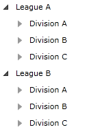
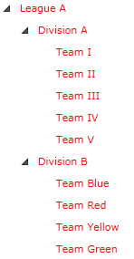

# ItemContainerStyle

The Telerik RadTreeView supports styling its RadTreeViewItem elements. 

To style the items you can use the __ItemContainerStyle__ property of RadTreeView. The container created by the __RadTreeView__ for each item in the collection is of type __RadTreeViewItem__. The style defined for the ItemContainerStyle property should have the __RadTreeViewItem__ class as __TargetType__.


__Example 1: RadTreeView definition__  
```XAML
	<UserControl.Resources>	
	    <sampleData:RadTreeViewSampleData x:Key="DataSource"/>	
	    <DataTemplate x:Key="Team">
	        <TextBlock Text="{Binding Name}" />
	    </DataTemplate>	
	    <telerik:HierarchicalDataTemplate x:Key="Division" ItemTemplate="{StaticResource Team}"
	       ItemsSource="{Binding Teams}">
	        <TextBlock Text="{Binding Name}" />
	    </telerik:HierarchicalDataTemplate>	
	    <telerik:HierarchicalDataTemplate x:Key="League" ItemTemplate="{StaticResource Division}"
	       ItemsSource="{Binding Divisions}">
	        <TextBlock Text="{Binding Name}" />
	    </telerik:HierarchicalDataTemplate>	
	</UserControl.Resources>
	
	<Grid x:Name="LayoutRoot" Background="White">	
	    <telerik:RadTreeView x:Name="radTreeView"
	       ItemsSource="{Binding Source={StaticResource DataSource}, Path=LeaguesDataSource}"
	       ItemTemplate="{StaticResource League}"/>	
	</Grid>
```  

__Example 1: RadTreeView definition__  
```XAML
	<UserControl.Resources>	
	    <sampleData:RadTreeViewSampleData x:Key="DataSource"/>	
	    <DataTemplate x:Key="Team">
	        <TextBlock Text="{Binding Name}" />
	    </DataTemplate>	
	    <HierarchicalDataTemplate x:Key="Division" ItemTemplate="{StaticResource Team}"
	       ItemsSource="{Binding Teams}">
	        <TextBlock Text="{Binding Name}" />
	    </HierarchicalDataTemplate>	
	    <HierarchicalDataTemplate x:Key="League" ItemTemplate="{StaticResource Division}"
	       ItemsSource="{Binding Divisions}">
	        <TextBlock Text="{Binding Name}" />
	    </HierarchicalDataTemplate>	
	</UserControl.Resources>
	
	<Grid x:Name="LayoutRoot" Background="White">	
	    <telerik:RadTreeView x:Name="radTreeView"
	       ItemsSource="{Binding Source={StaticResource DataSource}, Path=LeaguesDataSource}"
	       ItemTemplate="{StaticResource League}"/>	
	</Grid>
```


The data source class __RadTreeViewSampleData__ assigned to the __RadTreeView__ is covered in greater details in the chapter [Binding to Object]().

#### __Figure 1: Result from Example 1__


>tip Defining the style in the resources of the control or in the resources of the application makes it reusable.

## ItemContainerStyle Definition

__Example 2__ demonstrates how to create an ItemContainerStyle, which sets the Foreground and IsExpanded properties of the items. 

__Example 2: ItemContainerStyle Definition__  
```XAML
 	<!-- If you are using the NoXaml binaries, you will have to base the style on the default one for the theme like so: 
	<Style x:Key="myItemContainerStyle" TargetType="telerik:RadTreeViewItem" BasedOn="{StaticResource RadTreeViewItemStyle}">-->

	<Style x:Key="myItemContainerStyle" TargetType="telerik:RadTreeViewItem">
	    <Setter Property="Foreground" Value="Red"/>
	    <Setter Property="IsExpanded" Value="True"/>
	</Style>
```

__Example 3: Setting the ItemContainerStyle property__  
```XAML
	<telerik:RadTreeView x:Name="radTreeView"
	   ItemsSource="{Binding Source={StaticResource DataSource}, Path=LeaguesDataSource}"
	   ItemTemplate="{StaticResource League}"
	   ItemContainerStyle="{StaticResource myItemContainerStyle}"/>
```

#### __Figure 2: Result from Example 3__


>When using __ItemContainerStyle__ with static items, it will get applied only to the direct children of the __RadTreeView__ - the top-level items. If you want their child items to have the same style, you have to manually set the __ItemContainerStyle__ property of the __RadTreeViewItems__.

<!-- -->

>When using the __ItemContainerStyle__ with dynamic items, its value gets inherited through the hierarchy thanks to the __HierarchicalDataTemplate__. You are free to break the inheritance, when needed, by using multiple nested __HierarchicalDataTemplates__ and by setting the __ItemContainerStyle__ property of each of them.

<!-- -->

> If you have different items and/or you prefer to display items with different styles, you can use the [ItemContainerStyleSelector]() property of RadTreeView.

>The __ItemContainerStyle setting is overridden__ by the StyleManager's applied theme in case the theme is set to the RadTreeView control using the __StyleManager.Theme__ attached property. To use a theme different than the default one and ItemContainerStyle you can use the the [Implicit Styles theming]() mechanism.

## See Also
 * [ItemContainerStyleSelector]()
 * [Styling and Appearance - Overview]()
 * [Styling the Expander]()