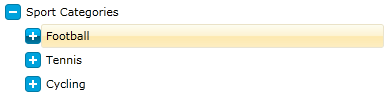
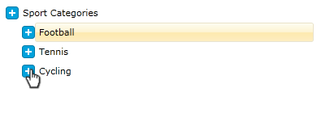

# Styling the Expander

If you need to change the icon that is used to expand an item, you can use the __ExpanderStyle__ property of the __RadTreeView__. The icon is a __ToggleButton__, so any style that can be applied to a ToggleButton can be applied to the icon too.

This tutorial will walk you through the common task of styling an expander.

On the snapshot below you can see how the final result will look like:


For  the purpose of the following tutorial I will use the following treeview declaration: 

```XAML
	<telerik:RadTreeView Margin="8" x:Name="radTreeView">
	    <telerik:RadTreeViewItem Header="Sport Categories">
	        <telerik:RadTreeViewItem Header="Football">
	            <telerik:RadTreeViewItem Header="Futsal"/>
	            <telerik:RadTreeViewItem Header="Soccer"/>
	        </telerik:RadTreeViewItem>
	        <telerik:RadTreeViewItem Header="Tennis">
	            <telerik:RadTreeViewItem Header="Table Tennis"/>
	        </telerik:RadTreeViewItem>
	        <telerik:RadTreeViewItem Header="Cycling">
	            <telerik:RadTreeViewItem Header="Road Cycling"/>
	            <telerik:RadTreeViewItem Header="Indoor Cycling"/>
	            <telerik:RadTreeViewItem Header="Mountain Bike"/>
	        </telerik:RadTreeViewItem>
	    </telerik:RadTreeViewItem>
	</telerik:RadTreeView>
```


* Since the expander is a toggle button we need to create a style with __TargetType__ - __ToggleButton__.			  

	Declare a new style in your application (user control) resources and set the following common properties:
	* Set the __IsEnabled__ property to __True__;
	* Set the __IsTabStop__ property to __False__;

* Change the cursor to be __Hand__

	```XAML
		<Style x:Key="ExpanderStyle" TargetType="ToggleButton">
			<Setter Property="IsEnabled" Value="True" />
			<Setter Property="IsTabStop" Value="False" />
			<Setter Property="Cursor" Value="Hand"/>
		</Style>
	```

* Next, we need to change the __Template__ property of the __ToggleButton__ (Expander). Add the following elements to your Template:			

	```XAML
		<Style x:Key="ExpanderStyle" TargetType="{x:Type ToggleButton}">
			<Setter Property="IsEnabled" Value="True" />
			<Setter Property="IsTabStop" Value="False" />
			<Setter Property="Cursor" Value="Hand"/>
			<Setter Property="Template">
				<Setter.Value>
					<ControlTemplate TargetType="{x:Type ToggleButton}">
						<Grid x:Name="Button" Margin="0,4,0,0" HorizontalAlignment="Right"
									   VerticalAlignment="Top" Width="16" Height="16">
							<Rectangle Stroke="#FF027BA6" HorizontalAlignment="Stretch"
										   VerticalAlignment="Stretch" Width="Auto" Height="Auto"
										   RadiusX="3" RadiusY="3" Fill="#FF00A2DC">
							</Rectangle>
							<Rectangle x:Name="CollapsedVisual" HorizontalAlignment="Left"
										   VerticalAlignment="Top" Width="2" Height="8" RadiusX="0"
										   RadiusY="0" Fill="#FFFFFFFF" Margin="7,4,0,0" />
							<Rectangle RadiusX="0" RadiusY="0" Fill="#FFFFFFFF"
										   HorizontalAlignment="Left" Margin="4,7,0,0"
										   VerticalAlignment="Top" Width="8" Height="2" />
						</Grid>
					</ControlTemplate>
				</Setter.Value>
			</Setter>
		</Style>
	```

* Set the __ExpanderStyle__ property of your treeview:

	```XAML
		<telerik:RadTreeView Margin="8" x:Name="radTreeView"
			ExpanderStyle="{StaticResource ExpanderStyle}">
			<telerik:RadTreeViewItem Header="Sport Categories">
				<telerik:RadTreeViewItem Header="Football">
					<telerik:RadTreeViewItem Header="Futsal"/>
					<telerik:RadTreeViewItem Header="Soccer"/>
				</telerik:RadTreeViewItem>
				<telerik:RadTreeViewItem Header="Tennis">
					<telerik:RadTreeViewItem Header="Table Tennis"/>
				</telerik:RadTreeViewItem>
				<telerik:RadTreeViewItem Header="Cycling">
					<telerik:RadTreeViewItem Header="Road Cycling"/>
					<telerik:RadTreeViewItem Header="Indoor Cycling"/>
					<telerik:RadTreeViewItem Header="Mountain Bike"/>
				</telerik:RadTreeViewItem>
			</telerik:RadTreeViewItem>
		</telerik:RadTreeView>
	```

	As you can see from the next figure, the expander of the treeview is changed: 
	

* We are one more step closer to the final result. Next we should add some visual effects. For that purpose add the following elements to your expander template:

	```XAML
		<Style x:Key="ExpanderStyle" TargetType="{x:Type ToggleButton}">
			<Setter Property="IsEnabled" Value="True" />
			<Setter Property="IsTabStop" Value="False" />
			<Setter Property="Cursor" Value="Hand"/>
			<Setter Property="Template">
				<Setter.Value>
					<ControlTemplate TargetType="{x:Type ToggleButton}">
						<Grid>
							<Grid x:Name="ButtonOver" Opacity="0" Margin="0,4,0,0"
									   HorizontalAlignment="Right" VerticalAlignment="Top"
									   Width="16" Height="16">
								<Rectangle Stroke="#FF027BA6" HorizontalAlignment="Stretch"
										   VerticalAlignment="Stretch" Width="Auto" Height="Auto"
										   RadiusX="3" RadiusY="3">
									<Rectangle.Fill>
										<LinearGradientBrush EndPoint="0.5,1" StartPoint="0.5,0">
											<GradientStop Color="#FF00BCFF" Offset="0" />
											<GradientStop Color="#FF027BA6" Offset="1" />
											<GradientStop Color="#FF00A5E0" Offset="0.5" />
											<GradientStop Color="#FF005674" Offset="0.501" />
										</LinearGradientBrush>
									</Rectangle.Fill>
								</Rectangle>
								<Rectangle x:Name="CollapsedVisualOver"
										   HorizontalAlignment="Left" VerticalAlignment="Top"
										   Width="2" Height="8" RadiusX="0" RadiusY="0"
										   Fill="#FFFFFFFF" Margin="7,4,0,0" />
								<Rectangle RadiusX="0" RadiusY="0" Fill="#FFFFFFFF"
										   HorizontalAlignment="Left" VerticalAlignment="Top"
										   Width="8" Height="2" Margin="4,7,0,0" />
							</Grid>
							<Grid x:Name="Button" Margin="0,4,0,0" HorizontalAlignment="Right"
							   VerticalAlignment="Top" Width="16" Height="16">
								<Rectangle Stroke="#FF027BA6" HorizontalAlignment="Stretch"
								   VerticalAlignment="Stretch" Width="Auto" Height="Auto"
								   RadiusX="3" RadiusY="3" Fill="#FF00A2DC">
								</Rectangle>
								<Rectangle x:Name="CollapsedVisual" HorizontalAlignment="Left"
								   VerticalAlignment="Top" Width="2" Height="8" RadiusX="0"
								   RadiusY="0" Fill="#FFFFFFFF" Margin="7,4,0,0" />
								<Rectangle RadiusX="0" RadiusY="0" Fill="#FFFFFFFF"
								   HorizontalAlignment="Left" Margin="4,7,0,0"
								   VerticalAlignment="Top" Width="8" Height="2" />
							</Grid>
						</Grid>
					</ControlTemplate>
				</Setter.Value>
			</Setter>
		</Style>
	```

	The __ButtonOver__ grid will be animated when the mouse is position over the expander.		  

* You should add two __Triggers__ to the ControlTemplate's Triggers Collection. The first one is activated when the mouse is over the expander, and the second one is activated when the __ToggleButton__ is checked:

	```XAML
		<ControlTemplate.Triggers>
			<Trigger Property="IsMouseOver" Value="True">
				<Trigger.EnterActions>
					<BeginStoryboard>
						<Storyboard>
						</Storyboard>
					</BeginStoryboard>
				</Trigger.EnterActions>
				<Trigger.ExitActions>
					<BeginStoryboard>
						<Storyboard>
						</Storyboard>
					</BeginStoryboard>
				</Trigger.ExitActions>
			</Trigger>
			<Trigger Property="IsChecked" Value="True">
				<Trigger.EnterActions>
					<BeginStoryboard>
						<Storyboard>
						</Storyboard>
					</BeginStoryboard>
				</Trigger.EnterActions>
				<Trigger.ExitActions>
					<BeginStoryboard>
						<Storyboard>
						</Storyboard>
					</BeginStoryboard>
				</Trigger.ExitActions>
			</Trigger>
		</ControlTemplate.Triggers>
	```

	When the mouse is over the expander the "ButtonOver" element must be visualized (set its Opacity property to 1), while the "Button" element must be hidden (set its Opacity property to 0). Respectively, when the mouse leaves the expander area, then the opposite operations must be performed. Here is how the "EnterActions" and "ExitActions" for the __IsMouseOver__  trigger should look like:
			  
	```XAML
		<Trigger Property="IsMouseOver" Value="True">
			<Trigger.EnterActions>
				<BeginStoryboard>
					<Storyboard>
						<DoubleAnimation Storyboard.TargetName="ButtonOver" Storyboard.TargetProperty="(UIElement.Opacity)" To="1"/>
						<DoubleAnimation Storyboard.TargetName="Button" Storyboard.TargetProperty="(UIElement.Opacity)" To="0"/>
					</Storyboard>
				</BeginStoryboard>
			</Trigger.EnterActions>
			<Trigger.ExitActions>
				<BeginStoryboard>
					<Storyboard>
						<DoubleAnimation Storyboard.TargetName="ButtonOver" Storyboard.TargetProperty="(UIElement.Opacity)" To="0"/>
						<DoubleAnimation Storyboard.TargetName="Button" Storyboard.TargetProperty="(UIElement.Opacity)" To="1"/>
					</Storyboard>
				</BeginStoryboard>
			</Trigger.ExitActions>
		</Trigger>
	```

	When the __ToggleButton__ is checked, then the "CollapseVisualOver" and "CollapseVisual" elements must be hidden (set their Opacity property to 0). When the ToggleButton is __checked__, then the both elements must be visualized (set their Opacity property to 1). Here is how the "EnterActions" and "ExitActions" for the __IsChecked__ trigger should look like:

	```XAML
		<Trigger Property="IsChecked" Value="True">
			<Trigger.EnterActions>
				<BeginStoryboard>
					<Storyboard>
						<DoubleAnimation Storyboard.TargetName="CollapsedVisualOver" Storyboard.TargetProperty="(UIElement.Opacity)" To="0"/>
						<DoubleAnimation Storyboard.TargetName="CollapsedVisual" Storyboard.TargetProperty="(UIElement.Opacity)" To="0"/>
					</Storyboard>
				</BeginStoryboard>
			</Trigger.EnterActions>
			<Trigger.ExitActions>
				<BeginStoryboard>
					<Storyboard>
						<DoubleAnimation Storyboard.TargetName="CollapsedVisualOver" Storyboard.TargetProperty="(UIElement.Opacity)" To="1"/>
						<DoubleAnimation Storyboard.TargetName="CollapsedVisual" Storyboard.TargetProperty="(UIElement.Opacity)" To="1"/>
					</Storyboard>
				</BeginStoryboard>
			</Trigger.ExitActions>
		</Trigger>
	```

And here is the complete XAML for the "ControlTemplate.Triggers" section:

```XAML
	<ControlTemplate.Triggers>
	    <Trigger Property="IsMouseOver" Value="True">
	        <Trigger.EnterActions>
	            <BeginStoryboard>
	                <Storyboard>
	                    <DoubleAnimation Storyboard.TargetName="ButtonOver" Storyboard.TargetProperty="(UIElement.Opacity)" To="1"/>
	                    <DoubleAnimation Storyboard.TargetName="Button" Storyboard.TargetProperty="(UIElement.Opacity)" To="0"/>
	                </Storyboard>
	            </BeginStoryboard>
	        </Trigger.EnterActions>
	        <Trigger.ExitActions>
	            <BeginStoryboard>
	                <Storyboard>
	                    <DoubleAnimation Storyboard.TargetName="ButtonOver" Storyboard.TargetProperty="(UIElement.Opacity)" To="0"/>
	                    <DoubleAnimation Storyboard.TargetName="Button" Storyboard.TargetProperty="(UIElement.Opacity)" To="1"/>
	                </Storyboard>
	            </BeginStoryboard>
	        </Trigger.ExitActions>
	    </Trigger>
	    <Trigger Property="IsChecked" Value="True">
	        <Trigger.EnterActions>
	            <BeginStoryboard>
	                <Storyboard>
	                    <DoubleAnimation Storyboard.TargetName="CollapsedVisualOver" Storyboard.TargetProperty="(UIElement.Opacity)" To="0"/>
	                    <DoubleAnimation Storyboard.TargetName="CollapsedVisual" Storyboard.TargetProperty="(UIElement.Opacity)" To="0"/>
	                </Storyboard>
	            </BeginStoryboard>
	        </Trigger.EnterActions>
	        <Trigger.ExitActions>
	            <BeginStoryboard>
	                <Storyboard>
	                    <DoubleAnimation Storyboard.TargetName="CollapsedVisualOver" Storyboard.TargetProperty="(UIElement.Opacity)" To="1"/>
	                    <DoubleAnimation Storyboard.TargetName="CollapsedVisual" Storyboard.TargetProperty="(UIElement.Opacity)" To="1"/>
	                </Storyboard>
	            </BeginStoryboard>
	        </Trigger.ExitActions>
	    </Trigger>
	</ControlTemplate.Triggers>
```

> With the same success and effectiveness you could use Expression Blend for adding interactivity. Since the operations in this example are pretty simple I decided to write the triggers by hand.

Here is the result:


## See Also
 * [ItemTemplate]()