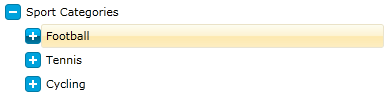
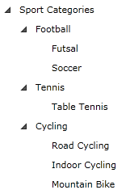
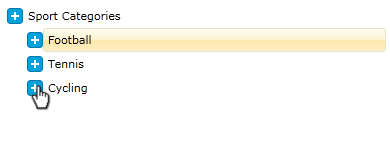
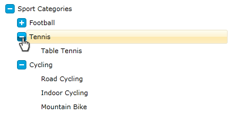

# Styling the Expander

If you need to change the icon that is used to expand an item, you can use the __ExpanderStyle__ property of the __RadTreeView__. The icon is a __ToggleButton__, so any style that can be applied to a ToggleButton can be applied to the icon too.

This tutorial will walk you through the common task of styling an expander.

On the snapshot below you can see how the final result will look like:

For  the purpose of the following tutorial I will use the following treeview declaration: 

<snippet id='radtreeview-styles-and-templates-styling-and-appearance-styling-expander-block_1-xaml' />

* Since the expander is a toggle button we need to create a style with __TargetType__ - __ToggleButton__.			  

	Declare a new style in your application (user control) resources and set the following common properties:
	* Set the __IsEnabled__ property to __True__;
	* Set the __IsTabStop__ property to __False__;

* Change the cursor to be __Hand__

	<snippet id='radtreeview-styles-and-templates-styling-and-appearance-styling-expander-block_2-xaml' />

* Next, we need to change the __Template__ property of the __ToggleButton__ (Expander). Add the following elements to your Template:			

	<snippet id='radtreeview-styles-and-templates-styling-and-appearance-styling-expander-block_3-xaml' />

* Set the __ExpanderStyle__ property of your treeview:

	<snippet id='radtreeview-styles-and-templates-styling-and-appearance-styling-expander-block_4-xaml' />

	As you can see from the next figure, the expander of the treeview is changed: 
	

* We are one more step closer to the final result. Next we should add some visual effects. For that purpose add the following elements to your expander template:

	<snippet id='radtreeview-styles-and-templates-styling-and-appearance-styling-expander-block_5-xaml' />

	The __ButtonOver__ grid will be animated when the mouse is position over the expander.		  

* You should add two __Triggers__ to the ControlTemplate's Triggers Collection. The first one is activated when the mouse is over the expander, and the second one is activated when the __ToggleButton__ is checked:

	<snippet id='radtreeview-styles-and-templates-styling-and-appearance-styling-expander-block_6-xaml' />

	When the mouse is over the expander the "ButtonOver" element must be visualized (set its Opacity property to 1), while the "Button" element must be hidden (set its Opacity property to 0). Respectively, when the mouse leaves the expander area, then the opposite operations must be performed. Here is how the "EnterActions" and "ExitActions" for the __IsMouseOver__  trigger should look like:
			  
	<snippet id='radtreeview-styles-and-templates-styling-and-appearance-styling-expander-block_7-xaml' />

	When the __ToggleButton__ is checked, then the "CollapseVisualOver" and "CollapseVisual" elements must be hidden (set their Opacity property to 0). When the ToggleButton is __checked__, then the both elements must be visualized (set their Opacity property to 1). Here is how the "EnterActions" and "ExitActions" for the __IsChecked__ trigger should look like:

	<snippet id='radtreeview-styles-and-templates-styling-and-appearance-styling-expander-block_8-xaml' />

And here is the complete XAML for the "ControlTemplate.Triggers" section:

<snippet id='radtreeview-styles-and-templates-styling-and-appearance-styling-expander-block_9-xaml' />

> With the same success and effectiveness you could use Expression Blend for adding interactivity. Since the operations in this example are pretty simple I decided to write the triggers by hand.

Here is the result:

## See Also
 * [ItemTemplate]()