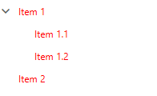

# Styling the RadTreeViewItem

The __RadTreeViewItem__ can be styled by creating an appropriate __Style__ and setting it to the __Style__ property of the control or by creating an implicit style.

## Targeting the RadTreeViewItem Element

In order to style all __RadTreeViewItem__ elements in a RadTreeView, you should create a style targeting __RadTreeViewItem__.

__Example 1: Creating an implicit style targeting RadTreeViewItem__

```XAML
	<Grid>
        <Grid.Resources>
            <!-- If you are using the NoXaml binaries, you will have to base the style on the default one for the theme like so: 
			<Style TargetType="telerik:RadTreeViewItem" BasedOn="{StaticResource RadTreeViewItemStyle}">-->

			<Style TargetType="telerik:RadTreeViewItem">
				<Setter Property="Foreground" Value="Red" />
			</Style>
        </Grid.Resources>
        
        <telerik:RadTreeView>
            <telerik:RadTreeView.Items>
                <telerik:RadTreeViewItem Header="Item 1">
                    <telerik:RadTreeViewItem Header="Item 1.1" />
                    <telerik:RadTreeViewItem Header="Item 1.2" />
                </telerik:RadTreeViewItem>
                <telerik:RadTreeViewItem Header="Item 2" />
            </telerik:RadTreeView.Items>
        </telerik:RadTreeView>
    </Grid>
```

#### __Figure 1: RadTreeViewItem with Red Foreground in the Fluent theme__


> You can also use the [ItemContainerStyle]() and [ItemContainerStyleSelector]() properties of the __RadTreeView__ in order to style its items. 
