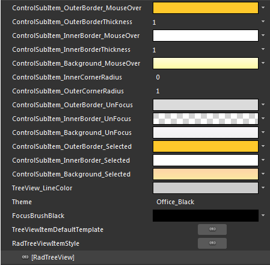
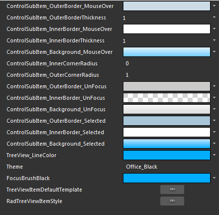
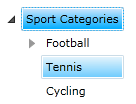

# Styling the RadTreeViewItem

The __RadTreeViewItem__ can be styled by creating an appropriate __Style__ and setting it to the __Style__ property of the control.

You have two options:

* To create an empty style and set it up on your own.
* To copy the default style of the control and modify it.

This topic will show you how to perform the second one.

## Modifying the Default Style

Load your project in Expression Blend and open the User Control that holds the __RadTreeView__. There are two ways to copy the default style for the __RadTreeViewItem__ :

* If you have static __RadTreeViewItems__, you can select one of them in the 'Objects and Timeline' pane and choose *Object -> Edit Style -> Edit a Copy* from the menu. After that you have to apply the generated style to the other __RadTreeViewItems__.

* You can also use the __ItemContainerStyle__ property of the __RadTreeView__, when you have dynamic items. In this way you have to set the style only once and it will be applied to all of the __RadTreeViewItems__. To copy the default style via the __ItemContainerStyle__ property select the __RadTreeView__ holding the items and choose *Object -> Edit Additional Styles -> Edit Generated Item Container (ItemContainerStyle) -> Edit a Copy* from the menu.

	>When using __ItemContainerStyle__ with static items, it will get applied only to the direct children of the __RadTreeView__ - the top-level items. If you want their child items to have the same style you have to manually set the __ItemContainerStyle__ property of their parents.

	>When using the __ItemContainerStyle__ with dynamic items, its value gets inherited through the hierarchy thanks to the __HierarchicalDataTemplate__. You are free to break the inheritance, when needed, by using multiple nested __HierarchicalDataTemplates__ and by setting the __ItemContainerStyle__ property of each of them.

	>Choosing the style for an item depending on its position in the hierarchy can be done by using the __ItemContainerStyleSelector__ property. Read more about selectors [here]().

	>tip To see an example of defining the __ItemContainerStyle__ look [here]().

You will be prompted for the name of the style and where to be placed. 

>tipIf you choose to define the style in Application, it would be available for the entire application. This allows you to define a style only once and then reuse it where needed.

After clicking 'OK', Expression Blend will generate the default style of the __RadTreeViewItem__ control in the __Resources__ section of your User Control. The properties available for the style will be loaded in the 'Properties' pane and you will be able to modify their default values. You can also edit the generated XAML in the XAML View or in Visual Studio.

If you go to the 'Resources' pane, you will see an editable list of resources generated together with the style and used by it. In this list you will find the brushes, styles and templates needed to change the visual appearance of the __RadTreeViewItem.__ Their names indicate to which part of the __RadTreeViewItem's__ appearance they are assigned.



* __ControlSubItem_OuterBorder_MouseOver__ - a brush that represents the color of the __RadTreeViewItem's__ border, when the mouse is over it.

* __ControlSubItem_Background_MouseOver__ - a brush that represents the background of the __RadTreeViewItem__, when the mouse is over it.

* __ControlSubItem_OuterBorder_UnFocus__ - a brush that represents the color of the __RadTreeViewItem's__ border, when it is selected and not focused.

* __ControlSubItem_Background_UnFocus__ - a brush that represents the background of the __RadTreeViewItem__, when it is selected and not focused.

* __ControlSubItem_OuterBorder_Selected__ -  a brush that represents the color of the __RadTreeViewItem's__ border, when it is selected and not focused.

* __ControlSubItem_Background_Selected__ -  a brush that represents the background of the __RadTreeViewItem__, when it is selected.

* __TreeView_LineColor__ - a brush that represent the color of the lines that connect the child nodes to their parent.

* __FocusBrushBlack__ - the color of the border around the focused __RadTreeViewItem__.

* __TreeViewItemDefaultTemplate__ - the __ControlTemplate__ applied to the __RadTreeViewItem__.

* __RadTreeViewItemStyle__ - the __Style__ generated for the __RadTreeViewItem__.

>tipChanging the value of the resources can be done by clicking on the color indicator or the icon next to them.

Modify the resource to bring the desired appearance of the __RadTreeViewItem__.



Here is a snapshot of the result.


