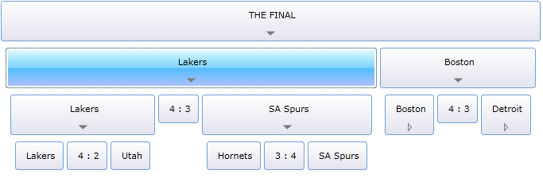
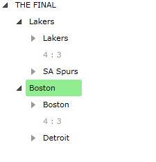
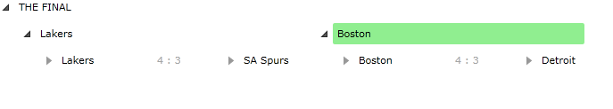
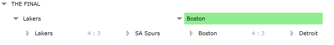
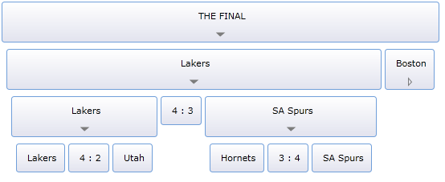
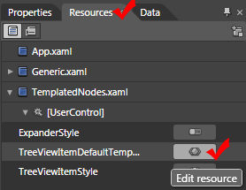

# Templated Nodes

The Telerik __RadTreeView__ is a lookless and completely stylable control. This tutorial will demonstrate how you can build a horizontal treeview by simply using __Styles__ and __ControlTemplates__.

Here is how the final result should look like: 


For the purpose of this tutorial will be used the following treeview declaration: 

#### __XAML__

```XAML
	<telerik:RadTreeView IsExpandOnSingleClickEnabled="True">
	    <telerik:RadTreeViewItem Header="THE FINAL">
	        <telerik:RadTreeViewItem Header="Lakers">
	            <telerik:RadTreeViewItem Header="Lakers">
	                <telerik:RadTreeViewItem Header="Lakers"/>
	                <telerik:RadTreeViewItem Header="4 : 2" IsEnabled="False"/>
	                <telerik:RadTreeViewItem Header="Utah"/>
	            </telerik:RadTreeViewItem>
	            <telerik:RadTreeViewItem Header="4 : 3" IsEnabled="False"/>
	            <telerik:RadTreeViewItem Header="SA Spurs">
	                <telerik:RadTreeViewItem Header="Hornets"/>
	                <telerik:RadTreeViewItem Header="3 : 4" IsEnabled="False"/>
	                <telerik:RadTreeViewItem Header="SA Spurs"/>
	            </telerik:RadTreeViewItem>
	        </telerik:RadTreeViewItem>
	        <telerik:RadTreeViewItem Header="Boston" Background="LightGreen">
	            <telerik:RadTreeViewItem Header="Boston">
	                <telerik:RadTreeViewItem Header="Boston"/>
	                <telerik:RadTreeViewItem Header="4 : 3" IsEnabled="False"/>
	                <telerik:RadTreeViewItem Header="Cleveland"/>
	            </telerik:RadTreeViewItem>
	            <telerik:RadTreeViewItem Header="4 : 3" IsEnabled="False"/>
	            <telerik:RadTreeViewItem Header="Detroit">
	                <telerik:RadTreeViewItem Header="Detroit"/>
	                <telerik:RadTreeViewItem Header="4 : 1" IsEnabled="False"/>
	                <telerik:RadTreeViewItem Header="Orlando"/>
	            </telerik:RadTreeViewItem>
	        </telerik:RadTreeViewItem>
	    </telerik:RadTreeViewItem>
	</telerik:RadTreeView>
	```



* The treeview has to be made horizontal. In order to do that you need to set the __ItemContainerStyle__ property of the __RadTreeView__ and __RadTreeViewItem__.

	Declare the following style in the resources of your application. It will set the __ItemsPanel__ to a __StackPanel__ with __Horizontal__ orientation: 

	#### __XAML__

	```XAML
		<Style TargetType="telerik:RadTreeViewItem" x:Key="TreeViewItemStyle">
			<Setter Property="IsExpanded" Value="True"></Setter>
			<Setter Property="ItemsPanel">
				<Setter.Value>
					<ItemsPanelTemplate>
						<StackPanel HorizontalAlignment="Center" Margin="4,6"
			   Orientation="Horizontal" />
					</ItemsPanelTemplate>
				</Setter.Value>
			</Setter>
		</Style>
		```

	#### __XAML__

	```XAML
		<Style TargetType="{x:Type telerik:RadTreeViewItem}" x:Key="TreeViewItemStyle">
			<Setter Property="IsExpanded" Value="True"></Setter>
			<Setter Property="ItemsPanel">
				<Setter.Value>
					<ItemsPanelTemplate>
						<StackPanel HorizontalAlignment="Center" Margin="4,6"
			   Orientation="Horizontal" />
					</ItemsPanelTemplate>
				</Setter.Value>
			</Setter>
		</Style>
		```

	Apply this style to the __ItemContainerStyle__ of the treeview and each treeview item. 

	#### __XAML__

	```XAML
		<telerik:RadTreeView IsExpandOnSingleClickEnabled="True" ItemContainerStyle="{StaticResource TreeViewItemStyle}">
			<telerik:RadTreeViewItem Header="THE FINAL" ItemContainerStyle="{StaticResource TreeViewItemStyle}">
				<telerik:RadTreeViewItem Header="Lakers" ItemContainerStyle="{StaticResource TreeViewItemStyle}">
					<telerik:RadTreeViewItem Header="Lakers" ItemContainerStyle="{StaticResource TreeViewItemStyle}">
						<telerik:RadTreeViewItem Header="Lakers" ItemContainerStyle="{StaticResource TreeViewItemStyle}"/>
						<telerik:RadTreeViewItem Header="4 : 2" IsEnabled="False" ItemContainerStyle="{StaticResource TreeViewItemStyle}"/>
						<telerik:RadTreeViewItem Header="Utah" ItemContainerStyle="{StaticResource TreeViewItemStyle}"/>
					</telerik:RadTreeViewItem>
					<telerik:RadTreeViewItem Header="4 : 3" IsEnabled="False" ItemContainerStyle="{StaticResource TreeViewItemStyle}"/>
					<telerik:RadTreeViewItem Header="SA Spurs" ItemContainerStyle="{StaticResource TreeViewItemStyle}">
						<telerik:RadTreeViewItem Header="Hornets" ItemContainerStyle="{StaticResource TreeViewItemStyle}"/>
						<telerik:RadTreeViewItem Header="3 : 4" IsEnabled="False" ItemContainerStyle="{StaticResource TreeViewItemStyle}"/>
						<telerik:RadTreeViewItem Header="SA Spurs" ItemContainerStyle="{StaticResource TreeViewItemStyle}"/>
					</telerik:RadTreeViewItem>
				</telerik:RadTreeViewItem>
				<telerik:RadTreeViewItem Header="Boston" Background="LightGreen" ItemContainerStyle="{StaticResource TreeViewItemStyle}">
					<telerik:RadTreeViewItem Header="Boston" ItemContainerStyle="{StaticResource TreeViewItemStyle}">
						<telerik:RadTreeViewItem Header="Boston" ItemContainerStyle="{StaticResource TreeViewItemStyle}"/>
						<telerik:RadTreeViewItem Header="4 : 3" IsEnabled="False" ItemContainerStyle="{StaticResource TreeViewItemStyle}"/>
						<telerik:RadTreeViewItem Header="Cleveland" ItemContainerStyle="{StaticResource TreeViewItemStyle}"/>
					</telerik:RadTreeViewItem>
					<telerik:RadTreeViewItem Header="4 : 3" IsEnabled="False" ItemContainerStyle="{StaticResource TreeViewItemStyle}"/>
					<telerik:RadTreeViewItem Header="Detroit" ItemContainerStyle="{StaticResource TreeViewItemStyle}">
						<telerik:RadTreeViewItem Header="Detroit" ItemContainerStyle="{StaticResource TreeViewItemStyle}"/>
						<telerik:RadTreeViewItem Header="4 : 1" IsEnabled="False" ItemContainerStyle="{StaticResource TreeViewItemStyle}"/>
						<telerik:RadTreeViewItem Header="Orlando" ItemContainerStyle="{StaticResource TreeViewItemStyle}"/>
					</telerik:RadTreeViewItem>
				</telerik:RadTreeViewItem>
			</telerik:RadTreeViewItem>
		</telerik:RadTreeView>
		```

	Additionally you need to set the __ItemsPanel__ of the treeview: 

	#### __XAML__

	```XAML
		<telerik:RadTreeView IsExpandOnSingleClickEnabled="True"
			ItemContainerStyle="{StaticResource TreeViewItemStyle}">
			<telerik:RadTreeView.ItemsPanel>
				<ItemsPanelTemplate>
					<StackPanel VerticalAlignment="Top" Orientation="Horizontal"
			 HorizontalAlignment="Center" />
				</ItemsPanelTemplate>
			</telerik:RadTreeView.ItemsPanel>
			<telerik:RadTreeViewItem Header="THE FINAL" ItemContainerStyle="{StaticResource TreeViewItemStyle}">
		......................
		```

	So far you should have the following result: 
	

The next step is to make some visual enhancements in the tree. 

* Style the expander. If you want to read more information about how to style a treeview expander, see the main topic [Styling Expander]().

	Add the following style declaration in your resources and apply it on the __ExpanderStyle__ property of the treeview: 

	#### __XAML__

	```XAML
		<Style TargetType="ToggleButton" x:Key="ExpanderStyle">
			<Setter Property="IsEnabled" Value="True" />
			<Setter Property="IsTabStop" Value="False" />
			<Setter Property="Cursor" Value="Hand" />
			<Setter Property="Template">
				<Setter.Value>
					<ControlTemplate TargetType="ToggleButton">
						<Grid>
							<VisualStateManager.VisualStateGroups>
								<VisualStateGroup x:Name="CommonStates">
									<VisualState x:Name="Normal">
									</VisualState>
								</VisualStateGroup>
								<VisualStateGroup x:Name="CheckStates">
									<VisualState x:Name="Checked">
										<Storyboard>
											<DoubleAnimation Duration="0:0:0.2"
					Storyboard.TargetName="ExpandedStates"
					Storyboard.TargetProperty="Opacity" To="1" />
											<DoubleAnimation Duration="0:0:0.2"
					Storyboard.TargetName="CollapsedStates"
					Storyboard.TargetProperty="Opacity" To="0" />
										</Storyboard>
									</VisualState>
									<VisualState x:Name="Unchecked">
										<Storyboard>
											<DoubleAnimation Duration="0:0:0.2"
					Storyboard.TargetName="ExpandedStates"
					Storyboard.TargetProperty="Opacity" To="0" />
											<DoubleAnimation Duration="0:0:0.2"
					Storyboard.TargetName="CollapsedStates"
					Storyboard.TargetProperty="Opacity" To="1" />
										</Storyboard>
									</VisualState>
								</VisualStateGroup>
							</VisualStateManager.VisualStateGroups>
							<Grid x:Name="CollapsedStates">
								<Path x:Name="CollapsedVisual" Height="10" Width="5"
				 Stretch="Fill" Stroke="#FF7C7C7C"
				 Data="M1098.3334,527.90997 L1098.3334,536.30115 L1102.2695,532.36487 z"
				 RenderTransformOrigin="0.5,0.5" />
							</Grid>
							<Grid x:Name="ExpandedStates">
								<Path x:Name="ExpandedVisual" Height="10" Width="5"
				 Fill="#FF7C7C7C" Stretch="Fill" Stroke="#FF7C7C7C"
				 Data="M1098.3334,527.90997 L1098.3334,536.30115 L1102.2695,532.36487 z"
				 RenderTransformOrigin="0.5,0.5">
									<Path.RenderTransform>
										<TransformGroup>
											<ScaleTransform ScaleX="1" ScaleY="1" />
											<SkewTransform AngleX="0" AngleY="0" />
											<RotateTransform Angle="90" />
											<TranslateTransform X="0" Y="0" />
										</TransformGroup>
									</Path.RenderTransform>
								</Path>
							</Grid>
						</Grid>
					</ControlTemplate>
				</Setter.Value>
			</Setter>
		</Style>
		```

	#### __XAML__

	```XAML
		<Style TargetType="{x:Type ToggleButton}" x:Key="ExpanderStyle">
			<Setter Property="IsEnabled" Value="True" />
			<Setter Property="IsTabStop" Value="False" />
			<Setter Property="Cursor" Value="Hand" />
			<Setter Property="Template">
				<Setter.Value>
					<ControlTemplate TargetType="{x:Type ToggleButton}">
						<Grid>
							<Grid x:Name="CollapsedStates">
								<Path x:Name="CollapsedVisual" Height="10" Width="5"
			   Stretch="Fill" Stroke="#FF7C7C7C"
			   Data="M1098.3334,527.90997 L1098.3334,536.30115 L1102.2695,532.36487 z"
			   RenderTransformOrigin="0.5,0.5" />
							</Grid>
							<Grid x:Name="ExpandedStates">
								<Path x:Name="ExpandedVisual" Height="10" Width="5"
			   Fill="#FF7C7C7C" Stretch="Fill" Stroke="#FF7C7C7C"
			   Data="M1098.3334,527.90997 L1098.3334,536.30115 L1102.2695,532.36487 z"
			   RenderTransformOrigin="0.5,0.5">
									<Path.RenderTransform>
										<TransformGroup>
											<ScaleTransform ScaleX="1" ScaleY="1" />
											<SkewTransform AngleX="0" AngleY="0" />
											<RotateTransform Angle="90" />
											<TranslateTransform X="0" Y="0" />
										</TransformGroup>
									</Path.RenderTransform>
								</Path>
							</Grid>
						</Grid>
						<ControlTemplate.Triggers>
							<Trigger Property="IsChecked" Value="True">
								<Trigger.EnterActions>
									<BeginStoryboard>
										<Storyboard>
											<DoubleAnimation Duration="0:0:0.2"
				  Storyboard.TargetName="ExpandedStates"
				  Storyboard.TargetProperty="Opacity" To="1" />
											<DoubleAnimation Duration="0:0:0.2"
				  Storyboard.TargetName="CollapsedStates"
				  Storyboard.TargetProperty="Opacity" To="0" />
										</Storyboard>
									</BeginStoryboard>
								</Trigger.EnterActions>
								<Trigger.ExitActions>
									<BeginStoryboard>
										<Storyboard>
											<DoubleAnimation Duration="0:0:0.2"
				  Storyboard.TargetName="ExpandedStates"
				  Storyboard.TargetProperty="Opacity" To="0" />
											<DoubleAnimation Duration="0:0:0.2"
				  Storyboard.TargetName="CollapsedStates"
				  Storyboard.TargetProperty="Opacity" To="1" />
										</Storyboard>
									</BeginStoryboard>
								</Trigger.ExitActions>
							</Trigger>
						</ControlTemplate.Triggers>
					</ControlTemplate>
				</Setter.Value>
			</Setter>
		</Style>
		```
		
	#### __XAML__

	```XAML
		<telerik:RadTreeView IsExpandOnSingleClickEnabled="True"
			ItemContainerStyle="{StaticResource TreeViewItemStyle}"
			ExpanderStyle="{StaticResource ExpanderStyle}">
		```

	And the effect can be seen on the next snapshot:
	

* You need to create the template for the treeview nodes. Add the following __ControlTemplate__ declaration to your application resources: 

	#### __XAML__

	```XAML
		<ControlTemplate TargetType="telerik:RadTreeViewItem"
		   x:Key="TreeViewItemDefaultTemplate">
			<Grid Margin="2" Height="Auto" VerticalAlignment="Top">
				<Grid.RowDefinitions>
					<RowDefinition Height="Auto" />
					<RowDefinition Height="Auto" />
				</Grid.RowDefinitions>
				<Grid Grid.Row="0" x:Name="HeaderRow" Height="Auto" VerticalAlignment="Bottom">
					<Rectangle RadiusX="3" RadiusY="3" Stroke="#FF709FDA" StrokeLineJoin="Bevel"
			  StrokeThickness="1">
						<Rectangle.Fill>
							<LinearGradientBrush EndPoint="0.5,0.034" StartPoint="0.5,0.966">
								<GradientStop Color="#FFE4E5F0" Offset="0" />
								<GradientStop Color="#FFFFFFFF" Offset="1" />
							</LinearGradientBrush>
						</Rectangle.Fill>
					</Rectangle>
					<Border x:Name="SelectionVisual" Visibility="Collapsed"
			  BorderBrush="#FFA8C9D8" BorderThickness="1,1,1,1"
			  CornerRadius="3,3,3,3">
						<Border.Background>
							<LinearGradientBrush EndPoint="0.5,1" StartPoint="0.5,0">
								<GradientStop Color="#FF00CCFF" Offset="0" />
								<GradientStop Color="#FF9BB1FF" Offset="1" />
							</LinearGradientBrush>
						</Border.Background>
						<Border CornerRadius="2,2,2,2" BorderBrush="#FFFFFFFF"
			   BorderThickness="2">
							<Border.Background>
								<LinearGradientBrush EndPoint="0.5,1" StartPoint="0.5,0">
									<GradientStop Color="#E5FFFFFF" Offset="0" />
									<GradientStop Color="#33FFFFFF" Offset="1" />
									<GradientStop Color="#4DFFFFFF" Offset="0.5" />
									<GradientStop Color="#00FFFFFF" Offset="0.511" />
								</LinearGradientBrush>
							</Border.Background>
						</Border>
					</Border>
					<StackPanel>
						<StackPanel Orientation="Horizontal" HorizontalAlignment="Center"
			   Margin="5">
							<Image MaxWidth="25" MaxHeight="25" Stretch="Fill" x:Name="Image"
				Source="{TemplateBinding DefaultImageSrc}" Margin="2" />
							<ContentControl Name="Header" Padding="5"
				Content="{TemplateBinding Header}"
				ContentTemplate="{TemplateBinding HeaderTemplate}"
				HorizontalAlignment="Center" VerticalAlignment="Center" />
						</StackPanel>
						<ToggleButton x:Name="Expander" Margin="0,0,0,5"></ToggleButton>
					</StackPanel>
					<Rectangle x:Name="FocusVisual" RadiusX="3" RadiusY="3"
			  Visibility="Collapsed" Stroke="Black" StrokeThickness="0.75"
			  StrokeDashArray="1,2" IsHitTestVisible="False" />
				</Grid>
				<ItemsPresenter Grid.Row="1" x:Name="ItemsHost" Visibility="Collapsed" />
			</Grid>        
		</ControlTemplate>
		```
		
	#### __XAML__

	```XAML
		<ControlTemplate TargetType="{x:Type telerik:RadTreeViewItem}"
		   x:Key="TreeViewItemDefaultTemplate">
			<Grid Margin="2" Height="Auto" VerticalAlignment="Top">
				<Grid.RowDefinitions>
					<RowDefinition Height="Auto" />
					<RowDefinition Height="Auto" />
				</Grid.RowDefinitions>
				<Grid Grid.Row="0" x:Name="HeaderRow" Height="Auto" VerticalAlignment="Bottom">
					<Rectangle RadiusX="3" RadiusY="3" Stroke="#FF709FDA" StrokeLineJoin="Bevel"
			  StrokeThickness="1">
						<Rectangle.Fill>
							<LinearGradientBrush EndPoint="0.5,0.034" StartPoint="0.5,0.966">
								<GradientStop Color="#FFE4E5F0" Offset="0" />
								<GradientStop Color="#FFFFFFFF" Offset="1" />
							</LinearGradientBrush>
						</Rectangle.Fill>
					</Rectangle>
					<Border x:Name="SelectionVisual" Visibility="Collapsed"
			  BorderBrush="#FFA8C9D8" BorderThickness="1,1,1,1"
			  CornerRadius="3,3,3,3">
						<Border.Background>
							<LinearGradientBrush EndPoint="0.5,1" StartPoint="0.5,0">
								<GradientStop Color="#FF00CCFF" Offset="0" />
								<GradientStop Color="#FF9BB1FF" Offset="1" />
							</LinearGradientBrush>
						</Border.Background>
						<Border CornerRadius="2,2,2,2" BorderBrush="#FFFFFFFF"
			   BorderThickness="2">
							<Border.Background>
								<LinearGradientBrush EndPoint="0.5,1" StartPoint="0.5,0">
									<GradientStop Color="#E5FFFFFF" Offset="0" />
									<GradientStop Color="#33FFFFFF" Offset="1" />
									<GradientStop Color="#4DFFFFFF" Offset="0.5" />
									<GradientStop Color="#00FFFFFF" Offset="0.511" />
								</LinearGradientBrush>
							</Border.Background>
						</Border>
					</Border>
					<StackPanel>
						<StackPanel Orientation="Horizontal" HorizontalAlignment="Center"
			   Margin="5">
							<Image MaxWidth="25" MaxHeight="25" Stretch="Fill" x:Name="Image"
				Source="{TemplateBinding DefaultImageSrc}" Margin="2" />
							<ContentControl Name="Header" Padding="5"
				Content="{TemplateBinding Header}"
				ContentTemplate="{TemplateBinding HeaderTemplate}"
				HorizontalAlignment="Center" VerticalAlignment="Center" />
						</StackPanel>
						<ToggleButton x:Name="Expander" Margin="0,0,0,5"></ToggleButton>
					</StackPanel>
					<Rectangle x:Name="FocusVisual" RadiusX="3" RadiusY="3"
			  Visibility="Collapsed" Stroke="Black" StrokeThickness="0.75"
			  StrokeDashArray="1,2" IsHitTestVisible="False" />
				</Grid>
				<ItemsPresenter Grid.Row="1" x:Name="ItemsHost" Visibility="Collapsed" />
			</Grid>        
		</ControlTemplate>
		```

* In your __TreeViewItemStyle__ set the __Template__ property to the __ControlTemplate__ declared on the previous step: 

	#### __XAML__

	```XAML
		<Style TargetType="telerik:RadTreeViewItem" x:Key="TreeViewItemStyle">
			<Setter Property="Template" Value="{StaticResource TreeViewItemDefaultTemplate}" />
			<Setter Property="IsExpanded" Value="True"></Setter>
			<Setter Property="ItemsPanel">
				<Setter.Value>
					<ItemsPanelTemplate>
						<StackPanel HorizontalAlignment="Center" Margin="4,6"
			 Orientation="Horizontal" />
					</ItemsPanelTemplate>
				</Setter.Value>
			</Setter>
		</Style>
		```

	#### __XAML__

	```XAML
		<Style TargetType="{x:Type telerik:RadTreeViewItem}" x:Key="TreeViewItemStyle">
			<Setter Property="Template" Value="{StaticResource TreeViewItemDefaultTemplate}" />
			<Setter Property="IsExpanded" Value="True"></Setter>
			<Setter Property="ItemsPanel">
				<Setter.Value>
					<ItemsPanelTemplate>
						<StackPanel HorizontalAlignment="Center" Margin="4,6"
			 Orientation="Horizontal" />
					</ItemsPanelTemplate>
				</Setter.Value>
			</Setter>
		</Style>
		```

	We are one step closer to the desired result: 
	

In order to add animation to your treeview you need to use triggers the Visual State Manager. Open your application in Expression Blend.


* Find the __TreeViewItemDefaultTemplate__in the Resources pane and open it for edit:

Add the following visual states and set the following properties:


* __Selected__
	* Set the __SelectionVisual__'s __Visibility__ to __Visible__
* __Focused__
	* Set the __FocusVisual__'s __Visibility__ to __Visible__
	

Here is the final XAML for the __TreeViewItemDefaultTemplate__:


#### __XAML__

```XAML
	<ControlTemplate TargetType="telerik:RadTreeViewItem"
	   x:Key="TreeViewItemDefaultTemplate">
	    <Grid Margin="2" Height="Auto" VerticalAlignment="Top">
	        <VisualStateManager.VisualStateGroups>
	            <VisualStateGroup x:Name="CommonStates">
	                <VisualState x:Name="Normal">
	                    <Storyboard>
	                    </Storyboard>
	                </VisualState>
	            </VisualStateGroup>
	            <VisualStateGroup x:Name="SelectionStates">
	                <VisualState x:Name="Unselected">
	                </VisualState>
	                <VisualState x:Name="Selected">
	                    <Storyboard>
	                        <ObjectAnimationUsingKeyFrames
	         Storyboard.TargetName="SelectionVisual"
	         Storyboard.TargetProperty="Visibility" Duration="0">
	                            <DiscreteObjectKeyFrame KeyTime="0">
	                                <DiscreteObjectKeyFrame.Value>
	                                    <Visibility>Visible</Visibility>
	                                </DiscreteObjectKeyFrame.Value>
	                            </DiscreteObjectKeyFrame>
	                        </ObjectAnimationUsingKeyFrames>
	                    </Storyboard>
	                </VisualState>
	            </VisualStateGroup>
	            <VisualStateGroup x:Name="FocusStates">
	                <VisualState x:Name="Focused">
	                    <Storyboard>
	                        <ObjectAnimationUsingKeyFrames
	         Storyboard.TargetName="FocusVisual"
	         Storyboard.TargetProperty="Visibility" Duration="0">
	                            <DiscreteObjectKeyFrame KeyTime="0">
	                                <DiscreteObjectKeyFrame.Value>
	                                    <Visibility>Visible</Visibility>
	                                </DiscreteObjectKeyFrame.Value>
	                            </DiscreteObjectKeyFrame>
	                        </ObjectAnimationUsingKeyFrames>
	                    </Storyboard>
	                </VisualState>
	                <VisualState x:Name="Unfocused">
	                </VisualState>
	            </VisualStateGroup>
	            <VisualStateGroup x:Name="ExpandStates">
	                <VisualState x:Name="Expanded">
	                    <Storyboard>
	                        <ObjectAnimationUsingKeyFrames Storyboard.TargetName="ItemsHost"
	         Storyboard.TargetProperty="Visibility" Duration="0">
	                            <DiscreteObjectKeyFrame KeyTime="0">
	                                <DiscreteObjectKeyFrame.Value>
	                                    <Visibility>Visible</Visibility>
	                                </DiscreteObjectKeyFrame.Value>
	                            </DiscreteObjectKeyFrame>
	                        </ObjectAnimationUsingKeyFrames>
	                        <DoubleAnimation Storyboard.TargetName="ItemsHost"
	         Storyboard.TargetProperty="Opacity" From="0.1" To="1.0"
	         Duration="0:0:0.2" />
	                    </Storyboard>
	                </VisualState>
	                <VisualState x:Name="Collapsed">
	                    <Storyboard>
	                        <DoubleAnimation Storyboard.TargetName="ItemsHost"
	         Storyboard.TargetProperty="Opacity" From="1" To="0.1"
	         Duration="0:0:0.2" />
	                        <ObjectAnimationUsingKeyFrames Storyboard.TargetName="ItemsHost"
	         Storyboard.TargetProperty="Visibility" Duration="0"
	         BeginTime="0:0:0.2">
	                            <DiscreteObjectKeyFrame KeyTime="0">
	                                <DiscreteObjectKeyFrame.Value>
	                                    <Visibility>Collapsed</Visibility>
	                                </DiscreteObjectKeyFrame.Value>
	                            </DiscreteObjectKeyFrame>
	                        </ObjectAnimationUsingKeyFrames>
	                    </Storyboard>
	                </VisualState>
	            </VisualStateGroup>
	        </VisualStateManager.VisualStateGroups>
	        <Grid.RowDefinitions>
	            <RowDefinition Height="Auto" />
	            <RowDefinition Height="Auto" />
	        </Grid.RowDefinitions>
	        <Grid Grid.Row="0" x:Name="HeaderRow" Height="Auto" VerticalAlignment="Bottom">
	            <Rectangle RadiusX="3" RadiusY="3" Stroke="#FF709FDA" StrokeLineJoin="Bevel"
	      StrokeThickness="1">
	                <Rectangle.Fill>
	                    <LinearGradientBrush EndPoint="0.5,0.034" StartPoint="0.5,0.966">
	                        <GradientStop Color="#FFE4E5F0" Offset="0" />
	                        <GradientStop Color="#FFFFFFFF" Offset="1" />
	                    </LinearGradientBrush>
	                </Rectangle.Fill>
	            </Rectangle>
	            <Border x:Name="SelectionVisual" Visibility="Collapsed"
	      BorderBrush="#FFA8C9D8" BorderThickness="1,1,1,1"
	      CornerRadius="3,3,3,3">
	                <Border.Background>
	                    <LinearGradientBrush EndPoint="0.5,1" StartPoint="0.5,0">
	                        <GradientStop Color="#FF00CCFF" Offset="0" />
	                        <GradientStop Color="#FF9BB1FF" Offset="1" />
	                    </LinearGradientBrush>
	                </Border.Background>
	                <Border CornerRadius="2,2,2,2" BorderBrush="#FFFFFFFF"
	       BorderThickness="2">
	                    <Border.Background>
	                        <LinearGradientBrush EndPoint="0.5,1" StartPoint="0.5,0">
	                            <GradientStop Color="#E5FFFFFF" Offset="0" />
	                            <GradientStop Color="#33FFFFFF" Offset="1" />
	                            <GradientStop Color="#4DFFFFFF" Offset="0.5" />
	                            <GradientStop Color="#00FFFFFF" Offset="0.511" />
	                        </LinearGradientBrush>
	                    </Border.Background>
	                </Border>
	            </Border>
	            <StackPanel>
	                <StackPanel Orientation="Horizontal" HorizontalAlignment="Center"
	       Margin="5">
	                    <Image MaxWidth="25" MaxHeight="25" Stretch="Fill" x:Name="Image"
	        Source="{TemplateBinding DefaultImageSrc}" Margin="2" />
	                    <ContentControl Name="Header" Padding="5"
	        Content="{TemplateBinding Header}"
	        ContentTemplate="{TemplateBinding HeaderTemplate}"
	        HorizontalAlignment="Center" VerticalAlignment="Center" />
	                </StackPanel>
	                <ToggleButton x:Name="Expander" Margin="0,0,0,5"></ToggleButton>
	            </StackPanel>
	            <Rectangle x:Name="FocusVisual" RadiusX="3" RadiusY="3"
	      Visibility="Collapsed" Stroke="Black" StrokeThickness="0.75"
	      StrokeDashArray="1,2" IsHitTestVisible="False" />
	        </Grid>
	        <ItemsPresenter Grid.Row="1" x:Name="ItemsHost" Visibility="Collapsed" />
	    </Grid>
	</ControlTemplate>
	```



Add three triggers to your control template, which are activated when the treeview item is selected, focused and expanded.

* When the __IsSelected__ property is __True__, set the __SelectionVisual's__ visibility to __Visible__. Accordingly, when the __IsSelected__ property is __False__, set the __SelectionVisual's__ visibility to __Hidden__. 
* When the __IsFocused__ property is __True__, set the __FocusVisual's__ visibility to __Visible__. Accordingly, when the __IsFocused__ property is __False__, set the __FocusVisual's__ visibility to __Hidden__. 
* When the __IsExpanded__ property is __True__, set the __ItemHost's__ visibility to __Visible__. Accordingly, when the __IsExpanded__ property is __False__, set the __ItemHost's__ visibility to __Hidden__.


Here is the complete XAML for __ControlTemplate.Triggers__ section and the final result:


#### __XAML__

```XAML
	<ControlTemplate.Triggers>
	    <Trigger Property="IsSelected" Value="True">
	        <Trigger.EnterActions>
	            <BeginStoryboard>
	                <Storyboard>
	                    <ObjectAnimationUsingKeyFrames
	      Storyboard.TargetName="SelectionVisual"
	      Storyboard.TargetProperty="Visibility" Duration="0">
	                        <DiscreteObjectKeyFrame KeyTime="0">
	                            <DiscreteObjectKeyFrame.Value>
	                                <Visibility>Visible</Visibility>
	                            </DiscreteObjectKeyFrame.Value>
	                        </DiscreteObjectKeyFrame>
	                    </ObjectAnimationUsingKeyFrames>
	                </Storyboard>
	            </BeginStoryboard>
	        </Trigger.EnterActions>
	        <Trigger.ExitActions>
	            <BeginStoryboard>
	                <Storyboard>
	                    <ObjectAnimationUsingKeyFrames
	      Storyboard.TargetName="SelectionVisual"
	      Storyboard.TargetProperty="Visibility" Duration="0">
	                        <DiscreteObjectKeyFrame KeyTime="0">
	                            <DiscreteObjectKeyFrame.Value>
	                                <Visibility>Hidden</Visibility>
	                            </DiscreteObjectKeyFrame.Value>
	                        </DiscreteObjectKeyFrame>
	                    </ObjectAnimationUsingKeyFrames>
	                </Storyboard>
	            </BeginStoryboard>
	        </Trigger.ExitActions>
	    </Trigger>
	    <Trigger Property="IsFocused" Value="True">
	        <Trigger.EnterActions>
	            <BeginStoryboard>
	                <Storyboard>
	                    <ObjectAnimationUsingKeyFrames
	      Storyboard.TargetName="FocusVisual"
	      Storyboard.TargetProperty="Visibility" Duration="0">
	                        <DiscreteObjectKeyFrame KeyTime="0">
	                            <DiscreteObjectKeyFrame.Value>
	                                <Visibility>Visible</Visibility>
	                            </DiscreteObjectKeyFrame.Value>
	                        </DiscreteObjectKeyFrame>
	                    </ObjectAnimationUsingKeyFrames>
	                </Storyboard>
	            </BeginStoryboard>
	        </Trigger.EnterActions>
	        <Trigger.ExitActions>
	            <BeginStoryboard>
	                <Storyboard>
	                    <ObjectAnimationUsingKeyFrames
	      Storyboard.TargetName="FocusVisual"
	      Storyboard.TargetProperty="Visibility" Duration="0">
	                        <DiscreteObjectKeyFrame KeyTime="0">
	                            <DiscreteObjectKeyFrame.Value>
	                                <Visibility>Hidden</Visibility>
	                            </DiscreteObjectKeyFrame.Value>
	                        </DiscreteObjectKeyFrame>
	                    </ObjectAnimationUsingKeyFrames>
	                </Storyboard>
	            </BeginStoryboard>
	        </Trigger.ExitActions>
	    </Trigger>
	    <Trigger Property="IsExpanded" Value="True">
	        <Trigger.EnterActions>
	            <BeginStoryboard>
	                <Storyboard>
	                    <ObjectAnimationUsingKeyFrames Storyboard.TargetName="ItemsHost"
	      Storyboard.TargetProperty="Visibility" Duration="0">
	                        <DiscreteObjectKeyFrame KeyTime="0">
	                            <DiscreteObjectKeyFrame.Value>
	                                <Visibility>Visible</Visibility>
	                            </DiscreteObjectKeyFrame.Value>
	                        </DiscreteObjectKeyFrame>
	                    </ObjectAnimationUsingKeyFrames>
	                    <DoubleAnimation Storyboard.TargetName="ItemsHost"
	      Storyboard.TargetProperty="Opacity" From="0.1" To="1.0"
	      Duration="0:0:0.2" />
	                </Storyboard>
	            </BeginStoryboard>
	        </Trigger.EnterActions>
	        <Trigger.ExitActions>
	            <BeginStoryboard>
	                <Storyboard>
	                    <DoubleAnimation Storyboard.TargetName="ItemsHost"
	      Storyboard.TargetProperty="Opacity" From="1" To="0.1"
	      Duration="0:0:0.2" />
	                    <ObjectAnimationUsingKeyFrames Storyboard.TargetName="ItemsHost"
	      Storyboard.TargetProperty="Visibility" Duration="0"
	      BeginTime="0:0:0.2">
	                        <DiscreteObjectKeyFrame KeyTime="0">
	                            <DiscreteObjectKeyFrame.Value>
	                                <Visibility>Collapsed</Visibility>
	                            </DiscreteObjectKeyFrame.Value>
	                        </DiscreteObjectKeyFrame>
	                    </ObjectAnimationUsingKeyFrames>
	                </Storyboard>
	            </BeginStoryboard>
	        </Trigger.ExitActions>
	    </Trigger>
	</ControlTemplate.Triggers>
	```

And here is the final result:


## See Also
 * [Styling the Expander]()