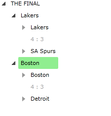
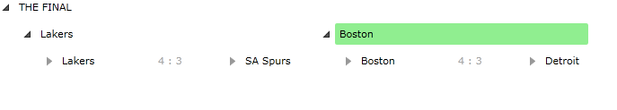
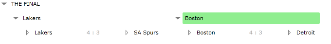
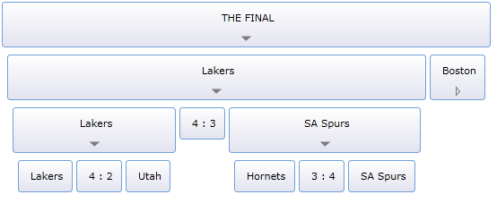
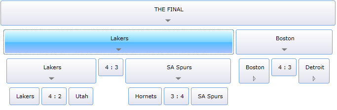

# Templated Nodes

The Telerik __RadTreeView__ is a lookless and completely stylable control. This tutorial will demonstrate how you can build a horizontal treeview by simply using __Styles__ and __ControlTemplates__.

Here is how the final result should look like: 

For the purpose of this tutorial will be used the following treeview declaration: 

<snippet id='radtreeview-styles-and-templates-templated-nodes-block_1-xaml' />

* The treeview has to be made horizontal. In order to do that you need to set the __ItemContainerStyle__ property of the __RadTreeView__ and __RadTreeViewItem__.

	Declare the following style in the resources of your application. It will set the __ItemsPanel__ to a __StackPanel__ with __Horizontal__ orientation: 

	<snippet id='radtreeview-styles-and-templates-templated-nodes-block_2-xaml' />
	
	<snippet id='radtreeview-styles-and-templates-templated-nodes-block_3-xaml' />

	Apply this style to the __ItemContainerStyle__ of the treeview and each treeview item. 

	<snippet id='radtreeview-styles-and-templates-templated-nodes-block_4-xaml' />

	Additionally you need to set the __ItemsPanel__ of the treeview: 

	<snippet id='radtreeview-styles-and-templates-templated-nodes-block_5-xaml' />

	So far you should have the following result: 
	

The next step is to make some visual enhancements in the tree. 

* Style the expander. If you want to read more information about how to style a treeview expander, see the main topic [Styling Expander]().

	Add the following style declaration in your resources and apply it on the __ExpanderStyle__ property of the treeview: 

	<snippet id='radtreeview-styles-and-templates-templated-nodes-block_6-xaml' />

	<snippet id='radtreeview-styles-and-templates-templated-nodes-block_7-xaml' />
	
	<snippet id='radtreeview-styles-and-templates-templated-nodes-block_8-xaml' />

	And the effect can be seen on the next snapshot:
	

* You need to create the template for the treeview nodes. Add the following __ControlTemplate__ declaration to your application resources: 

	<snippet id='radtreeview-styles-and-templates-templated-nodes-block_9-xaml' />

	<snippet id='radtreeview-styles-and-templates-templated-nodes-block_10-xaml' />

* In your __TreeViewItemStyle__ set the __Template__ property to the __ControlTemplate__ declared on the previous step: 

	<snippet id='radtreeview-styles-and-templates-templated-nodes-block_11-xaml' />

	<snippet id='radtreeview-styles-and-templates-templated-nodes-block_12-xaml' />

	We are one step closer to the desired result: 
	

In order to add animation to your treeview you need to use triggers the Visual State Manager. Open your application in Expression Blend.
* __Selected__
	* Set the __SelectionVisual__'s __Visibility__ to __Visible__
* __Focused__
	* Set the __FocusVisual__'s __Visibility__ to __Visible__

<snippet id='radtreeview-styles-and-templates-templated-nodes-block_13-xaml' />

Add three triggers to your control template, which are activated when the treeview item is selected, focused and expanded.

* When the __IsSelected__ property is __True__, set the __SelectionVisual's__ visibility to __Visible__. Accordingly, when the __IsSelected__ property is __False__, set the __SelectionVisual's__ visibility to __Hidden__. 
* When the __IsFocused__ property is __True__, set the __FocusVisual's__ visibility to __Visible__. Accordingly, when the __IsFocused__ property is __False__, set the __FocusVisual's__ visibility to __Hidden__. 
* When the __IsExpanded__ property is __True__, set the __ItemHost's__ visibility to __Visible__. Accordingly, when the __IsExpanded__ property is __False__, set the __ItemHost's__ visibility to __Hidden__.

Here is the complete XAML for __ControlTemplate.Triggers__ section and the final result:

<snippet id='radtreeview-styles-and-templates-templated-nodes-block_14-xaml' />

And here is the final result:

## See Also
 * [Styling the Expander]()