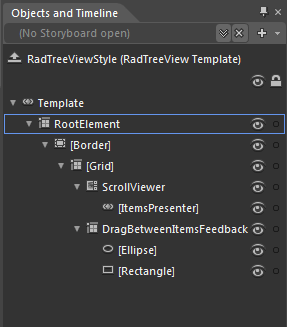
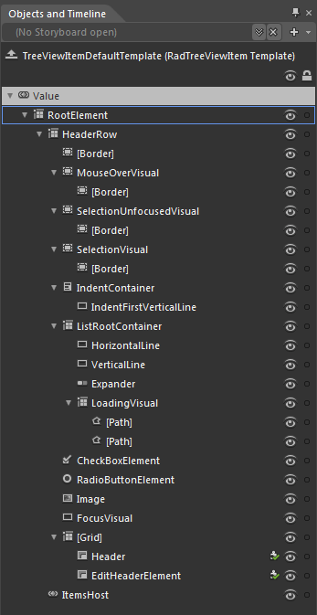

# Templates Structure

Like most SilverlightWPF controls, the __RadTreeView__ also allows you to template it in order to change the control from the inside. Except for templating the whole control, you can template parts of it or even independent controls related to it. This topic will make you familiar with the:

* [RadTreeView Template Structure](#RadTreeView_Template_Structure)
* [RadTreeViewItem Template Structure](#RadTreeViewItem_Template_Structures)

>tip For more information about templating and how to modify the default templates of the __RadControls__ read [the common topics](http://www.telerik.com/help/silverlight/common-styling-appearance-edit-control-templates-blend.html) on this matter.

## RadTreeView Template Structure

This section will explain the structure of the __RadTreeView__ 's template. Here is a snapshot of the template generated in Expression Blend.

It contains the following parts:

* __RootElement__ - is of type __Grid__ and represents the layout root for the template. 

	* __[Border]__ - hosts the __RadTreeView__ items and is of type __Border__.  
	 
		* __[Grid]__ - represents the host control for the __RadTreeView__'s items. 

			* __ScrollViewer__ - is of type __ScrollViewer__ element and represents the control that holds all the items. 

				* __[ItemsPresenter]__ - this is the only mandatory element from the __RadTreeView__ template used to display the __RadTreeView__ items. 

			* __DragBetweenItemsFeedback__ - is of type __FrameworkElement__ and represents the indicator which is displayed when the item that is dragged will be dropped between two items. 

				* __Ellipse__ - is the circle drawn in the most left part of that indicator. 

				* __Rectangle__ - is the line drawn from the circle to the end of the whole item.

## RadTreeViewItem Template Structure

* __Root Element__ - is of type __Grid__ and represents the layout root for the template. 

* __HeaderRow__ - is of type __Grid__ and contains the header parts of the item. 

	* __[Border]__ - hosts the item's header and is of type __Border__. 

	* __MouseOverVisual__ - is of type __Border__ and represents the mouse over state of the item - the outer border around the item when the mouse is  over it. 

		* __[Border]__ - is of type __Border__ and represents the inner border of the item whan the mouse is located over it.

	* __SelectionUnfocusedVisual__- is of type __Border__ and represents the visual used for the selected unfocused state of the Item. This is the state when the item is selected, but the __RadTreeView__ is not focused. 

		* __[Border]__ - represents the item's inner border while it is in the selected unfocused state.

	* __SelectionVisual__ - is of type __Border__ and represents the visual used for the selected focused state of the item. 

		* __[Border]__ - represents the inner border of an item in the selected focused state.

	* __IndentContainer__ - is of type __StackPanel__ and contains the indentation for the Item. 

		* __IndentFirstVerticalLine__ - is of type __Rectangle__ and represents... 

	* __ListRootContainer__ 

		* __HorizontalLine__ - is of type __Rectangle__ and is used when creating the line of the __RadTreeView__. See __IsLineEnabled__ property [here](). 

		* __VerticalLine__ - is of type __Rectangle__ and is used when creating the line of the __RadTreeView__. See __IsLineEnabled__ property [here](). 

		* __Expander__ - is of type __ToggleButton__ and represents the element used for collapse/expand of the item. You can set the style of the element by using the __ExpanderStyle__ property of the __RadTreeView__, read more [here](). 

		* __LoadingVisual__ - is container for the loading animation elements. It is of type __Grid__ and hosts two paths.   

			* __[Path]__ - is a path in the form of not full circle. 

			* __[Path]__ - is of type Path and represents the arrow.

		* __CheckBoxElement__ - if of type __CheckBox__ and when visible is shown next to the __Expander__ element. 

		* __RadioButtonElement__ -  if of type __RadioButton__ and when visible is shown next to the __Expander__ element 

		* __Image__- the image used to display the current state. State images are declared by the __DefaultImageSrc__, __SelectedImageSrc__ and __ExpandedImageSrc__ properties, read more [here](). 

		* __FocusVisual__ - is of type __FrameworkElement__ and represents the visual used for the focused state of the item. 

	* __Grid__ - hosts the header of the item. 

		* __Header__ - is of type __ContentPresenter__ and also represents a control __part__ used to display the header of the Item. 

		* __EditHeaderElement__ - is also a control __part__ of type __ContentPresenter__ used to edit the header of the Item. 

* __ItemsHost__ - is of type __ItemsPresenter__ and represents the child items of the Item. 