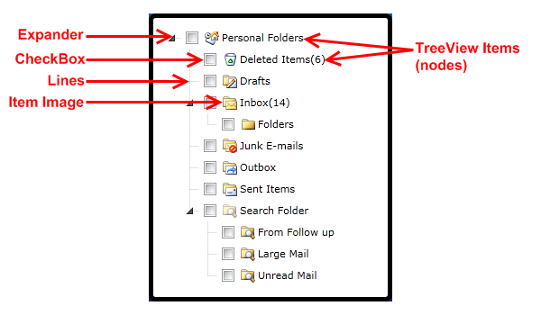

# Visual Structure

## 

This section defines terms and concepts used in the scope of __RadTreeView__ you have to get familiar with prior to continue reading this help.

__RadTreeView__ is a powerful control which lets you create complicated navigation systems and display hierarchical structures, such as directories and relational data. Below you can see a snapshot and explanation of the main visual elements of the standard __RadTreeView__ control.

The structure of a __RadTreeView__ is pretty simple. It consists of the following main elements:

* __TreeView Items (Nodes) - RadTreeView__ control provides a way to display information in a hierarchical structure by using collapsible items (nodes). Each TreeView item is an instance of the __RadTreeViewItem__class. You can navigate between these items using either your mouse device or your keyboard. [Read more]()

* __Expander -__the expander is used to expand or collapse the TreeView items. You can easily style it to provide better user experience. [Read more]()

* __Check Boxes (Radio Buttons) -__check Boxes (Radio Buttons) are displayed in front of the nodes' text. To show them you should set the __ItemsOptionsListType__to __CheckList__(or __OptionList__for Radio Buttons). The TreeView nodes support "tri-state" checkboxes. [Read more]()

* __Lines -__connecting lines between the nodes. You can easily show/hide the connecting lines. You should use a single property to do so - __IsLineEnabled__. [Read more]()

* __Item Images -__item images are displayed in front of the nodes' text (check boxes - if they are shown). __RadTreeView__ gives you the ability to define images for each item state. [Read more]()

# See Also

 * [Getting Started]()

 * [Populating with Data]()

 * [Templates Structure]()
