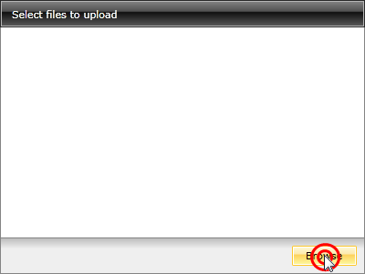
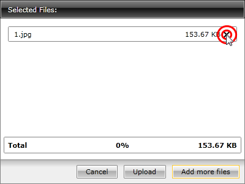
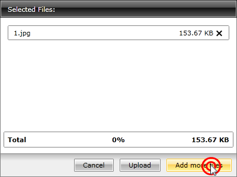
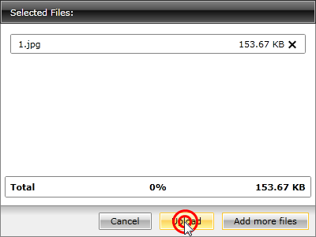
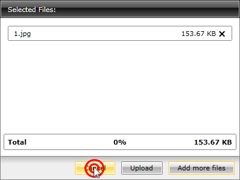
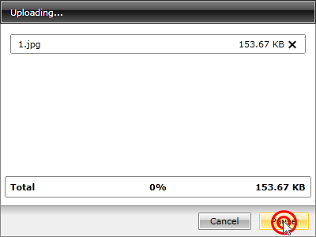
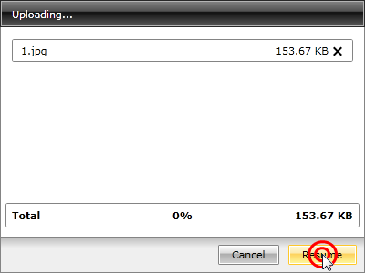

# End-User Capabilities

The user is able to do the following things with the __RadUpload__ control:

* [Select files for upload](#Selecting_Files_for_Upload)

* [Remove files](#Removing_Files)

* [Add more files for upload](#Adding_More_Files_for_Upload)

* [Upload files](#Uploading_Files)

* [Cancel the upload](#Canceling_the_Upload)

* [Pause the upload](#Pausing_the_Upload)

* [Resume the upload](#Resuming_the_Upload)

## Selecting Files for Upload

To select the files which the user want to upload, the __"Browse"__ button has to be clicked.

## Removing Files

To remove items from the list the user has to click the delete button of the desired items.

## Adding More Files for Upload

To add more files to the list the user has to click the __"Add more files"__ button.

## Uploading Files

To upload the selected files the user has to click the __"Upload"__ button.

## Canceling the Upload

To cancel the upload the user has to click the __"Cancel"__ button.

## Pausing the Upload

To pause the upload the user has to click the __"Pause"__ button.

## Resuming the Upload

To resume the upload the user has to click the __"Resume"__ button.

## See Also
 * [Visual Structure]()
 * [Events - Overview]()
 * [Localization]()
