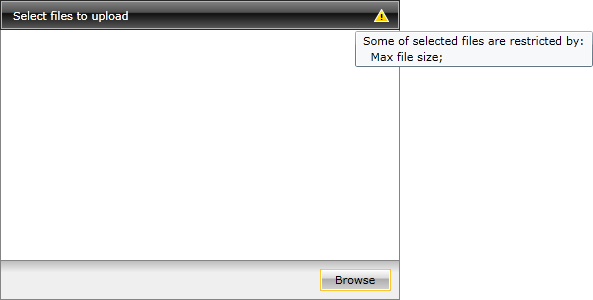
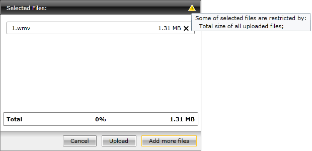
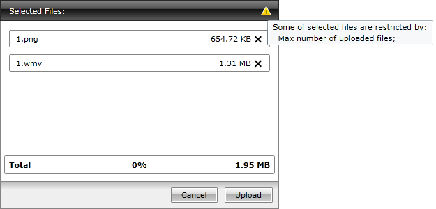

# File Size and Count Limitation

The __RadUpload__ allows you to apply some limitations regarding the size and the count of the files which the user wants to upload. This topic will explain the following:

* [Maximum File Size](#Maximum_File_Size)

* [Maximum Total Upload Size](#Maximum_Total_Upload_Size)

* [Maximum Files Count](#Maximum_Files_Count)

## Maximum File Size

To limit the size of a single file, you have to set the __MaxFileSize__ property of the __RadUpload__. The value of the property should be in __bytes__. Here is an example of __RadUpload__ with __MaxFileSize__ of __1 MB__(the default value is __long.MaxValue__):

#### __[XAML] Example 1: Setting the maximum file size__  
{{region xaml-radupload-features-file-size-and-count-limitation_0}}
	<telerik:RadUpload MaxFileSize="1000000" />
{{endregion}}

>When the maximum file size gets exceeded, the __FileTooLarge__ event gets raised. More about the events can be found [here]().

If the selected file is larger than 1 MB, it won't be added to the list and the __RadUpload__ will display a notification icon and a tooltip with an error message.

>tip You can see the size of each file in the list on the right side of its container.

## Maximum Total Upload Size

To limit the total size of the files, you have to set the __MaxUploadSize__ property of the __RadUpload__. The value of the property should be in __bytes__. Here is an example of __RadUpload__ with __MaxUploadSize__ of __2 MB__ (the default value is __long.MaxValue__):

#### __[XAML] Example 2: Setting the maximum upload size__  
{{region xaml-radupload-features-file-size-and-count-limitation_1}}
	<telerik:RadUpload MaxUploadSize="2000000" />
{{endregion}}

>When the total upload size gets exceeded the __UploadSizeExceeded__ event gets raised. More about the events can be found [here]().

If the selected files make the total upload size larger than 2 MB, the files, that are over the limit, won't be added to the list and the __RadUpload__ will display a notification icon and a tooltip with an error message.

>tip You can see the total size of the files in the list on the right side of the total details container.

## Maximum Files Count

To limit the count of the files that can be uploaded at a time, you have to set the __MaxFileCount__ property of the __RadUpload__ control. Here is an example of a __RadUpload__ with __MaxFileCount__ set to __2__ (the default value is __int.MaxValue__).

#### __[XAML] Example 3: Setting the maximum files count__  
{{region xaml-radupload-features-file-size-and-count-limitation_2}}
	<telerik:RadUpload MaxFileCount="2" />
{{endregion}}

>When the maximum file size gets exceeded, the __FileCountExceeded__ event gets raised. More about the events can be found [here]().

If the count of the files in the list becomes greater than the allowed one, the files that are over the count, won't be added to the list and the __RadUpload__ will display a notification icon and a tooltip with an error message.

## See Also  
 * [Automatic Upload]()
 * [Multiple Times File Selection]()
 * [Multiple Files Selection]()
 * [Events - Overview]()