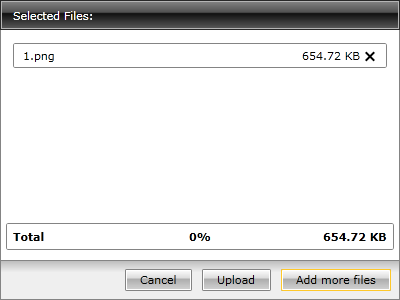

# Multiple Times File Selection

By default the __RadUpload__ allows one time file selection. This means that after selecting the desired files from the browse dialog the user won't be able to add more files to the list. To enable the multiple times file selection you have to set the __IsAppendFilesEnabled__ property to __True__ (its default value is __True__).

>When the __IsMultiselect__ property is set to __False__, the multiple times file selection is __disabled__. The default value of the __IsMultiselect__ property is __True__. To learn more about selecting multiple files read [here]().

#### __[XAML] Example 1: Enabling the multiple times file selection__  
{{region xaml-radupload-features-multiple-times-file-selection_0}}
	<telerik:RadUpload IsAppendFilesEnabled="True" />
{{endregion}}

When the multiple times file selection is enabled, the Add more files button appears after the first selection.

## See Also  
 * [Automatic Upload]()
 * [File Size and Count Limitation]()
 * [Overwrite Existing Files]()
 * [Multiple Files Selection]()
