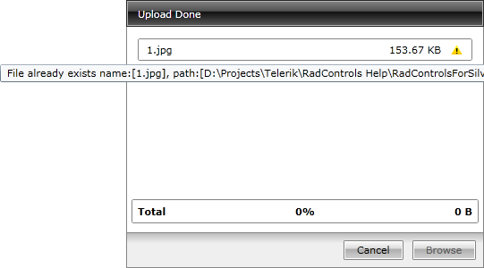

# Overwrite Existing Files

## 

When there are files with the same name as the uploaded ones, the __RadUpload__ can overwrite the existing files. By default the overwriting of files is disabled, but you can enable it by setting the __OverwriteExistingFiles__ property to __True__.

#### __XAML__

{{region radupload-features-overwrite-existing-files_0}}
	<telerik:RadUpload x:Name="radUpload"
	                   OverwriteExistingFiles="True" />
	{{endregion}}

When the overwriting is disabled and there are files with matching names, an error message is displayed.

# See Also

 * [Working with RadUpload]()

 * [Automatic Upload]()

 * [Extension Filters]()

 * [Multiple Times File Selection]()

 * [Multiple Files Selection]()
