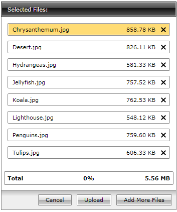
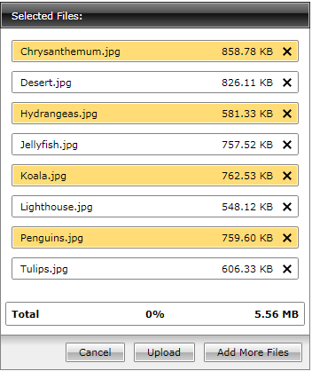

# Selection

The __RadUploadItem__ inherits the __ListBoxItem__ class thus allowing a selection of __RadUploadItems__.

By default the __RadUpload__ doesn’t display the selected __RadUploadItems__. To enable the user to see the selection you have to set the __SelectionVisibility__ property to __Visible__ (its default value is __Collapsed__).
		

#### __[XAML] Example 1: Setting the selection visibility__

{{region xaml-upload-features-selection_0}}
	<telerik:RadUpload x:Name="radUpload" SelectionVisibility="Visible"/>
{{endregion}}

The __RadUpload__ control also lets users select single or multiple __RadUploadItems__ by simply setting the __SelectionMode__ property. The __SelectionMode__ property is a __SelectionMode__ enumeration which exposes the following members:

* __Single__ - use it for a single selection. At this mode the user will be available to select only one item at once.

* __Multiple__ and __Extended__ - use these values when you want the user to be able to select multiple items at one time by holding down the control key and clicking multiple items with the mouse or by using the keyboard. A second click on a selected item will unselect that item.

