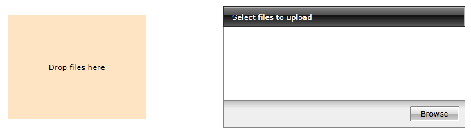

# RadUploadDropPanel

__RadUploadDropPanel__ is a content control that works with RadUpload and allows you to drop files into it. The dropped files are prepared for upload in the assosiated RadUpload component. The drop panel doesn't have a specific default layout which means that you can define its look and feel.

The drop panel have the following properties:
* __RadUpload__: A property of type __RadUpload__ that gets or sets a value indicating the assosisated RadUpload control.
* __Suspend__: A property of type __bool__ that gets or sets a value that indicates whether the drop action is allowed.

#### __[XAML] Example 1: Defining RadUploadDropPanel__
{{region radupload-features-uploaddroppanel-0}}
	<Grid>
		<Grid.ColumnDefinitions>
			<ColumnDefinition/>
			<ColumnDefinition/>
		</Grid.ColumnDefinitions>	
		<telerik:RadUploadDropPanel RadUpload="{Binding ElementName=uploader}" Width="200" Height="150">
			<Border Background="Bisque">
				<TextBlock Text="Drop files here" 
						   HorizontalAlignment="Center" 
						   VerticalAlignment="Center"/>
			</Border>
		</telerik:RadUploadDropPanel>
		<telerik:RadUpload x:Name="upload" Grid.Column="1"/>
	</Grid>
{{endregion}}

#### __Figure 1: RadUploadDropPanel example__

## See Also
 * [Getting Started]()
 * [Automatic Upload]()
