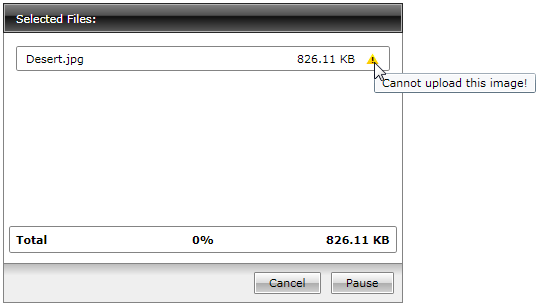

# Upload Validation

The __RadUpload__ allows you to apply some limitations regarding the uploaded files thus validating the upload process.

In order to take advantage of this feature you will need to handle the __RadUploadItem__ __ValidateEvent event__.

## Add handler for the RadUploadItem ValidateEvent

#### __[C#] Example 1: Subscribing to the Validate event__  
{{region cs-radupload-features-upload-validation_0}}
    radUpload.AddHandler(RadUploadItem.ValidateEvent, new UploadValidateEventHandler(OnValidate));
{{endregion}}

#### __[VB.NET] Example 1: Subscribing to the Validate event__  
{{region vb-radupload-features-upload-validation_1}}
	    radUpload.AddHandler(RadUploadItem.ValidateEvent, New UploadValidateEventHandler(AddressOf OnValidate))
{{endregion}}

>In order to add the __ValidateEvent__ handler you need to include a using statement for the __Telerik.Windows__ namespace.

##  Implement custom validation for the upload process 

#### __[C#] Example 2: Implementing custom validation__  
{{region cs-radupload-features-upload-validation_2}}
    void OnValidate(object sender, UploadValidateEventArgs e)
    {
        if ((e.OriginalSource as RadUploadItem).FileName.Equals("Desert.jpg"))
        {
            e.ErrorMessage = "Cannot upload this image!";
            e.Cancel = true;
        }
    }
{{endregion}}

#### __[VB.NET] Example 2: Implementing custom validation__  
{{region vb-radupload-features-upload-validation_3}}

	    Private Sub OnValidate(ByVal sender As Object, ByVal e As UploadValidateEventArgs)
	        If (TryCast(e.OriginalSource, RadUploadItem)).FileName.Equals("Desert.jpg") Then
	            e.ErrorMessage = "Cannot upload this image!"
	            e.Cancel = True
	        End If
	    End Sub
{{endregion}}

If the selected file is named Desert.jpg, it won't be uploaded and the __RadUpload__ will display a notification icon and a tooltip with the error message.

