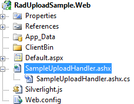
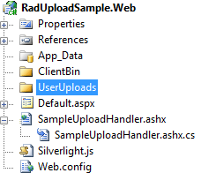
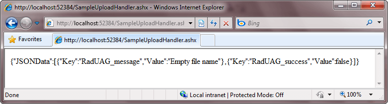

# Working with RadUpload

This topic will explain in details how to work with the __RadUpload__.
	  

## Defining a RadUpload control

Here is a sample declaration of a __RadUpload__ control.
		

>The __RadUpload__ control is located in the __Telerik.Windows.Controls__ namespace of the __Telerik.Windows.Controls.Input__ assembly.
		  

#### __XAML__

{{region radupload-features-working-with-radupload_0}}
	<UserControl x:Class="RadUploadSamples.GettingStarted"
	             xmlns="http://schemas.microsoft.com/winfx/2006/xaml/presentation"
	             xmlns:x="http://schemas.microsoft.com/winfx/2006/xaml"
	             xmlns:telerik="http://schemas.telerik.com/2008/xaml/presentation">    
	    <Grid x:Name="LayoutRoot" Background="White">
	        <telerik:RadUpload />
	    </Grid>
	</UserControl>
	{{endregion}}

#### __C#__

{{region radupload-features-working-with-radupload_1}}
	RadUpload radUpload = new RadUpload();
	{{endregion}}

#### __VB.NET__

{{region radupload-features-working-with-radupload_2}}
	Dim radUpload As New RadUpload()
	{{endregion}}

## Defining an Upload Service

The first thing you have to do is to add a reference to the __Telerik.Windows.RadUploadHandler__ assembly in the ASP.NET application, that hosts your Silverlight application. After that create a Generic (__ASHX__) Handler, that derives from the __RadUploadHandler__ class.

#### __C#__

{{region radupload-features-working-with-radupload_3}}
	public class SampleUploadHandler : RadUploadHandler
	{
	}
	{{endregion}}

#### __VB.NET__

{{region radupload-features-working-with-radupload_4}}
	Public Class SampleUploadHandler
	 Inherits RadUploadHandler
	End Class
	{{endregion}}

Create a folder, in which the uploaded files will get stored.

>Please, note the target folder should be in the same folder as the upload handler.

To test the handler point your browser to the SampleUploadHandler.ashx file. You should see the following output if everything is done correctly.

>tipTo learn how to create custom upload handlers read [this topic]().
		  

## Specifying an Upload Service

To specify an Upload Service for the __RadUpload__ control you have to set the url of the service to the __UploadServiceUrl__ of the __RadUpload__. The value should be an absolute or relative url that points to the upload handler.
		

>The domain where the Silverlight application is hosted should be the same as the domain where the upload handler is hosted, otherwise a cross-domain conflict will occur. In such case you have to add a Cross-Domain Policy file to the services domain.

For example, if you rely on the absolute path, the __UploadServiceUrl__ should point to [http://localhost:6519/SampleUploadHandler.](http://localhos6519/SampleUploadHandler.ashx)ashx and the Silverlight application should be hosted on the same domain - for example on this url: http://localhost:6519/index.html. Note that the port of the application should be the same (in this case the port is set to 6519, but any other port - including the default port 80 - will work).
		

If you prefer the relative path then pay attention to the following things: 

* if the path begins with "/" or "~/" then it is relative to the root of the domain where the Silverlight application had been loaded.

* if the path begins with "./" then it is relative to the location of the Silverlight application.

* if the path begins with one or more "../", then it is relative to the location above the location of the Silverlight application.

#### __XAML__

{{region radupload-features-working-with-radupload_5}}
	<telerik:RadUpload UploadServiceUrl="/SampleUploadHandler.ashx" />
	{{endregion}}

## Specifying the Upload Folder

To specify the folder to which the files to be uploaded, you have to set one of the following properties:

* __TargetFolder__ - use this property, if the storage folder is relative to the upload handler.
			

#### __XAML__

{{region radupload-features-working-with-radupload_6}}
	<telerik:RadUpload UploadServiceUrl="/SampleUploadHandler.ashx"
	                        TargetFolder="UserUploads" />
	{{endregion}}

* __TargetPhysicalFolder__ - use this property with the full path of the storage folder.
			

#### __XAML__

{{region radupload-features-working-with-radupload_7}}
	<telerik:RadUpload UploadServiceUrl="/SampleUploadHandler.ashx"
	                        TargetPhysicalFolder="C:\RadUploadSample\RadUploadSample.Web\UserUploads" />
	{{endregion}}

>If both __TargetPhysicalFolder__ and __TargetFolder__ are set, the __TargetPhysicalFolder__ will take precedence.
		  

## Restricting the User from Certain Actions

You can use the following properties to restrict the user actions against the __RadUpload__ control:
		

* __IsDeleteEnabled__ - when set to __False__ the user is not able to remove files from the selected file list. The default value is __True__.
			

* __IsPauseEnabled__ - when set to __False__ the user is not able to pause the upload process. The default value is __True__.
			

# See Also

 * [Visual Structure]()

 * [Upload Handler]()

 * [Upload Service Parameters]()

 * [Buffering]()

 * [Programmatic Upload]()

 * [Events - Overview]()

 * [Styles and Templates - Overview]()

 * [Localization]()
