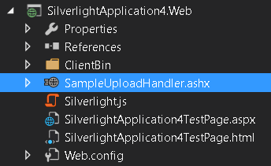
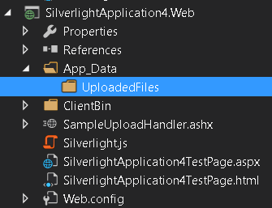
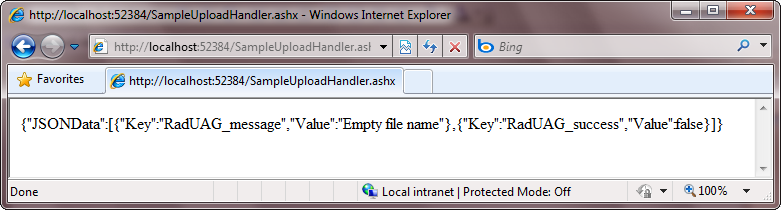

# Getting Started

To use the __RadUpload__ control you have to configure both the client and the server side part of your application. 

The client side is executed entirely in the browser using the Silverlight platform. The server side requires a handler on the server for processing the files that are submitted from the client side. This topic will explain the basics of:

* [Configuring the server side](#Configuring_the_server_side)

* [Configuring the client side](#Configuring_the_client_side)

## Assembly References

In order to use __RadUpload__ control in your projects you have to add references to the following assemblies:

* __Telerik.Windows.Controls__
* __Telerik.Windows.Controls.Input__

You can find more information about the different assemblies and their dependencies in the [Controls Dependencies]() article.

## Configuring the server side

The first thing you have to do is to add a reference to the __Telerik.Windows.RadUploadHandler__ assembly in the ASP.NET application that hosts your Silverlight application. It is located in the __ServerSide__ folder of your UI for Silverlight installation. After that create a Generic (__ASHX__) Handler, that derives from the __RadUploadHandler__ class.

#### Figure 1: The generic RadUploadHandler  

#### __[C#] Example 1: Create a generic handler__
{{region cs-radupload-getting-started_0}}
	public class SampleUploadHandler : RadUploadHandler
	{
	}
{{endregion}}

#### __[VB.NET] Example 1: Create a generic handler__
{{region vb-radupload-getting-started_1}}
	Public Class SampleUploadHandler
	 Inherits RadUploadHandler
	End Class
{{endregion}}

>important In version prior [LIB]() `2020.1.413` of Telerik UI for Silverilght by default the files are uploaded in the directory on the server where the RadUploadHandler class is located. In later versions this behavior was changed due to security reasons. Currently, the defaul upload directory of the handler is the __App_Data__ folder of the web project. If you use an older version, we strongly recommend to add logic in your handler  to secure the file path and avoid uploading in forbiden directories on the server. See one way to do this in the [Secure Upload File Paths]() article.

Next, create a folder, in which the uploaded files will be stored. The folder should be in the __App_Data__ directory of the web project. If the folder doesn't exist the handler will try to create it. 

#### Figure 2: UploadFiles folder where the files will be added

If you skip this step, the handler will try to automatically create the __App_Data/UserUploads__ folder and upload there.

To test the handler point your browser to the SampleUploadHandler.ashx file. You should see the following output if everything is done correctly.

#### Figure 3: The ouput when navigating to the handler  

## Configuring the client side

The first thing you have to do on the client side is to declare a __RadUpload__ control in the appropriate UserControl.

#### __[XAML] Example 2: RadUpload definition__
{{region xaml-radupload-getting-started_2}}
	<telerik:RadUpload />
{{endregion}}

Next you have to set the __UploadServiceUrl__ property of the __RadUpload__. The value can be an absolute or relative url that points to the upload handler.		

>The domain where the Silverlight application is hosted should be the same as the domain where the upload handler is hosted, otherwise a cross-domain conflict will occur. In such case you have to add a Cross-Domain Policy file to the services domain.

For example, if you rely on the absolute path, the __UploadServiceUrl__ should point to http://localhost:6519/SampleUploadHandler.ashx and the Silverlight application should be hosted on the same domain - for example on this url: http://localhost:6519/index.html. Note that the port of the application should be the same (in this case the port is set to 6519, but any other port - including the default port 80 - will work).		

If you prefer the relative path then pay attention to the following things: 

* if the path begins with "/" or "~/" then it is relative to the root of the domain where the Silverlight application had been loaded.

* if the path begins with "./" then it is relative to the location of the Silverlight application.

* if the path begins with one or more "../", then it is relative to the location above the location of the Silverlight application.

#### __[XAML] Example 3: Setting the upload service URL property__
{{region xaml-radupload-getting-started_3}}
	<telerik:RadUpload UploadServiceUrl="/SampleUploadHandler.ashx" />
{{endregion}}

The last thing to do is to set the __TargetFolder__ property. The __TargetFolder__ should point to the folder that is configured to accept the uploaded files. In our case the __TargetFolder__ should be set to "UploadedFiles".		

>The __TargetFolder__ property represents a path relative to the __App_Data__ folder of the web project. The path should point to a directory inside App_Data, otherwise the upload won't succeed.	  

#### __[XAML] Example 4: Setting the target folder__
{{region xaml-radupload-getting-started_4}}
	<telerik:RadUpload UploadServiceUrl="/SampleUploadHandler.ashx"
					   TargetFolder="UploadedFiles" />
{{endregion}}

This is enough to make the RadUpload work.

## Restricting the User from Certain Actions

You can use the following properties to restrict the user actions against the __RadUpload__ control:		

* __IsDeleteEnabled__ - when set to __False__ the user is not able to remove files from the selected file list. The default value is __True__.			

* __IsPauseEnabled__ - when set to __False__ the user is not able to pause the upload process. The default value is __True__.

To fine tune the upload to match your application requirements, read the following topics.		

* [Upload Handler]()  
* [Automatic Upload]()  
* [Upload Service Parameters]()  
* [File Size and Count Limitations]()  
* [Multiple Times File Selection]()  
* [Multiple Files Selection]()  
* [Extension Filters]()  
* [Overwriting Existing Files]()  
* [Buffering]()  
* [Programmatic Upload]()

## See Also
 * [Visual Structure]()
 * [Events - Overview]()
 * [Styles and Templates - Overview]()
 * [Localization]()
