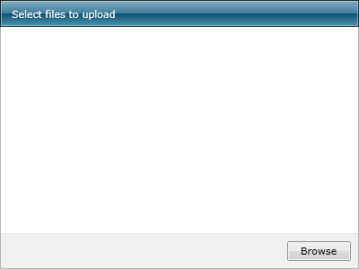

# Change the Default Theme

You can set the theme of the __RadUpload__ to one of the predefined themes for the RadControls for Silverlight or create your own custom theme. Read the [Creating a Custom Theme](http://www.telerik.com/help/silverlight/common-styling-and-appearance-creating-custom-theme.html), [Modifying a Built-In Theme](http://www.telerik.com/help/silverlight/common-styling-apperance-modifying-built-in-theme.html) and [Setting a Theme](http://www.telerik.com/help/silverlight/common-styling-apperance-setting-theme.html) for more information.

To set the theme of the __RadUpload__ use the __StyleManager.Theme__ attached property. Here is a simple example of setting the theme of the __RadUpload__ to one of the built-in ones.		

>The __StyleManager__ class can be found in the __Telerik.Windows.Control__ namespace of the __Telerik.Windows.Controls__ assembly. To use it in xaml you have to declare the namespace: `xmlns:telerik="clr-namespace:Telerik.Windows.Controls;assembly=Telerik.Windows.Controls"`

#### __[XAML] Example 1: Setting the theme__
{{region xaml-radupload-how-to-change-the-default-theme_0}}
	<telerik:RadUpload x:Name="radUpload"
					   telerik:StyleManager.Theme="Vista" />
{{endregion}}

Here is a snapshot of the result.

## See Also
 * [Styles and Templates - Overview]()
 * [Styling the RadUpload]()
 * [Styling the RadUploadItem]()
