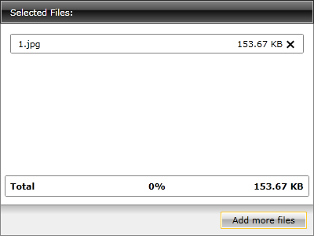

# Hide the Buttons

If you want to implement your custom command UI outside of the __RadUpload__, you have to hide the __RadUpload's__ buttons. In order to hide them you have to get an instance of the desired button and modify its __Opacity__ and __IsHitTestVisible__ properties. Here is an example with the Upload and Cancel buttons.

>As the buttons appear after some files have been selected, the logic is implemented in the handler for the __FilesSelected__ event. More about the __RadUpload__ events can be found [here]().

#### __[C#] Example 1: Hide the buttons__
{{region cs-radupload-how-to-hide-the-buttons_0}}
	private void radUpload_FilesSelected( object sender, Telerik.Windows.Controls.FilesSelectedEventArgs e )
	{
	    Button uploadButton = this.radUpload.ChildrenOfType<Button>().Where( b => b.Name.Equals( "UploadButton" ) ).FirstOrDefault();
	    Button cancelButton = this.radUpload.ChildrenOfType<Button>().Where( b => b.Name.Equals( "CancelButton" ) ).FirstOrDefault();
	    if ( uploadButton != null )
	    {
	        uploadButton.Opacity = 0;
	        uploadButton.IsHitTestVisible = false;
	    }
	    if ( cancelButton != null )
	    {
	        cancelButton.Opacity = 0;
	        cancelButton.IsHitTestVisible = false;
	    }
	}
{{endregion}}

#### __[VB.NET] Example 1: Hide the buttons__
{{region vb-radupload-how-to-hide-the-buttons_1}}
	Private Sub radUpload_FilesSelected(sender As Object, e As Telerik.Windows.Controls.FilesSelectedEventArgs)
	 Dim uploadButton As Button = Me.radUpload.ChildrenOfType(Of Button)().Where(Function(b As ) b.Name.Equals("UploadButton")).FirstOrDefault()
	 Dim cancelButton As Button = Me.radUpload.ChildrenOfType(Of Button)().Where(Function(b As ) b.Name.Equals("CancelButton")).FirstOrDefault()
	 If uploadButton <> Nothing Then
	  uploadButton.Opacity = 0
	  uploadButton.IsHitTestVisible = False
	 End If
	 If cancelButton <> Nothing Then
	  cancelButton.Opacity = 0
	  cancelButton.IsHitTestVisible = False
	 End If
	End Sub
{{endregion}}

Here is a snapshot of the result.  

## See Also
 * [Change the Size of the RadUpload]()
 * [Rename a File]()
 * [Template Structure]()