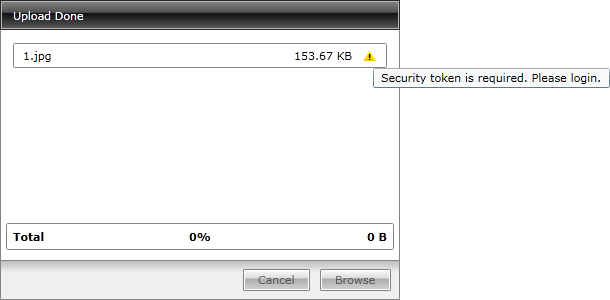

# Implement Simple Authentication

In order to authenticate the user that uploads files on the server-side of your application, you have to validate the user on the client and pass a parameter with his status to the server. To learn more about passing parameters to the Upload Handler read [here]().

On the server you have to read the parameter and take the respective actions, depending on its value. There are several things that you have to do in order to achieve a reliable authentication on the server. First you have to override the __SaveChunkData()__ method of the __RadUploadHandler__ class.

#### __[C#] Example 1: Overriding the SaveChunkData method__  
{{region cs-radupload-how-to-implement-simple-authentication_0}}
	public override bool SaveChunkData( string filePath, long position, byte[] buffer, int contentLength, out int savedBytes )
	{
	    return base.SaveChunkData( filePath, position, buffer, contentLength, out savedBytes );
	}
{{endregion}}

#### __[VB.NET] Example 1: Overriding the SaveChunkData method__  
{{region vb-radupload-how-to-implement-simple-authentication_1}}
	Public Overrides Function SaveChunkData(filePath As String, position As Long, buffer As Byte(), contentLength As Integer, savedBytes As Integer) As Boolean
	 Return MyBase.SaveChunkData(filePath, position, buffer, contentLength, savedBytes)
	End Function
{{endregion}}

Then you have to check if the parameter sent by the client indicates whether the user is valid or not. If the user is valid you have to call the base method.

>tip To learn how to work with parameters read [here]().

#### __[C#] Example 2: Authenticate the user__  
{{region cs-radupload-how-to-implement-simple-authentication_2}}
	public override bool SaveChunkData( string filePath, long position, byte[] buffer, int contentLength, out int savedBytes )
	{
	    string authorized = this.GetQueryParameter("Authorized");
	    bool isAuthorized = !string.IsNullOrEmpty( authorized ) && authorized.ToLower() == "true";
	    if ( !isAuthorized )
	    {
	    }
	    return base.SaveChunkData( filePath, position, buffer, contentLength, out savedBytes );
	}
{{endregion}}

#### __[VB.NET] Example 2: Authenticate the user__  
{{region vb-radupload-how-to-implement-simple-authentication_3}}
	Public Overrides Function SaveChunkData(filePath As String, position As Long, buffer As Byte(), contentLength As Integer, savedBytes As Integer) As Boolean
	 Dim authorized As String = Me.GetQueryParameter("Authorized")
	 Dim isAuthorized As Boolean = Not String.IsNullOrEmpty(authorized) AndAlso authorized.ToLower() = "true"
	 If Not isAuthorized Then
	 End If
	 Return MyBase.SaveChunkData(filePath, position, buffer, contentLength, savedBytes)
	End Function
{{endregion}}

If the user is not valid, you have to skip the execution of the base method and return the following set of parameters to the client.

#### __[C#] Example 3: Skipping the chunk saving if the user is not valid__  
{{region cs-radupload-how-to-implement-simple-authentication_4}}
	public override bool SaveChunkData( string filePath, long position, byte[] buffer, int contentLength, out int savedBytes )
	{
	    string authorized = this.GetQueryParameter( "Authorized" );
	    bool isAuthorized = !string.IsNullOrEmpty( authorized ) && authorized.ToLower() == "true";
	    if ( !isAuthorized )
	    {
	        this.AddReturnParam( RadUploadConstants.ParamNameMessage, "Security token is required. Please login." );
	        string fileName = this.GetQueryParameter( RadUploadConstants.ParamNameFileName );
	        this.AddReturnFileParam( RadUploadConstants.ParamNameSuccess, false );
	        this.AddReturnFileParam( RadUploadConstants.ParamNameFileName, fileName );
	        this.AddReturnFileParam( RadUploadConstants.ParamNameFinalFileRequest, true );
	        savedBytes = 0;
	        return false;
	    }
	    return base.SaveChunkData( filePath, position, buffer, contentLength, out savedBytes );
	}
{{endregion}}

#### __[VB.NET] Example 3: Skipping the chunk saving if the user is not valid__  
{{region vb-radupload-how-to-implement-simple-authentication_5}}
	Public Overrides Function SaveChunkData(filePath As String, position As Long, buffer As Byte(), contentLength As Integer, savedBytes As Integer) As Boolean
	 Dim authorized As String = Me.GetQueryParameter("Authorized")
	 Dim isAuthorized As Boolean = Not String.IsNullOrEmpty(authorized) AndAlso authorized.ToLower() = "true"
	 If Not isAuthorized Then
	  Me.AddReturnParam(RadUploadConstants.ParamNameMessage, "Security token is required. Please login.")
	  Dim fileName As String = Me.GetQueryParameter(RadUploadConstants.ParamNameFileName)
	  Me.AddReturnFileParam(RadUploadConstants.ParamNameSuccess, False)
	  Me.AddReturnFileParam(RadUploadConstants.ParamNameFileName, fileName)
	  Me.AddReturnFileParam(RadUploadConstants.ParamNameFinalFileRequest, True)
	  savedBytes = 0
	  Return False
	 End If
	 Return MyBase.SaveChunkData(filePath, position, buffer, contentLength, savedBytes)
	End Function
{{endregion}}

Here is a snapshot of the __RadUpload__ control, after an invalid upload attempt.

## See Also  
 * [Upload Handler]()
 * [Upload Service Parameters]()
 * [Create Custom Upload Handler]()