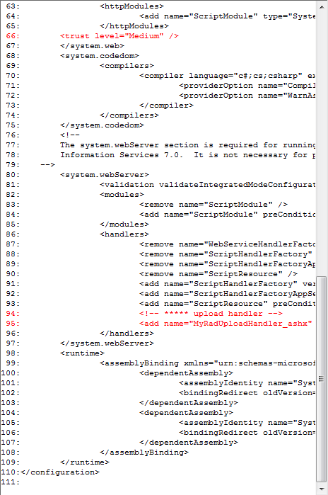

# Use RadUpload in Medium Trust

In order to run the __RadUpload__ in Medium Trust level you should do only one thing: register the upload handler in the __web.config__ file. In order to do this you have to do the following:

1. Open (for editing) the __web.config__ file related to the chosen application; 

2. In the "handlers" section append your upload handler.

	#### __[XML] Registering the upload handlers__
	{{region radupload-how-to-use-radupload-in-medium-trust_0}}
		<system.WebServer>
			<handlers>
				<add name="MyRadUploadHandler_ashx" 
					 path="MyRadUploadHandler.ashx" 
					 verb="*" 
					 type="Telerik.Windows.RadUploadHandler" />
				...
			</handlers>
			...
		</system.WebServer>
	{{endregion}}

3. Now you can configure your web site (or the whole web server) to run in Medium Trust level. Of course you can script by hand the command for Medium Trust level (see row 66 in the picture below);

	

## See Also  
 * [Limit the Upload Speed]()
 * [Implement Simple Authentication]()
