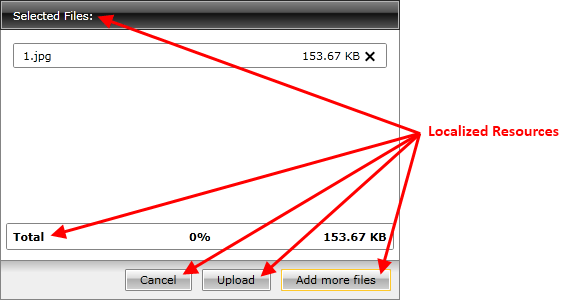
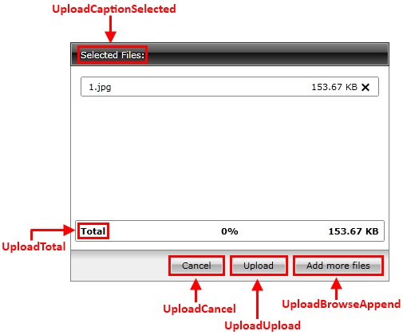

# Localization

The built-in localization mechanism in Silverlight and WPF allows you to localize any string resource used by the standard __RadUpload__ control. Once translated you might use your resources in both Silverlight and WPF projects without changing anything.

>tip To learn more about the ways in which to localize the RadControls please read the common topic about

## Resource Keys

__RadUpload__ is a complex user interface control and its strings for localization are numerous. In order to be able to distinguish these resources, a unique identifier called __resource key__ is assigned to each localizable string.

Here is a list of all of the __Resources__ available and their default values:
		
|Key|Value|
|---|-----|
|UploadItemDismissed|Item dismissed.|
|UploadCaptionSelected|Selected Files:|
|UploadBufferSizeSoBig|BufferSize too big. Please set it to a smaller value.|
|UploadCancel|Cancel|
|UploadBrowse|Browse|
|UploadRestriction|Some of selected files are restricted by:|
|UploadUploadServiceUrlInvalidPropertyValue|Invalid upload url. Please make sure the url is absolute!|
|UploadResume|Resume|
|UploadUpload|Upload|
|UploadUploadServiceUrlSetProperty|Property UploadServiceUrl not set|
|UploadUnknownError|Unknown error!|
|UploadTotal|Total|
|UploadPause|Pause|
|UploadCaptionUploaded|Upload Done|
|UploadBrowseAppend|Add more files|
|UploadCaptionUploading|Uploading...|
|UploadCaptionSelect|Select files to upload|
|UploadHandlerNotFoundOrFailed|Handler not found or execution of the handler failed!|
|UploadRestrictionCount|Max number of uploaded files;|
|UploadRestrictionSize|Max file size;|
|UploadRestrictionTotalSize|Total size of all uploaded files;|

## See Also
 * [Visual Structure]()
 * [End-User Capabilities]()
