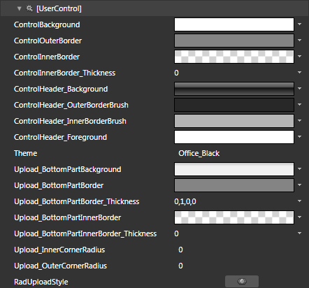
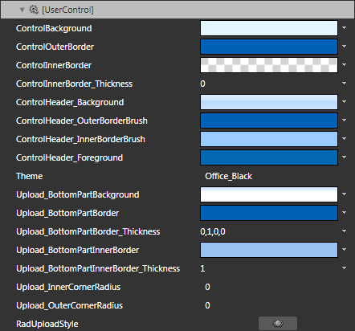
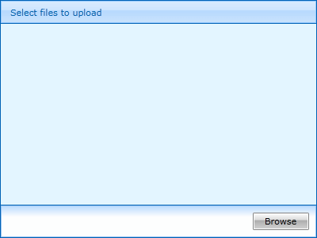

# Styling the RadUpload

>tipBefore reading this topic, you might find it useful to get familiar with the [Template Structure of the RadUpload control](#RadUpload_Template_Structure).

The __RadUpload__ can be styled by creating an appropriate __Style__ and setting it to the __Style__ property of the control. 

You have two options:

* To create an empty style and set it up on your own.

* To copy the default style of the control and modify it.

This topic will show you how to perform the second one.

## Modifying the Default Style

To copy the default style, load your project in Expression Blend and open the User Control that holds the __RadUpload__. In the 'Objects and Timeline' pane select the __RadUpload__ you want to style. From the menu choose *Object -> Edit Style -> Edit a Copy*. You will be prompted for the name of the style and where to be placed.

>tipIf you choose to define the style in Application, it would be available for the entire application. This allows you to define a style only once and then reuse it where needed.

After clicking 'OK', Expression Blend will generate the default style of the __RadUpload__ control in the __Resources__ section of your User Control. The properties available for the style will be loaded in the 'Properties' pane and you will be able to modify their default values. You can also edit the generated XAML in the XAML View or in Visual Studio.

If you go to the 'Resources' pane, you will see an editable list of resources generated together with the style and used by it. In this list you will find the brushes, styles and templates needed to change the visual appearance of the __RadUpload__. Their names indicate to which part of the __RadUpload__ appearance they are assigned.

* __ControlBackground__ - a brush that represents the background of the __RadUpload__ control.

* __ControlOuterBorder__ - a brush that represents the outer border color of the __RadUpload__ control.

* __ControlInnerBorder__ - a brush that represents the inner border color of the __RadUpload__ control.

* __ControlInnerBorder_Thickness__ - represents the thickness of the inner border of the __RadUpload__ control.

* __ControlHeader_Background__ - a brush that represents the background color of the __RadUpload's__ header.

* __ControlHeader_OuterBorderBrush__ - a brush that represents the outer border color of the __RadUpload's__ header.

* __ControlHeader_InnerBorderBrush__ - a brush that represents the inner border color of the __RadUpload's__ header.

* __ControlHeader_Foreground__ - a brush that represents the foreground color of the __RadUpload's__ header.

* __Upload_BottomPartBackground__ - a brush that represents the background color of the command area.

* __Upload_BottomPartBorder__ - a brush that represents the outer border color of the command area.

* __Upload_BottomPartBorder_Thickness__ - represents the thickness of the command area's outer border.

* __Upload_BottomPartInnerBorder__ - a brush that represents the inner border color of the command area.

* __Upload_BottomPartInnerBorder_Thickness__ - represents the thickness of the command area's inner border.

* __Upload_InnerCornerRadius__ - represents the corner radius for the __RadUpload's__ inner border.

* __Upload_OuterCornerRadius__ - represents the corner radius for the __RadUpload's__ outer border.

* __RadUploadStyle__ - represents the __Style__ applied to the __RadUpload__.

>tipChanging the value of the resources can be done by clicking on the color indicator or the icon next to them.

Modify the resource to bring the desired appearance of the __RadUpload__. 

Here is a snapshot of the result.

## See Also

 * [Styles and Templates - Overview]()

 * [Template Structure]()

 * [Styling the RadUploadItem]()
