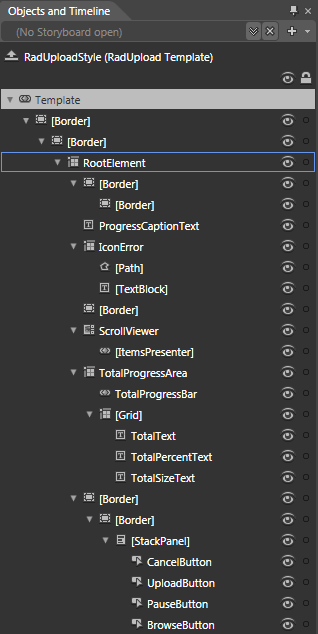
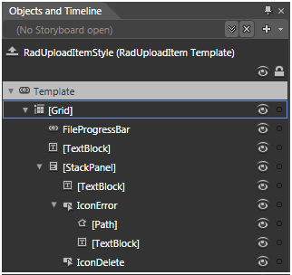

# Template Structure

Like most SilverlightWPF controls, the __RadUpload__ also allows you to template it in order to change the control from the inside. Except for templating the whole control, you can template parts of it or even independent controls related to it. This topic will make you familiar with the:

* [RadUpload Template Structure](#RadUpload_Template_Structure)

* [RadUploadItem Template Structures](#RadUploadItem_Template_Structure)

>tipFor more information about templating and how to modify the default templates of the __RadControls__ read [the common topics](http://www.telerik.com/help/silverlight/common-styling-appearance-edit-control-templates-blend.html) on this matter.

## RadUpload Template Structure

This section will explain the structure of the __RadUpload__'s template. Here is a snapshot of the template generated in Expression Blend.

It contains the following parts:

* __[Border]__ - represents the outer border of the __RadUpload__ and is of type __Border__.
            

* __[Border]__ - represents the inner border of the __RadUpload__ and is of type __Border__.
                

* __RootElement__ - hosts the template elements and is of type __Grid__.
                    

* __[Border]__ - represents the outer border and the background of the __RadUpload's__ header and is of type __Border__.
                        

* __[Border]__ - represents the inner border of the __RadUpload's__ header and is of type __Border__.
                          

* __ProgressCaptionText__ - represents the text in the __RadUpload's__ header and is of type __TextBlock__.
                      

* __IconError__ - hosts the visual elements, that represent the error icon, and is of type __Grid__.
                        

* __[Path]__ - represents the shape of the error icon and is of type __Path__.
                          

* __[TextBlock]__ - represents the symbols inside the error icon and is of type __TextBlock__.
                          

* [__Border]__ - represents the background of the __RadUpload's__ content area and is of type __Border__.
                      

* __[ScrollViewer]__ - hosts the content of the __RadUpload__ and is of type __ScrollViewer__.
                        

* __[ItemsPresenter]__ - displays the __RadUploadItems__ and is of type __ItemsPresenter__.
                          

* __TotalProgressArea__ - hosts the elements of the total progress area (the overall details) and is of type __Grid__.
                        

* __TotalProgressBar__ - indicates the total progress of the upload and is of type __RadProgressBar__.
                          

* __[Grid]__ - hosts the text elements of the total progress area and is of type __Grid__.
                             

* __TotalText__ - represents the label of the total progress area and is of type __TextBlock__.
                               

* __TotalPercentText__ - displays the progress of the total upload in percentage and is of type __TextBlock__.
                               

* __TotalSizeText__ - displays the total size of the upload and is of type __TextBlock__.
                               

* __[Border]__ - represents the background and the outer border of the command area and is of type __Border__.
                        

* __[Border]__ - represents the inner border of the command area and is of type __Border__.
                            

* __[StackPanel]__ - hosts the buttons in the command area and is of type __StackPanel__.
                                

* __CancelButton__ - represents the Cancel Button and is of type __Button__.
                                  

* __UploadButton__ - represents the Upload Button and is of type __Button__.
                                  

* __PauseButton__ - represents the Pause/Resume Button and is of type __Button__.
                                  

* __BrowseButton__ - represents the Browse/Add more files Button and is of type __Button__.
                                  

## RadUploadItem Template Structure

This section will explain the structure of the __RadUploadItem__'s template. Here is a snapshot of the template generated in Expression Blend.

It contains the following parts:

* __[Grid]__ - hosts the elements of the template and is of type __Grid__.
            

* __FileProgressBar__ - represents the progress bar for the __RadUploadItem__ and is of type __ProgressBar__.
              

* __[TextBlock]__ - displays the name of the file and is of type __TextBlock__.
              

* __[StackPanel]__ - hosts the details for the file and is of type __StackPanel__.
                

* __[TextBlock]__ - displays the size of the file and is of type __TextBlock__.
                  

* __IconError__ - hosts the visual elements, that represent the error icon, and is of type __Button__.
                    

* __[Path]__ - represents the shape of the error icon and is of type __Path__.
                      

* __[TextBlock]__ - represents the symbols inside the error icon and is of type __TextBlock__.
                      

* __IconDelete__ - represents the remove file icon and is of type __Button__.
                  

# See Also

 * [Visual Structure]()

 * [Styles and Templates - Overview]()

 * [Styling the RadUpload]()

 * [Styling the RadUploadItem]()
