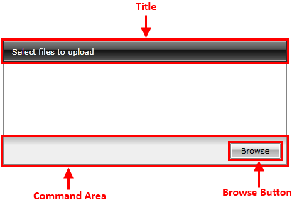
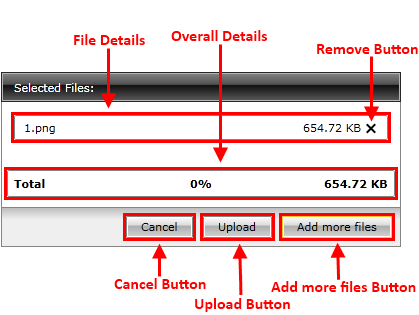

# Visual Structure

This section defines the terms and concepts used in the scope of __RadUpload__ that you have to get familiar with prior to continue reading this help. They can also be helpful when contacting the support service in order to describe your issue better. Below you can see snapshots and explanations of the main states and visual elements of the standard __RadUpload__ control.

The __RadUpload__ is an user interface control, that provides the users with a way to upload their files to a server. In its default state the following visual elements can be seen.

* __Title__ - Shows information related to the control's state, for example: "Select files to upload", "Uploading...", "Upload Done".

* __Command Area__ - holds the command buttons that allow the user to interact with the control.

* __Browse Button__ - opens the browse dialog window. All previously selected files will be removed from the upload list.

After selecting some files from the browse dialog window, the following elements can be seen.

* __Add more files Button__ - it is the same as the __Browse Button__. The only difference is that the upload list will not be cleared.

* __File Details__ - displays details about the particular file, such as file name, file size.

* __Remove Button__ - removes the particular file from the upload list.

* __Overall Details__ - displays details about the entire upload, such as total file size.

* __Upload Button__ - starts the upload of the selected files.

* __Cancel Button__ - clears the upload list.

When the upload process has been started the following elements are available.

* __Pause Button__ - pauses the upload process.

* __Resume Button__ - resumes the paused upload.

* __File Progress__ - represents the upload progress for the particular file.

* __Overall Progress__ - represents the total upload progress.

* __Cancel Button__ - breaks the upload and clears the upload list.

## See Also
 * [Getting Started]()
 * [Template Structure]()