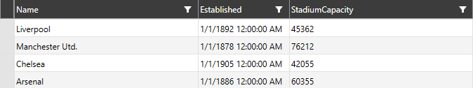
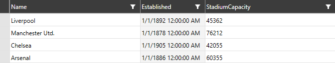

# Alternation

__RadVirtualGrid__ allows alternating its rows and columns when readability needs to be improved. This article covers the mechanism in details.

## Row Alternation

The row alternation of the control can be utilized through the __RowAlternationCount__ property. 

__Example 1: Setting the RowAlternationCount__
```XAML
	<telerik:RadVirtualGrid x:Name="VirtualGrid" 
                                InitialColumnCount="4" 
                                InitialRowCount="4"
                                RowAlternationCount="2"/>
```

#### __Figure 1: Setting the RowAlternationCount property__


## Column Alternation

Respectively, the alternation of the columns of __RadVirtualGrid__ can be manipulated through the __ColumnAlternationCount__ property of the control.

__Example 2: Setting the ColumnAlternationCount__
```XAML
	<telerik:RadVirtualGrid x:Name="VirtualGrid" 
                                InitialColumnCount="4" 
                                InitialRowCount="4"
                                ColumnAlternationCount="2"/>
```

#### __Figure 2: Setting the ColumnAlternationCount property__


## Custom Alternation color

__RadVirtualGrid__ exposes a property for altering the default background applied to the elements participating in the alternation: __AlternationBrush__.

__Example 3: Setting the AlternationBrush__
```XAML
		<telerik:RadVirtualGrid x:Name="VirtualGrid" 
                                InitialColumnCount="4" 
                                InitialRowCount="4"
								RowAlternationCount="2"
                                ColumnAlternationCount="2"
								AlternationBrush="Beige"/>
```

#### __Figure 3: Setting the AlternationBrush property__


## See Also

* [Column and Row Resizing]()

* [Editing]()

* [Insert and Remove Data]()