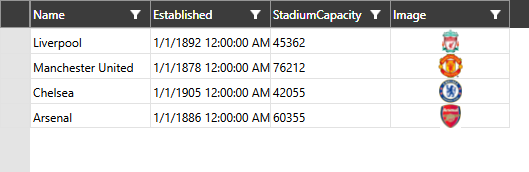

# Custom Cell Content

As of **R2 2022**, the RadVirtualGrid allows you to display any control as the content of its cells.

You can do so via the new `CellTemplateNeeded` event. Its `CellTemplateEventArgs` expose the following properties:

* **ColumnIndex**: The index of the column.
* **RowIndex**: The index of the row.
* **DataItem**: The object that represents the row in case a **DataProvider** is used, otherwise it's `null`.
* **DataTemplate**: The DataTemplate to be applied for this cell.

When a [DataProvider]() is used, the CellTemplateNeeded event also provides the data item, which will be the DataContext inside the DataTemplate. In scenarios without a DataProvider, the DataContext inside the cell will be whatever is passed to the [CellValueNeeded](#cellvalueneeded) event for the given cell. 

Here's an example of how you can display an image for one of the columns.

__Define the template for the cells__
```C#
    <Window.Resources>
        <DataTemplate x:Key="ImageTemplate">
            <!-- This example assumes the bound objects expose a public Image property
            which holds the path to the actual image -->
            <Image Source="{Binding Image}" />
        </DataTemplate>
    </Window.Resources>
```

__Display image as the content of the cells__
```C#
    private void VirtualGrid_CellTemplateNeeded(object sender, Telerik.Windows.Controls.VirtualGrid.CellTemplateEventArgs e)
    {
        if (e.ColumnIndex == 3)
        {
            e.DataTemplate = this.Resources["ImageTemplate"] as DataTemplate;
        }
    }
```


	
## See Also

* [Custom Data Provider]()
* [Editing]()
* [Insert and Remove Data]()
* [Pinned Rows and Columns]()