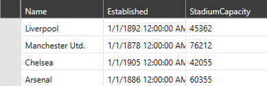

# Custom DataProvider

The __DataProvider__ class exposes various methods and properties for extending and customizing the default behavior of its respective **RadVirtualGrid** control. **Examples 1 and 2** demonstrate how you can create and apply a custom DataProvider.

__Example 1: Defining a Custom DataProvider__

```C#
	public class CustomDataProvider: DataProvider
    {
        public CustomDataProvider(IEnumerable source) : base(source)
        {
        }
    }
```
```VB.NET
	Public Class CustomDataProvider
		Inherits DataProvider

		Public Sub New(ByVal source As IEnumerable)
			MyBase.New(source)
		End Sub
	End Class
```

__Example 2: Applying the Custom DataProvider__

```C#
	this.VirtualGrid.DataProvider = new CustomDataProvider(Club.GetClubs());
```
```VB.NET
    Me.VirtualGrid.DataProvider = New CustomDataProvider(Club.GetClubs())
```

#### __Figure 1: RadVirtualGrid with applied custom DataProvider__



By inheriting the default __DataProvider__, the following methods and properties are exposed for customization.

>A good example of how to override some of these members can be found in the "MVVM" demo from the [SDK Samples Browser](https://demos.telerik.com/xaml-sdkbrowser). The source code of the demo is also available in our [GitHub repository](https://github.com/telerik/xaml-sdk/tree/master/VirtualGrid/MVVM).

### Properties

* __InitialRowCount__: If not overridden, gets the value that is set to the __InitialRowCount__ property of __RadVirtualGrid__.

* __InitialColumnCount__: If not overridden, gets the value that is set to the __InitialRowCount__ property of __RadVirtualGrid__.

* __ShouldPushEditValueToGrid__: When an editor is provided for the [Editing]() operation, its edited value needs to be manually pushed to underlying source and to the grid through its __PushCellValue__ method. If the __ShouldPushEditValueToGrid__ property is overridden and returns a __True__ value, updating the control with the edited property value will be done automatically.

* __DistinctValuesLimit__: By default, its value is set to 1000. Through it, the maximum count of distinct values in the __FilteringControl__ can be manipulated.

### Methods

You can override each of the following methods in order to customize the behavior of the control when a certain operation is perfrormed either through the UI or programmatically. 

* __OnCellEditEnded__: The method that is called when the __CellEditEnded__ event is raised.

* __OnCellValueNeeded__: The method that is called when the __CellValueNeeded__ event is raised.

* __OnEditorNeeded__: The method that is called when the __EditorNeeded__ event is raised.

* __OnEditorValueChanged__: The method that is called when the __EditorValueChanged__ event is raised.

* __OnHeaderValueNeeded__: The method that is called when the __HeaderValueNeeded__ event is raised.

* __DistinctValuesLoading__: Occurs when the grid column distinct values are about to be loaded. 

* __FilterOperatorsLoading__: The method is invoked when the __FilterOperators__ for a given column are being loaded.

* __SortDescriptorPreparing__: The method is called when the __SortDescriptors__ are being prepared.

* __SortDescriptorPrepared__: The method is called when the __SortDescriptors__ are prepared and a sort operation will occur.

* __OnSortingCompleted__: The method is called when the sort operation is completed. 

* __FilterDescriptorPreparing__: The method is called when the __FilterDescriptors__ are being prepared.

* __FilterDescriptorPrepared__: The method is called when the __FilterDescriptors__ are prepared and a filter operation will occur.

* __OnFilteringCompleted__: The method is called when the filter operation is completed. 

* __ApplyFilterDescriptor__: Adds the filter descriptor to the __Source QCV__, which is the collection used for the data operations of the provider.

* __ApplySortDescriptor__: Adds the sort descriptor to the __Source QCV__, which is the collection used for the data operations of the provider.

* __RemoveColumnFilter__: Removes the given filter descriptor from the __Source QCV__.

* __IsColumnReadOnly__: Determines whether a given column is ReadOnly. 

* __RemoveItemsFromSource__: Removes a set of items from the underlying source.

## See Also

* [Editing]()
* [Insert and Remove Data]()
* [Pinned Rows and Columns]()