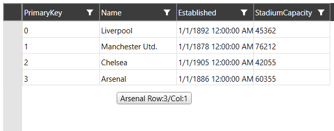
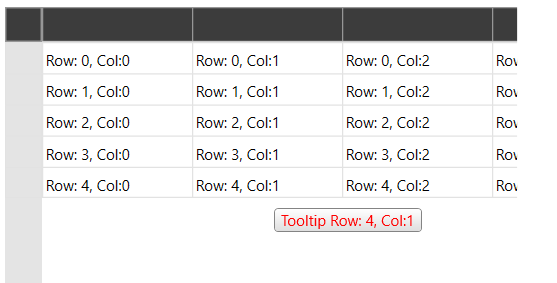

# Cell ToolTip

__RadVirtualGrid__ provides a cell tooltip behavior which can be used to visualize information while hovering a cell. The CellToolTip functionality is disabled by default. To enable it, you need to set the __ShowCellToolTip__ boolean property of the __RadVirtualGrid__.

__Example 1: Show Cell ToolTip__

```XAML
	<telerik:RadVirtualGrid ShowCellToolTip="True"/>
```

## Setting the CellToolTip while RadVirtualGrid is populated through DataProvider

>important If the default __DataProvider__ is used for populating the control with data, it handles the __OnCellToolTipNeeded__ event. In order for the default behavior to be altered, a [Custom Data Provider]() can be utilized. The properties that the event arguments expose are listed below.

* __Value__: A property of type __object__ which can be used to get or set the content of the cell tooltip.

* __ColumnIndex__: A property of type __int__ that gets the index of the current hovered column.

* __RowIndex__: A property of type __int__ that gets the index of the current hovered row.

> The column headers will have __RowIndex__ of -1. With this in hand, the row indicator area will have __ColumnIndex__ of -1.

The following example demonstrates how we can modify the default cell tooltip of the RadVirtualGrid when using DataProvider. We are going to use the code snippets from [MVVM Support]() help article. The only difference here will be that we are going to create our DataProvider to override the __OnCellToolTipNeeded()__ method. __Example 1__ demonstrates how to customize a little bit of the tooltip for the cell and column headers.

> To get the value of the current hovered cell, you need to call the base.OnCellToolTipNeeded() method. Otherwise, the value property from the event arguments will be null.

__Example 2: Override OnCellToolTipNeeded to provide custom value__

```C#
	public class MyDataProvider : DataProvider
	{
		public MyDataProvider(IEnumerable source)
			: base(source) 	{}
		protected override void OnCellToolTipNeeded(VirtualGridCellToolTipEventArgs valueEventArgs)
		{
			base.OnCellToolTipNeeded(valueEventArgs);
			int columnIndex = valueEventArgs.ColumnIndex;
			int rowIndex = valueEventArgs.RowIndex;
			if (columnIndex > -1 && rowIndex == -1)
			{
				valueEventArgs.Value = this.ItemProperties[columnIndex].Name+ " Column:" + columnIndex;
			}
			else if (columnIndex > -1 && rowIndex > -1)
			{
				valueEventArgs.Value = valueEventArgs.Value + " Row:" + rowIndex + "/Col:" + columnIndex;
			}
		}
	}
```



## Setting the CellToolTip while RadVirtualGrid is populated with data manually

In this case, while RadVirtualGrid is manually populated, the control provides a __CellToolTipNeeded__ event for setting the value of the cell tooltip on demand. 

> In order for the __RadVirtualGrid__ to be populated with data, its __InitialRowCount__ and __InitialColumnCount__ properties need to be set.

__Example 1: Setting the InitialRowCount and InitialColumnCount properties__
```XAML
	<telerik:RadVirtualGrid x:Name="VirtualGrid"  
							InitialColumnCount="5"  
							InitialRowCount="5"/> 
```

The control populates its data through the CellValueNeeded event. In our case, we will show the row/column index of the current hovered cell.

__Example 2: Setting the InitialRowCount and InitialColumnCount properties__
```C#
	private void virtualGrid_CellValueNeeded(object sender,Telerik.Windows.Controls.VirtualGrid.CellValueEventArgs e) 
	{ 
		e.Value = String.Format("{0}.{1}", e.RowIndex, e.ColumnIndex); 
	}  
```

You can set the CellToolTip content with a similar code by subscribing to the __CellToolTipNeeded__ event.

__Example 3: Setting the Value of the ToolTip__
```C#
	private void virtualGrid_CellToolTipNeeded(object sender,Telerik.Windows.Controls.VirtualGridToolTipEventArgs e) 
	{ 
		e.Value = String.Format("ToolTip Row:{0},Col:{1}", e.RowIndex, e.ColumnIndex); 
	}  
```

## CellToolTipTemplate

You can customize the CellToolTip through the CellToolTipTemplate property of the RadVirtualGrid.

__Example 4: Setting CellTooltipTemplate property to custom DataTemplate__
```C#
	<Window.Resources>
		<DataTemplate x:Key="CustomToolTipTemplate">
			<TextBlock Text="{Binding }" Foreground="Red"/>
		</DataTemplate>
	</Window.Resources>
	<Grid>
		<telerik:RadVirtualGrid x:Name="VirtualGrid" InitialColumnCount="5" InitialRowCount="5"
					CellValueNeeded="virtualGrid_CellValueNeeded" 		
					CellToolTipNeeded="virtualGrid_CellToolTipNeeded" 
					CellToolTipTemplate="{StaticResource CustomToolTipTemplate}" 
					ShowCellToolTip="True" />   
	</Grid>
```

	
	
## See Also

* [Custom Data Provider]()

* [Editing]()

* [Insert and Remove Data]()

* [Pinned Rows and Columns]()
