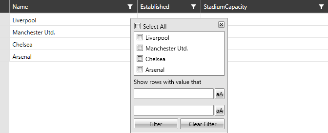
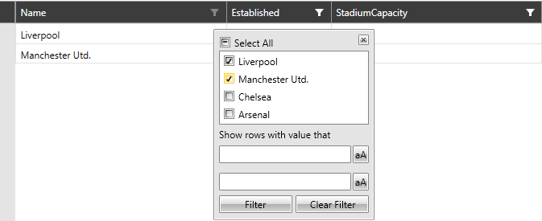
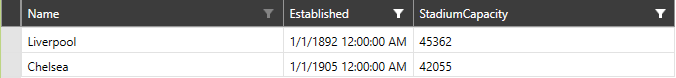

# Filtering with DataProvider

When __RadVirtualGrid__ populates its data through the __DataProvider__ mechanism, the filtering operation will be handled out-of-the-box. By default, the filtering of the control is enabled. The user can filter the data through the UI by clicking the filtering funnel in the column headers.

> The filtering of __RadVirtualGrid__ can be disabled by setting the __IsFilterable__ property to __false__.

> The __FilteringControl__ of __RadVirtualGrid__ can be manually closed by calling the __CloseFilteringControl__ method of the control.

* [Filtering](#filtering)

* [Filtering through ColumnFilterDescriptor](#filtering-through-columnfilterdescriptor)

* [Deferred Filtering](#deferred-filtering)

## Filtering

#### __Figure 1: Opening the FilteringControl of RadVirtualGrid__


After applying the needed filtering criteria, the control will appear as follows.

#### __Figure 2: Filtering  RadVirtualGrid__


## Filtering through ColumnFilterDescriptor

The __ColumnFilterDescriptor__ for a given column can be fetched through the __GetFilterDescriptorForColumn__ method. This can be done by providing the index of the needed column.

__Example 1: Getting the ColumnFilterDescriptor of a column__

```C#
	var descriptor = this.VirtualGrid.GetFilterDescriptorForColumn(0);
```

Then, the data can be filtered by adding/removing __DistinctFilters__ to the __DistinctFilter__ of the __ColumnFilterDescriptor__. 

__Example 2: Adding distinct values__

```C#
	var distinctFilter = this.VirtualGrid.GetFilterDescriptorForColumn(0).DistinctFilter;
        distinctFilter.AddDistinctValue("Liverpool");
        distinctFilter.AddDistinctValue("Chelsea");
```

#### __Figure 3: Filtering RadVirtualGrid by adding distinct values__


## Deferred Filtering 

By default, the filtering operation will be processed as soon as the user chooses a distinct filter from the predefined list. This behavior can be altered through the __IsFilteringDeferred__ property. By setting it to __True__, the filtering criteria will be evaluated only when the user presses the __Filter Button__.

## See Also

* [Programmatic Filtering]()