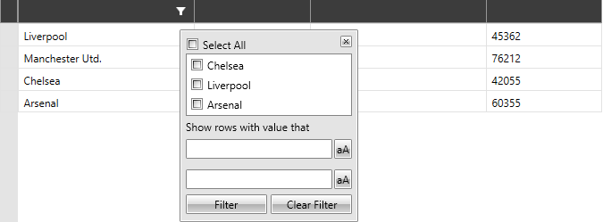

# Programmatic Filtering

`RadVirtualGrid` provides an API for programmatically filtering its data. The following article will go through the exposed mechanisms.

>important The `FilteringControl` of RadVirtualGrid can be manually closed via the `CloseFilteringControl` method of the control.

>important The events that this section covers cannot be utilized when the __DataProvider__ mechanism is used for populating data. In such scenario, the built-in filtering can be altered through a [Custom DataProvider]().

RadVirtualGrid provides a set of events which can be utilized so that the filtering operation is aligned to the specific needs. They will be raised in the order they are listed below.

## DataMemberNeeded

It is raised when the control is initially loaded and data related information for the given column is needed. 

It can be provided through the following properties that the event arguments expose:

* `ColumnIndex`&mdash;Gives information regarding the index of the given column.
* `DataType`&mdash;Gives information regarding the data type of the underlying member. The property can also be set.
* `IsFilterable`&mdash;Provides information regarding whether the column generated for the given data member is filterable. The property can also be set.
* `IsSortable`&mdash;Provides information regarding whether the column generated for the given data member is sortable. The property can also be set.
* `MemberName`&mdash;Gives information regarding the name of the underlying data member. The property can also be set.

__Subscribing to the DataMemberNeeded event__
```C#
	private void VirtualGrid_DataMemberNeeded(object sender, DataMemberEventArgs e)
    {
        if (e.ColumnIndex == 0)
        {
            e.IsFilterable = true;
            e.DataType = typeof(string);
            e.MemberName = "Name";
        }
    }
```

## DistinctValuesLoading

When the user clicks the filtering funnel, this event is raised as the FilteringControl needs to be populated with the relevant distinct values.

Achieving this can be done through the properties of the event arguments:

* `Cancel`&mdash;The event can be canceled by setting the property value to true.
* `ColumnIndex`&mdash;Provides information regarding the index of the column for which the distinct values are needed.
* `ItemsSource`&mdash;The property through which the distinct values required for the given column are provided.

__Subscribing to the DistinctValuesLoading event__
```C#
	private void VirtualGrid_DistinctValuesLoading(object sender, DistinctValuesLoadingEventArgs e)
    {
        if (e.ColumnIndex == 0)
        {
            e.ItemsSource = new List<string>() { "Chelsea", "Liverpool", "Arsenal" };
        }
    }
```

The end result after providing the needed distinct values will be as shown below.

__RadVirtualGrid populated with distinct values__



## FilterOperatorsLoading

After the required distinct values are loaded, the FilteringControl provides a mechanism its filter operators to be manipulated.

The event arguments expose the following properties:

* `AvailableOperators`&mdash;A readonly collection containing the available filter operators. It cannot be assigned and filter operators can only be removed from it.
* `ColumnIndex`&mdash;Providing information regarding the index for the column for which the filter operators are being loaded.
* `DefaultFilterOperator1`&mdash;Gets or sets the first default operator.
* `DefaultFilterOperator2`&mdash;Gets or sets the second default operator.

__Subscribing to the FilterOperatorsLoading event__
```C#
	private void VirtualGrid_FilterOperatorsLoading(object sender, FilterOperatorsLoadingEventArgs e)
    {
        if (e.ColumnIndex == 0)
        {
            e.DefaultOperator1 = Telerik.Windows.Data.FilterOperator.Contains;
            e.DefaultOperator2 = Telerik.Windows.Data.FilterOperator.DoesNotContain;
        }
    }
```

## FieldFilterEditorCreated

Raised when the FilteringControl loads the field filter editor. It provides the ability the default filter editor to be customized.

This can be achieved through the properties of the event arguments:

* `ColumnIndex`&mdash;Gives information regarding the index of the column for which the filter editor has been created.
* `Editor`&mdash;The default field filter editor can be accessed. Also, this is the property through which a custom filter editor can be applied.

__Subscribing to the FieldFilterEditorCreated event__
```C#
	private void VirtualGrid_FieldFilterEditorCreated(object sender, FieldFilterEditorCreatedEventArgs e)
    {
        if (e.ColumnIndex == 0)
        {
            var editor = new RadWatermarkTextBox();
            editor.WatermarkContent = "Enter value";

            Binding editorBinding = new Binding("Value") { UpdateSourceTrigger = UpdateSourceTrigger.PropertyChanged};
            BindingOperations.SetBinding(editor, RadWatermarkTextBox.TextProperty, editorBinding);

            e.Editor = editor;
        }
    }
```

## FilterDescriptorsPreparing

This event is raised when the filter descriptors for the filtered column are being prepared. Here is the state, at which the filtering can be canceled if needed.

The event arguments are of the type of `FilteringEventArgs` and expose the following properties:

* `Added`&mdash;Provides a collection that contains the added filter descriptors.
* `Removed`&mdash;Provides a collection that contains the removed filter descriptors.
* `ColumnFilterDescriptor`&mdash;Gets the filter descriptor for the filtered column.
* `ColumnIndex`&mdash;Gets the index of the column that is filtered.
* `Cancel`&mdash;Allows you to cancel the preparation of the filter descriptors.

>important In order for the `FilterDescriptorsPreparing` event to be raised, subscribe to the `DistinctValuesLoading` event and set the `ItemsSource` property of the event arguments.

__Subscribing to the FilterDescriptorsPreparing event__
```C#
    private void VirtualGrid_FilterDescriptorsPreparing(object sender, Telerik.Windows.Controls.VirtualGrid.FilteringEventArgs e)
    {
        if (e.ColumnIndex == 0)
        {
            e.Cancel = true;
        }
    }
```

## FilterDescriptorsPrepared

This event is raised when the filter descriptors for the filtered column are prepared and the filtering operation will be executed.

The event arguments are of the type of `FilteredEventArgs` and expose the following properties:

* `Added`&mdash;Provides a collection that contains the added filter descriptors.
* `Removed`&mdash;Provides a collection that contains the removed filter descriptors.
* `ColumnFilterDescriptor`&mdash;Gets the filter descriptor for the filtered column.
* `ColumnIndex`&mdash;Gets the index of the column that is filtered.

__Subscribing to the FilterDescriptorsPrepared event__
```C#
private void VirtualGrid_FilterDescriptorsPrepared(object sender, FilteredEventArgs e) 
{ 
    if (e.ColumnIndex == 0) 
    { 
        CompositeFilterDescriptorCollection compositeFilterDescriptorCollection = new CompositeFilterDescriptorCollection(); 
        compositeFilterDescriptorCollection.Add(e.ColumnFilterDescriptor); 
        var clubs = clubsSource.AsQueryable().Where(compositeFilterDescriptorCollection).ToIList(); 
        this.VirtualGrid.InitialRowCount = clubs.Count; 
    } 
} 
```

Note, that in the example above, the `CompositeFilterDescriptorCollection` is used for filtering the __underlying data source__. For this purpose, the __Where extension method__ which is defined within the __Telerik QueryableExtensions__ is utilized. More information can be found [here](https://docs.telerik.com/devtools/wpf/api/telerik.windows.data.queryableextensions#Telerik_Windows_Data_QueryableExtensions_Where_System_Linq_IQueryable_Telerik_Windows_Data_CompositeFilterDescriptorCollection_). After the filtering is evaluated for the data source, the `InitialRowCount` of RadVirtualGrid needs to be set so that it equals the number of items that have passed the filtering criteria.

## See Also

* [Filtering with DataProvider]()