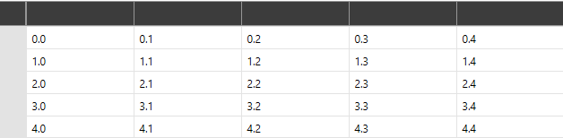

# Getting Started with {{ site.framework_name }} VirtualGrid

This tutorial will walk you through the required steps for using `RadVirtualGrid`. 

* [Assembly References](#assembly-references)
* [Adding RadVirtualGrid to the Project](#adding-radvirtualgrid-to-the-project)
* [Populating with Data](#populating-with-data-manually)
* [Populating with Data through DataProvider](#populating-with-data-through-dataprovider)
* [MeasureTextOnRender](#measuretextonrender)

## Adding Telerik Assemblies Using NuGet

To use `RadVirtualGrid` when working with NuGet packages, install the `Telerik.Windows.Controls.VirtualGrid.for.Wpf.Xaml` package. The [package name may vary]() slightly based on the Telerik dlls set - [Xaml or NoXaml]()

Read more about NuGet installation in the [Installing UI for WPF from NuGet Package]() article.

>tip With the 2025 Q1 release, the Telerik UI for WPF has a new licensing mechanism. You can learn more about it [here]().

## Adding Assembly References Manually

If you are not using NuGet packages, you can add a reference to the following assemblies:

* __Telerik.Licensing.Runtime__
* __Telerik.Windows.Controls__
* __Telerik.Windows.Controls.VirtualGrid__
* __Telerik.Windows.Data__

## Adding RadVirtualGrid to the Project

#### __[XAML] Defining RadVirtualGrid Declaratively__
{{region radvirtualgrid-gettingstarted_0}}
	 <telerik:RadVirtualGrid x:Name="VirtualGrid"/>
{{endregion}}

## Populating with Data Manually

> In order the control to be populated with data, its [InitialRowCount and InitialColumnCount](#setting-initial-row-and-column-count) properties need to be set.

RadVirtualGrid needs to be initially defined with a fixed amount of rows and columns. The below listed properties are exposed for achieving this. An important note is that when additional rows or columns are added at runtime, the values of these properties remain unmodified, but the capacity of the control increases. More information on inserting rows and columns can be found in the [Insert and Remove Data]() topic.

* `InitialRowCount`&mdash;Gets or sets the amount of initially loaded rows
* `InitialColumnCount`&mdash;Gets or sets the amount of initially loaded columns

#### __[XAML] Setting the InitialRowCount and InitialColumnCount properties__
{{region radvirtualgrid-gettingstarted_1}}
	<telerik:RadVirtualGrid x:Name="VirtualGrid" 
                                InitialColumnCount="5" 
                                InitialRowCount="5"/>
{{endregion}}

The control populates its data through the CellValueNeeded event. It is raised when the control is initially loaded and when newly data is about to be loaded on demand when the user scrolls horizontally or vertically. The event arguments expose the following properties:

### CellValueNeeded

* `CellIndex`&mdash;Provides information regarding the index of the currently loaded cell.
* `RowIndex`&mdash;Provides information regarding the index of the currently loaded row.
* `Value`&mdash;Through it the needed value for the respective cell can be set.

#### __[C#] Populating RadVirtualGrid with data through the CellValueNeeded event__
{{region radvirtualgrid-gettingstarted_2}}
	private void virtualGrid_CellValueNeeded(object sender, 
            Telerik.Windows.Controls.VirtualGrid.CellValueEventArgs e)
        {
            e.Value = String.Format("{0}.{1}", e.RowIndex, e.ColumnIndex);
        }
{{endregion}}

__RadVirtualGrid populated with data__

## Populating with Data Through DataProvider

Instead of using the `CellValueNeeded` event, RadVirtualGrid provides an option to populate its data through the built-in DataProvider mechanism. The DataProvider object accepts an `IEnumerable` through its constructor and can be applied to RadVirtualGrid through its relevant property.

>important When populating data with a `DataProvider`, it handles most of the operations of RadVirtualGrid out-of-the-box. Thus, the events that are intended to be used for manually populating and manipulating the data of the control will not be raised.

#### __[C#] Applying a DataProvider__
{{region radvirtualgrid-gettingstarted_3}}
	this.VirtualGrid.DataProvider = new Telerik.Windows.Controls.VirtualGrid.DataProvider(this.myCollection);
{{endregion}}

> The DataProvider mechanism is intended to cover basic scenarios for populating the control with data. For extending the default behavior, RadVirtualGrid provides support for [Custom DataProvider]()

## MeasureTextOnRender

The `MeasureTextOnRender` property indicates whether the text is measured on rendering. Its default value is __False__. When set to __True__, the usage of the `FitColumnWidthToContent` and `CellTextAlignment` mechanisms is enabled. Note, that this may affect the performance of the control.

>tip If the MeasureTextOnRender property is set to __True__, the FitColumnWidthToContent method will return the calculated column width. Otherwise, the return value will be __0.0__.

## Setting a Theme

The controls from our suite support different themes. You can see how to apply a theme different than the default one in the [Setting a Theme]() help article.

>important Changing the theme using implicit styles will affect all controls that have styles defined in the merged resource dictionaries. This is applicable only for the controls in the scope in which the resources are merged. 

To change the theme, you can follow the steps below:
* Choose between the themes and add reference to the corresponding theme assembly (ex: **Telerik.Windows.Themes.Windows8.dll**). You can see the different themes applied in the **Theming** examples from our [WPF Controls Examples](https://demos.telerik.com/wpf/)[Silverlight Controls Examples](https://demos.telerik.com/silverlight/#GridView/Theming) application.

* Merge the ResourceDictionaries with the namespace required for the controls that you are using from the theme assembly. For RadVirtualGrid, you will need to merge the following resources:

	* __Telerik.Windows.Controls__
	* __Telerik.Windows.Controls.VirtualGrid__

The following example demonstrates how to merge the ResourceDictionaries so that they are applied globally for the entire application.

#### __[XAML] Merge the ResourceDictionaries__  
{{region radvirtualgrid-getting-started_08}}
		<Application.Resources>
			<ResourceDictionary>
				<ResourceDictionary.MergedDictionaries>
	                <ResourceDictionary Source="/Telerik.Windows.Themes.Windows8;component/Themes/System.Windows.xaml"/>
	                <ResourceDictionary Source="/Telerik.Windows.Themes.Windows8;component/Themes/Telerik.Windows.Controls.xaml"/>
	                <ResourceDictionary Source="/Telerik.Windows.Themes.Windows8;component/Themes/Telerik.Windows.Controls.VirtualGrid.xaml"/>
				</ResourceDictionary.MergedDictionaries>
			</ResourceDictionary>
		</Application.Resources>
{{endregion}}
	
__RadVirtualGrid with the Windows8 theme__

## See also

* [Editing]()

* [Insert and Remove Data]()

* [Pinned Rows and Columns]()

* [Custom Data Provider]()


## Telerik UI for WPF Learning Resources

* [Telerik UI for WPF VirtualGrid Component](https://www.telerik.com/products/wpf/virtualgrid.aspx)
* [Getting Started with Telerik UI for WPF Components]()
* [Telerik UI for WPF Installation]()
* [Telerik UI for WPF and WinForms Integration]()
* [Telerik UI for WPF Visual Studio Templates]()
* [Setting a Theme with Telerik UI for WPF]()
* [Telerik UI for WPF Virtual Classroom (Training Courses for Registered Users)](https://learn.telerik.com/learn/course/external/view/elearning/16/telerik-ui-for-wpf) 
* [Telerik UI for WPF License Agreement](https://www.telerik.com/purchase/license-agreement/wpf-dlw-s)


