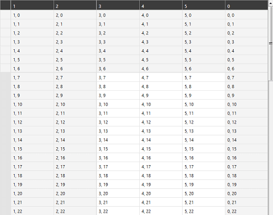

# Overview

Thank you for choosing __RadVirtualGrid__!

__RadVirtualGrid__ is a lightweight tabular component, designed to be able to operate with huge datasets. It provides outstanding performance through evading the common templating mechanism used in the framework. Instead, the control avoids adding most of its items to the visual tree and exposes a mechanism for loading data on demand. 

#### __Figure 1: RadVirtualGrid__ 

__RadVirtualGrid__'s features list:

* __Editing__

* __Pinned rows and columns__

* __Styling and customization support through a set of properties__

* __Conditional cell decoration__

* __Touch support for vertical and horizontal scrolling__

