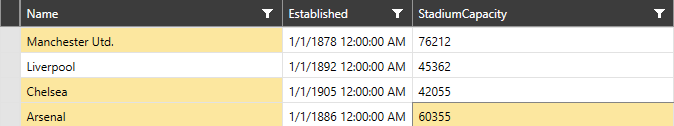

# Multiple Selection

__RadVirtualGrid__ allows users to select more than one item from the displayed data. The default row/cell selection of the control is set to single mode. The multiple selection can be enabled through the __SelectionMode__ property by setting it either to __Multiple__ or __Extended__.

The __Multiple SelectionMode__ allows the user to add an item to the selected items just by clicking on it. It will be removed when it gets clicked again.

The __Extended__ selection on the other hand, allows users to select multiple records using the common key modifiers - __Shift__ and __Ctrl__. Holding __Shift__ while selecting a row will select the range of rows between the newly-selected row and the previously-selected one. By holding __Ctrl__ upon selection, the selected row will be added to the current selection or removed from it if it has already been selected. The same rules apply to the cells if the __SelectionUnit__ property is set to __Cell__. If no modifiers are pressed when selecting a unit only that unit will be selected. 

> Pressing __Ctrl+A__ will select all items.

#### __Figure 1: RadVirtualGrid with Extended SelectionMode and Cell SelectionUnit__

## Column Selection

When the __SelectionUnit__ of __RadVirtualGrid__ is set to __Column__, all cells within the selected column will be added to the __SelectedCells__ collection irrelevant to whether the __SelectionMode__ is set or not.

#### __Figure 2: RadVirtualGrid with SelectionUnit set to Column__

## See also

* [Selection]()

* [Editing]()

* [Insert and Remove Data]()

* [Pinned Rows and Columns]()

