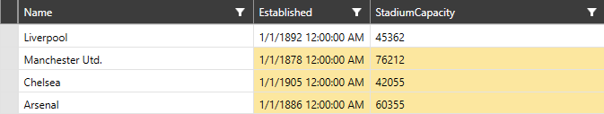
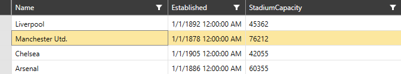

# Programmatic Selection

## Select Cell Region

__RadVirtualGrid__ supports selection of a cell region. This mechanism can be manipulated through the __SelectCellRegion__ method. It has two overloads.

* __SelectCellRegion(Telerik.Windows.Controls.VirtualGrid.CellRegion)__ - Expects a single __CellRegion__.

* __SelectCellRegion(IEnumerable<Telerik.Windows.Controls.VirtualGrid.CellRegion>)__ - Expects multiple __CellRegion__ elements.

__Example 1: Selecting a CellRegion__
```C#
	 this.VirtualGrid.SelectCellRegion
                (new Telerik.Windows.Controls.VirtualGrid.CellRegion(1, 1, 2, 5));
```

#### __Figure 1: Selecting a CellRegion__


## Unselect Cell Region

The control also provides a method for deselecting a __CellRegion__, or multiple __CellRegions__.

* __UnselectCellRegion(Telerik.Windows.Controls.VirtualGrid.CellRegion)__

* __UnselectCellRegion(IEnumerable<Telerik.Windows.Controls.VirtualGrid.CellRegion>)__

## Selected Index, Selected Indexes and ToggleIndexSelection

The control supports programmatic selection based on a given index/indexes. For this purpose, the __SelectedIndex__ and __SelectedIndexes__ properties are exposed, as well the __ToggleIndexSelection__ method.

> The index based selection of __RadVirtualGrid__ can be utilized only when the __SelectionUnit__ of the control is set to __Row__ or __Column__. Depending on the property value, the control will operate with either the index/indexes of the rows, or the columns.

* __SelectedIndex__: Provides information regarding the selected index of the control and can be assigned as well.

* __SelectedIndexes__: Provides information regarding the selected indexes. As it is a readonly collection, it __cannot be assigned__ and __items cannot be added to it__.

* __ToggleIndexSelection__: Selects the given index if it is not selected, or deselects if it is already selected. The unit that will be selected depends on the value of the __SelectionUnit__ property. When using this method, the __SelectedIndexes__ collection will be updated. Thus, using it is recommended when the application logic depends on the __SelectedIndexes__ collection.

__Example 2: Setting the SelectedIndex property__
```C#
	this.VirtualGrid.SelectedIndex = 1;
```

#### __Figure 2: Setting the SelectedIndex property__



## See also

* [Selection]()

* [Multiple Selection]()

* [Editing]()

* [Insert and Remove Data]()

* [Pinned Rows and Columns]()